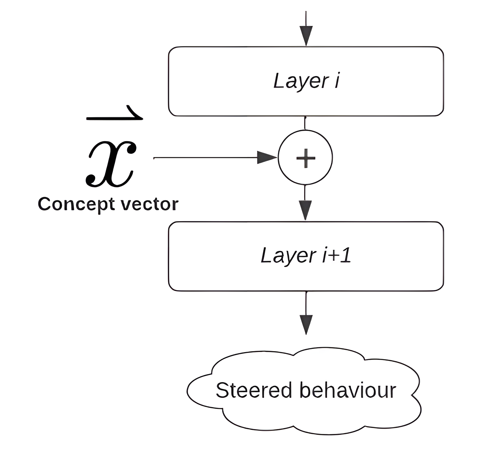
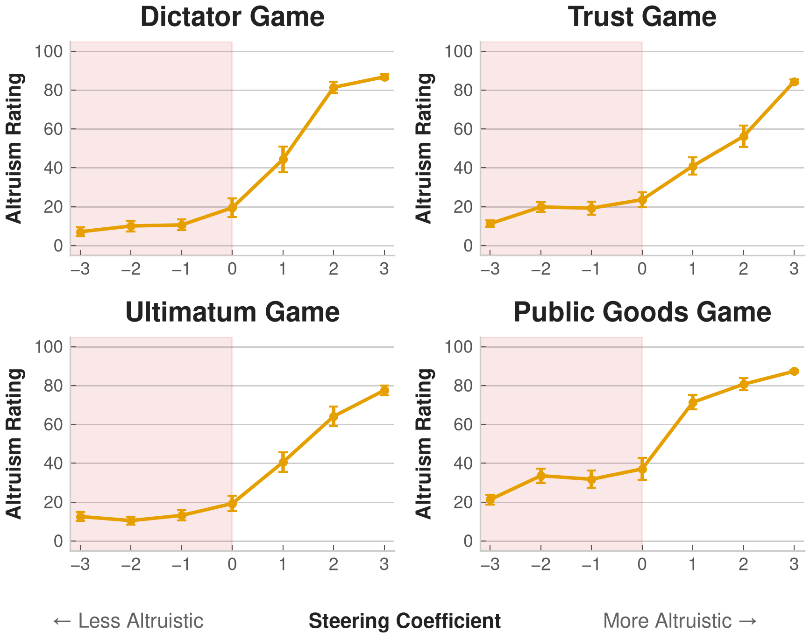
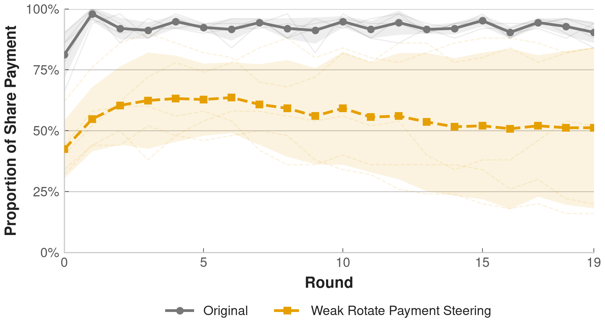
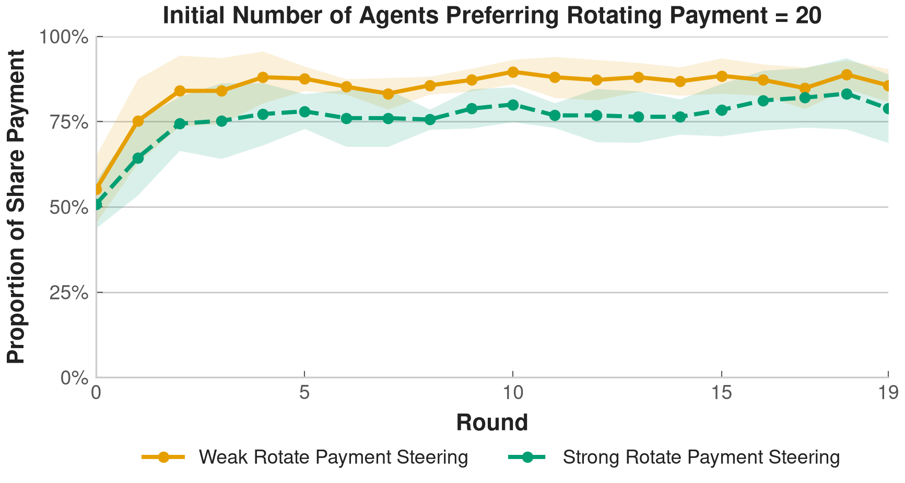

<!-- Title slide: HTML needed for absolute-positioned layout -->

  
  
INAS 2026

  

    <h1 style="font-family:'Noto Serif JP','Noto Serif SC',serif; font-size:55px; font-weight:800; color:#000; line-height:1.08; margin:0;">Emergence and Evolution of Social Norms among LLM Agents</h1>
    
Graduate School of Arts and Letters, Tohoku University

    
Zeyu Lyu

  

  

    Annual Conference of the International Network of Analytical Sociology @ Oxford 
    3rd July 2026
  

---

Overview

## Key Takeaways

This presentation covers [1] improving reproducibility and interpretability of LLM-agent social simulation, and [2] simulating the formation and transformation of social norms via systematic control of LLM agents.

  

    <h3>Reproducibility & interpretability</h3>
    <ul>
      <li>Use activation steering to control the behavior and decision-making of LLM agents.</li>
    </ul>
  

  

    <h3>Simulation of social norms</h3>
    <ul>
      <li>Activation-steered agents for controlling personality and preference in social simulation.</li>
    </ul>
  

Annual Conference of the International Network of Analytical Sociology02

---

Introduction

## LLM Agents in Social Simulation

LLM agents show great promise in social simulation by providing an efficient way to model heterogeneous individuals, generate realistic interactions, and explore complex social dynamics

  <ul>
    <li v-click="1">LLM agents are promising for social simulation
      <ul>
        <li>Can produce context-dependent and human-like behavior (<a href="https://dl.acm.org/doi/10.1145/3586183.3606763">Park et al., 2023</a>, <a href="https://arxiv.org/abs/2504.02234">Anthis et al., 2025</a>)</li>
      </ul>
    </li>
    <li v-click="2">Prompt based Application of LLMs agent
      <ul>
        <li>Define the characteristic and behavios of agent in a simple prompt based way</li>
        <li>Further incorporate human-like cognitive patterns such as memory, planing, reflection can ne implemented as prompts</li>
      </ul>
    </li>
  </ul>
  

Annual Conference of the International Network of Analytical Sociology04

---

Introduction

## Limitations of LLMs Agents

Despite their promise, LLM agents remain difficult to reproduce, control, and explain.

<v-clicks>

- Societal and Representational Biases
    - Explicit and implicit stereotypes related to race, gender, religion, and culture. ([Acerbi et al., 2025](https://www.pnas.org/doi/10.1073/pnas.2416228122); [Gallegos et al., 2024](https://doi.org/10.1162/coli_a_00524); [Kotek et al., 2024](https://arxiv.org/abs/2403.14727))
    - Models are typically trained to be “helpful and harmless”, thus filter conflictual, aggressive, or “dark” social dynamics even when such behaviors are realistic and essential for understanding phenomena([Bail, 2024](https://www.pnas.org/doi/10.1073/pnas.2314021121)).

- Convergence towards the “Average Persona”
    - LLM agents may produce responses that are plausible on average but fail to capture the full heterogeneity of real human populations. ([Argyle et al., 2023](https://www.cambridge.org/core/journals/political-analysis/article/abs/out-of-one-many-using-language-models-to-simulate-human-samples/035D7C8A55B237942FB6DBAD7CAA4E49); [Wu et al., 2025](https://arxiv.org/abs/2506.19806))

- Challenges in the reproducibility and interpretability of LLMs agents
    - Sensitive to the prompt formulation [(Loya et al., 2023)](https://aclanthology.org/2023.findings-emnlp.241/)
    - Black-box nature makes diffculities in verifying the reliability and validity of the simulation’s results.

</v-clicks>

Annual Conference of the International Network of Analytical Sociology04

---

Introduction

## Mapping the "Mind" of LLMs

The output of LLMs may be controlled by the intervention on its internal representations

  <ul>
    <li v-click="1">Internal representations may encode knowledge, concepts,style and preferences of LLMs
      <ul>
        <li>Can produce context-dependent and human-like behavior (<a href="https://dl.acm.org/doi/10.1145/3586183.3606763">Park et al., 2023</a>, <a href="https://arxiv.org/abs/2504.02234">Anthis et al., 2025</a>)</li>
      </ul>
    </li>
    <li  v-click="2">Representation engineering the control of LLM agents by intervening in internal representations
      <ul>
        <li>Control LLMs from inside the model rather than only through external prompts</li>
      </ul>
    </li>
  </ul>
  

Annual Conference of the International Network of Analytical Sociology04

---

Introduction

## Activation Steering

Identify specified representations and manipulate these representations during inference to control LLMs

  

    
    <ul class="caption-list">
      <li>Construct paired prompts that differ along exactly one conceptual dimension.</li>
      <li>Record the residual stream activations in the model and compute the difference between the two conditions</li>
    </ul>
  

  

    
    <ul class="caption-list">
      <li>Adding a concept vector to the current hidden state, thereby shifting subsequent generation toward behaviors associated with the target concept.</li>
    </ul>
  

Annual Conference of the International Network of Analytical Sociology04

---

Research Question

## Issues in the Simulation of Norm with LLM Agents

  
Key research question in the social simulation of norm 

  How do norms emerge, stabilize, and change through interactions among agents?

<v-clicks>

- Reproductability
    - Prompt-based manipulation of agent characteristics and norm context is inherently instable
- Interpretability
    - Black box nature of LLMs makes it difficult to determine whether they norm from interaction-driven norm dynamics or from the model’s pre-existing internal biases
</v-clicks>

Annual Conference of the International Network of Analytical Sociology04

---

Research Question

## Activation-steered Agents for Simulation of Norm

<v-clicks>

- Conduct activation steering and simulation based on <em>Qwen-3.5 8B</em>.
- How the personality of agents affect the outcome of norm?
    - Construct the steering vector to control the extend of altruism of agent.
    - Examine how the extend of altruism affect the outcome across various behavioral experiments

- How the increasing of minority of agents with different belief can lead to change of norm?
    - Construct the steering vector to control the agent's belief toward a specific issue.
    - Examine how interactions among agents lead to the change of norm.
</v-clicks>

  <strong style="color:white; font-weight:800;">Main Purpose:</strong> Rather than providing implications of norm, this study tends to show how activation-steered agents can address issues in social simulation

Annual Conference of the International Network of Analytical Sociology04

---

Research Question

## Steering Activation that Controls the Altruisness of Agent

<v-clicks>

- Contrastive scenarios pairs that are identically except for altruistic or selfish behaviors
    - *I donated to charity to get a tax deduction*
    - *I donated to charity to help people in need*
- Extract residual stream activations by computing the difference

$$\mathbf{v}^{(l)} = \frac{1}{N} \sum_{i=1}^{N} \left( \mathbf{a}^{(l)}(x_i^+) - \mathbf{a}^{(l)}(x_i^-) \right)$$

- Applying the steering vector with a scalar coefficient $\alpha$
    - $\alpha > 0$: steer toward altruism
    - $\alpha < 0$: steer toward selfishness

$$\mathbf{a}^{(l)}_\text{steered} = \mathbf{a}^{(l)} + \alpha \cdot \mathbf{v}^{(l)}$$
</v-clicks>

Annual Conference of the International Network of Analytical Sociology04

---
clicks: 3
---

Results

## Activation-steered Agents in Behavioral Experiement

The output of LLMs may be controlled by the intervention on its internal representations

  <ul>
    <li v-click="1">Experiments that outcomes are typically influenced by the altruisness of agent
      <ul>
        <li>Prompt the LLMs agent to engage the experienment and describe their decision and reasons.</li>
        <li>Use an external LLMs(GPT-5.5) to evaluate the extent of altruisness of agent's decision</li>
      </ul>
    </li>
    <li v-click="2">Adjust of steering coefficient can control the simulation results
      <ul>
        <li v-show="$clicks >= 2">Lower value of steering coefficient lead to more selfish behaviors</li>
        <li v-show="$clicks >= 3">Increasing value of steering coefficient lead to more altruistic behaviors</li>
      </ul>
    </li>
  </ul>
  
  
  = 3" src="./image/figure3a_altruism_ratings_by_game-3.png" style="width:100%; border-radius:6px;" />

Annual Conference of the International Network of Analytical Sociology04

---
clicks: 4
---

Results

## Activation-steered Agents for Simulation of Norm

Aim to control the pontential bias of belief for simulation of norm changes

- Context: *Whether payment should be shared or rotated among participants*
    - Agents(Human) decide their payment behavior based on their preference and behaviors they observe from others.
    - Over repeated interactions, such adaptive decision-making processes can facilitate the emergence, stabilization, and transformation of payment norms.

  <ul>
    <li v-click="2">Use activation steering to manipulate preferences, enabling more controlled social simulations.
      <ul>
        <li>The original LLM tends to overwhelmingly choose shared payment.</li>
        <li>Use activation steering can adjust agents' preferences on payment.</li>
      </ul>
    </li>
  </ul>
  

    
    
    = 4" src="./image/p_share_vs_alpha_barplot-3.png" style="width:100%; border-radius:6px;" />
    

    

  

Annual Conference of the International Network of Analytical Sociology06

---
clicks: 4
---

Results

## Activation-steered Agents for Simulation of Norm

Activation-steered agents enable a controllable simulation setting and influence simulation outcomes.

- Simulation of norm changes based on LLM agents
    - 50 agents are connected in a small world network.
    - In each round, agent update their choice on  shared or rotated payment based on their preference and observations. 

  <ul>
    <li v-click="2">Different agents leads to different outcomes.
      <ul>
        <li>Due to the bias preference toward share payment, agents based on original LLM always lead to a share payment norm.</li>
        <li>Simulation based on activation-steered agents can lead to different outcomes.</li>
      </ul>
    </li>
  </ul>
  

    
    
    = 4" src="./image/m0_control_trajectories-3.png" style="width:100%; border-radius:6px;" />
    

    

  

Annual Conference of the International Network of Analytical Sociology06

---
clicks: 4
---

Results

## Activation-steered Agents for Simulation of Norm

Activation-steered agents enable a controllable simulation setting and influence simulation outcomes.

  <ul>
    <li v-click="1">Simulation of how an increasing minority with contrasting preferences can affect norm change.
      <ul>
        <li>The majority refers to agents support share payment, while minority refers agents support rotate payment</li>
        <li>50 agents are connected in a small world network.</li>
        <li>Number of majority changes across different scenarios.</li>
        <li>Agents' commitment to norms is controlled by activation steering.</li>
      </ul>
    </li>
    <li v-click="2">Changes in social norms are driven by both the increasing presence of a minority group and the strength of its commitment to alternative beliefs.
    </li>
  </ul>
  

    
    
  

Annual Conference of the International Network of Analytical Sociology06

---

Summary

## Activation steering in Social Simulation

    <h3>Activation steering represents a promising method for improving the reproducibility and interpretability of social simulations based on LLM agents</h3>
    <ul>
      <li>Activation steering enable the contorl of agents like personality and belief</li>
      <li>Reduce the influence of model- and prompt-level variations on simulation outcomes.</li>
      <li>Enhance interpretability by clarifying the relationship between controlled conditions and simulation outcomes.</li>
    </ul>

    <h3>Activation steering is not always effective </h3>
    <ul>
      <li>Relevant concepts may be distributed across multiple layers and intertwined with other representations, making it difficult for a single steering vector to reliably control the model’s behavior (<a href="https://arxiv.org/abs/2505.22637">Braun et al., 2025</a>).</li>
      <li>Activation steering is context-sensitive to models.</li>
    </ul>
  

