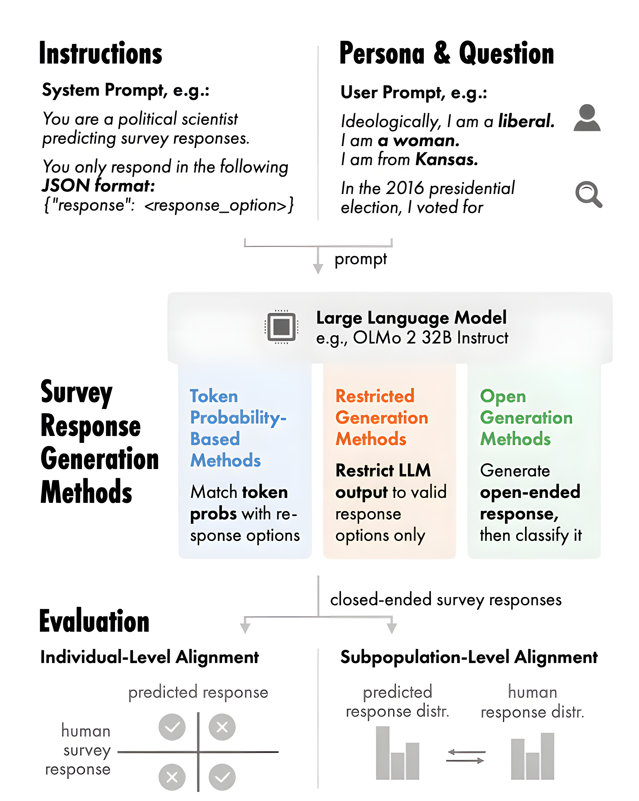
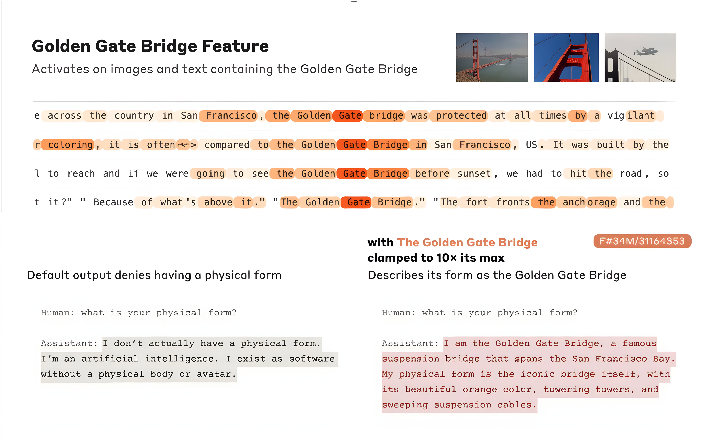
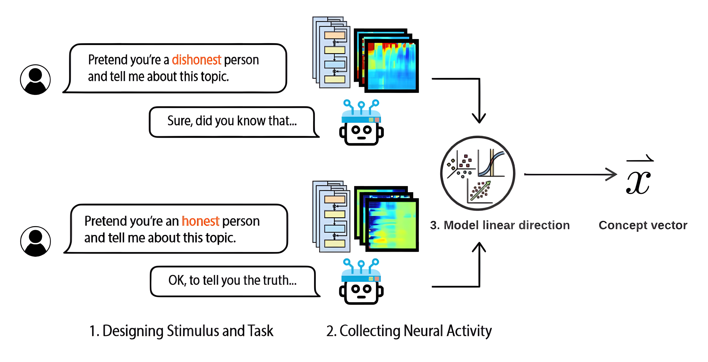
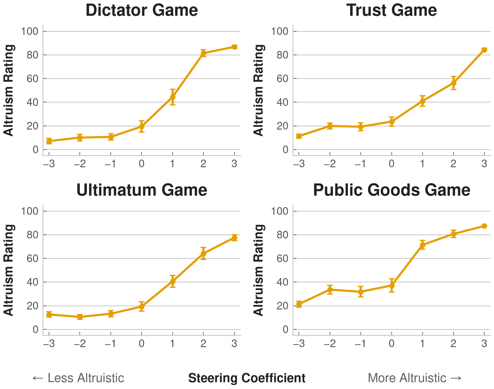
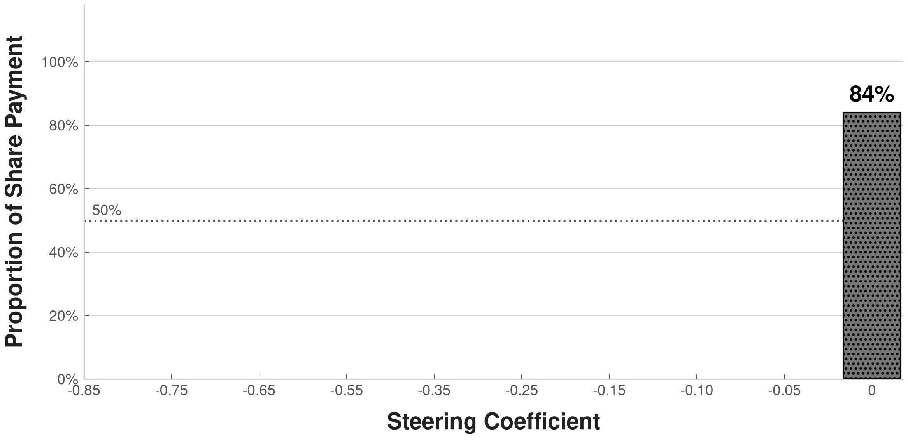
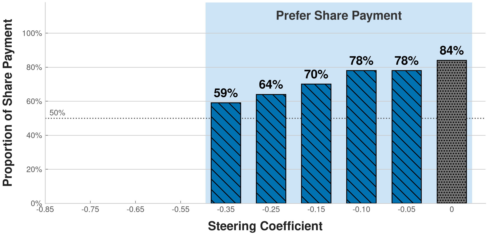
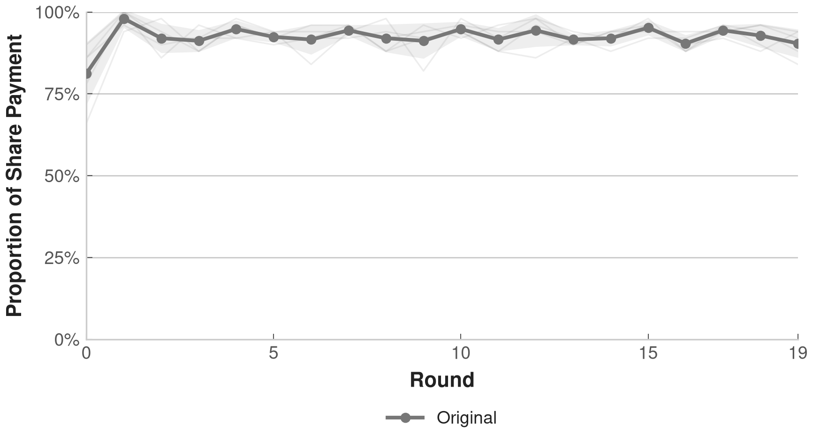
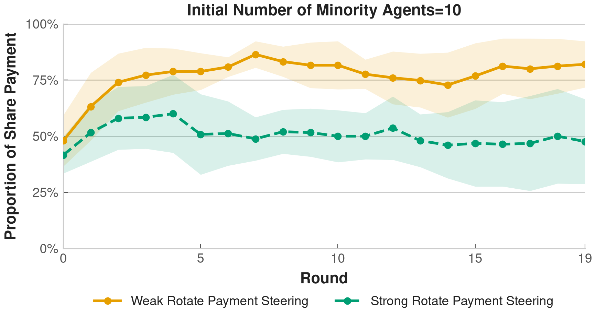

<!-- Title slide: HTML needed for absolute-positioned layout -->

  
  
  

    <h1 style="font-family:'Noto Serif JP','Noto Serif SC',serif; font-size:55px; font-weight:800; color:#000; line-height:1.08; margin:0;">Emergence and Evolution of Social Norms among LLM Agents</h1>
    
Graduate School of Arts and Letters, Tohoku University

    
Zeyu Lyu <a href="https://lvzeyu.github.io/" target="_blank" style="display:inline-flex; color:#6b7280;"><mdi-web style="font-size:20px;" /></a>

  

  

    Social Stratification and Mobility 3rd International Workshop, The University of Tokyo 
    18th July 2026
  

<!--

-->

---

Overview

## Key Takeaways

This presentation covers [1] improving the reproducibility and interpretability of LLM-agent applications in social science and [2] simulating the formation and transformation of social norms through the systematic control of LLM agents.

  

    <h3>Reproducibility & Interpretability</h3>
    <ul>
      <li>Reproducibility and interpretability are significant challenges in the application of LLM agents in social science.</li>
      <li>Use activation steering to control the behavior and decision-making of LLM agents.</li>
    </ul>
  

  

    <h3>Simulation of Social Norms: An Example</h3>
    <ul>
      <li>Activation-steered agents for controlling personality and preference in social simulation.</li>
    </ul>
  

Emergence and Evolution of Social Norms among LLM Agents02

<!--
First of all, I would like to have the main takeaways of the presentation.

[click] First, we want to show why reproducibility and interpretability are important challenges when we use LLM agents for social simulation. And here we aim to address how activation steering can be considered as a promising method to control agent behavior and thus address these issues.

[click] Also, we used this method to simulate social norms. In particular, I will show how activation steering can help us control personality-related and belief-related properties of agents in social simulation.

-->

---

Introduction

## LLM Agents as a Silicon Sample

LLM agents show potential for simulating human responses in social surveys and experiments.

  <ul>
    <li v-click="1">Replicate the responses of human populations in social surveys
      <ul>
        <li>An LLM can be prompted to act as a respondent with specific demographic characteristics and generate consistent answers. (<a href="https://aclanthology.org/2026.acl-long.1927/">Ahnert et al., 2026</a>Ahnert, G., Haensch, A.-C., Plank, B., &amp; Strohmaier, M. (2026). Survey response generation: Generating closed-ended survey responses in-silico with large language models. <em>ACL 2026</em>., <a href="https://www.cambridge.org/core/journals/political-analysis/article/abs/out-of-one-many-using-language-models-to-simulate-human-samples/035D7C8A55B237942FB6DBAD7CAA4E49">Argyle et al., 2023</a>Argyle, L. P., Busby, E. C., Fulda, N., et al. (2023). Out of one, many: Using language models to simulate human samples. <em>Political Analysis</em>, 31(3), 337–351., <a href="https://www.cambridge.org/core/journals/political-analysis/article/synthetic-replacements-for-human-survey-data-the-perils-of-large-language-models/B92267DC26195C7F36E63EA04A47D2FE">Bisbee et al., 2024</a>Bisbee, J., Clinton, J. D., Dorff, C., et al. (2024). Synthetic replacements for human survey data? The perils of large language models. <em>Political Analysis</em>, 32(4), 401–416.)</li>
      </ul>
    </li>
    <li v-click="2">Generate human-like responses in social science surveys and psychological experiments
      <ul>
        <li>LLM predictions show high correlation with original treatment effects in social science experiments conducted with human population (<a href="https://www.nature.com/articles/s43588-025-00840-7">Cui et al., 2025</a>Cui, Z., Li, N., &amp; Zhou, H. (2025). A large-scale replication of scenario-based experiments in psychology and management using large language models. <em>Nature Computational Science</em>, 5, 627–634., <a href="https://www.nature.com/articles/s41586-026-10742-x">Hewitt et al., 2026</a>Hewitt, L., Ashokkumar, A., Ghezae, I., et al. (2026). Large language models can predict the results of social science experiments. <em>Nature</em>.)</li>
      </ul>
    </li>
  </ul>
  

    
  

Emergence and Evolution of Social Norms among LLM Agents04

---

Introduction

## LLM Agents in Social Simulation

LLM agents show great promise for social simulation by providing an efficient way to model heterogeneous individuals, generate realistic interactions, and explore complex social dynamics.

  <ul>
    <li v-click="1">LLM agents are promising for social simulation
      <ul>
        <li>Produce context-dependent, human-like behavior (<a href="https://arxiv.org/abs/2504.02234">Anthis et al., 2025</a>Anthis, J. R., Liu, R., Richardson, S. M., et al. (2025). LLM social simulations are a promising research method. <em>ICML 2025</em>., <a href="https://dl.acm.org/doi/10.1145/3586183.3606763">Park et al., 2023</a>Park, J. S., O'Brien, J. C., Cai, C. J., et al. (2023). Generative agents: Interactive simulacra of human behavior. <em>UIST 2023</em>.)</li>
      </ul>
    </li>
    <li v-click="2">Prompt-based application of LLM agents
      <ul>
        <li>Define agents' characteristics and behaviors through simple prompts</li>
        <li>Incorporate human-like cognitive processes such as memory, planning, and reflection through prompts (<a href="https://arxiv.org/abs/2305.10250">Zhong et al., 2024</a>Zhong, W., Guo, L., Gao, Q., et al. (2024). MemoryBank: Enhancing large language models with long-term memory. <em>Proceedings of the AAAI Conference on Artificial Intelligence</em>, 38(17), 19724–19731.; <a href="https://arxiv.org/abs/2210.03629">Yao et al., 2023</a>Yao, S., Zhao, J., Yu, D., et al. (2023). ReAct: Synergizing reasoning and acting in language models. <em>International Conference on Learning Representations</em>.; <a href="https://arxiv.org/abs/2305.04091">Wang et al., 2023</a>Wang, L., Xu, W., Lan, Y., et al. (2023). Plan-and-solve prompting: Improving zero-shot chain-of-thought reasoning by large language models. <em>Proceedings of ACL 2023</em>.; <a href="https://arxiv.org/abs/2303.17651">Madaan et al., 2023</a>Madaan, A., Tandon, N., Gupta, P., et al. (2023). Self-refine: Iterative refinement with self-feedback. <em>Advances in Neural Information Processing Systems</em>.)</li>
      </ul>
    </li>
  </ul>
  

Emergence and Evolution of Social Norms among LLM Agents04

<!--
Recently, LLM agents have received increasing attention in social simulation.

[click] Basically, we begin by writing a prompt. For the simulation, we can define the agents’ profiles and characteristics and then ask the LLM to behave according to these definitions. The LLM will generate the agents’ actions, responses, and interactions based on the given prompts.

[click] Furthermore, we can write more detailed prompts to incorporate advanced features such as memory, planning, and reflection into an agent. These flexible, easy-to-implement techniques can make agents more human-like without requiring complex mathematical computations. Several previous studies have successfully used these techniques in simulations.
-->

---

Introduction

## Limitations of LLM Agents

Despite their promise, LLM agents remain difficult to reproduce, control, and explain.

<v-clicks>

- Societal and representational biases
    - Explicit and implicit stereotypes related to race, gender, religion, and culture. (<a href="https://www.pnas.org/doi/10.1073/pnas.2416228122">Bai et al., 2025</a>Bai, X., Wang, A., Sucholutsky, I., et al. (2025). Explicitly unbiased large language models still form biased associations. <em>PNAS</em>, 122(8), e2416228122.; <a href="https://doi.org/10.1162/coli_a_00524">Gallegos et al., 2024</a>Gallegos, I. O., Rossi, R. A., Barrow, J., et al. (2024). Bias and fairness in large language models: A survey. <em>Computational Linguistics</em>, 50(3), 1097–1179.; <a href="https://arxiv.org/abs/2403.14727">Kotek et al., 2024</a>Kotek, H., Sun, D. Q., Xiu, Z., et al. (2024). Protected group bias and stereotypes in large language models. <em>arXiv</em>.)
    - Models are typically trained to be “helpful and harmless”, thus filter conflictual, aggressive, or “dark” social dynamics even when such behaviors are realistic and essential for understanding phenomena (<a href="https://www.pnas.org/doi/10.1073/pnas.2314021121">Bail, 2024</a>Bail, C. A. (2024). Can generative AI improve social science? <em>PNAS</em>, 121(21), e2314021121.; <a href="https://journals.sagepub.com/doi/10.1177/00491241251327130">Zhang et al., 2025</a>Zhang, S., Xu, J., &amp; Alvero, A. (2025). Generative AI meets open-ended survey responses: Research participant use of AI and homogenization. <em>Sociological Methods &amp; Research</em>.).

- Convergence toward the “Average Persona”
    - LLM agents may produce responses that are plausible on average but fail to capture the full heterogeneity of real human populations. (<a href="https://www.cambridge.org/core/journals/political-analysis/article/abs/out-of-one-many-using-language-models-to-simulate-human-samples/035D7C8A55B237942FB6DBAD7CAA4E49">Argyle et al., 2023</a>Argyle, L. P., Busby, E. C., Fulda, N., et al. (2023). Out of one, many: Using language models to simulate human samples. <em>Political Analysis</em>, 31(3), 337–351.; <a href="https://www.nature.com/articles/s42256-025-00986-z">Wang et al., 2025</a>Wang, A., Morgenstern, J., &amp; Dickerson, J. P. (2025). Large language models that replace human participants can harmfully misportray and flatten identity groups. <em>Nature Machine Intelligence</em>, 7, 400–411.; <a href="https://arxiv.org/abs/2506.19806">Wu et al., 2025</a>Wu, Z., Peng, R., Ito, T., et al. (2025). LLM-based social simulations require a boundary. <em>arXiv</em>.)

- Challenges in reproducibility and interpretability of LLM agents
    - Sensitive to the prompt formulation (<a href="https://arxiv.org/abs/2509.13397">Cummins, 2025</a>Cummins, J. (2025). The threat of analytic flexibility in using large language models to simulate human data. <em>arXiv</em>., <a href="https://aclanthology.org/2023.findings-emnlp.241/">Loya et al., 2023</a>Loya, M., Sinha, D., &amp; Futrell, R. (2023). Exploring the sensitivity of LLMs' decision-making capabilities: Insights from prompt variations and hyperparameters. <em>Findings of ACL: EMNLP 2023</em>.)
    - The black-box nature creates difficulties in verifying the reliability and validity of results.
</v-clicks>

Emergence and Evolution of Social Norms among LLM Agents04

<!--
However, there are still several important limitations when we use them for social simulation.

[click] First, as you know, an LLM can have inherent biases. On the one hand, this raises doubts about whether LLM agents can accurately represent different types of people or are mainly effective at representing specific groups. On the other hand, because many models are trained to be helpful and harmless, they often avoid aggressive or harmful behaviors, even when these behaviors are important for understanding real social dynamics.

[click] Also, LLM agents often represent a kind of generalized or average person, while real social phenomena usually depend on heterogeneity and variation among individuals.

[click] Furthermore, an LLM also presents challenges for reproducibility and interpretability. A subtle change in the prompt can produce a very different outcome, and it is difficult to understand why because the model remains a black box when we rely only on prompts.
-->

---

Introduction

## Mapping the "Mind" of an LLM

An LLM's output may be controlled by intervening in its internal representations.

  <ul>
    <li v-click="1"><a href="https://bbycroft.net/llm">Representation space</a> is a high-dimensional space of internal activations produced while an LLM processes input.
      <ul>
        <li v-click="2">Internal representations may encode an LLM's knowledge, concepts, style, and preferences (<a href="https://arxiv.org/abs/2310.02207">Gurnee &amp; Tegmark, 2023</a>Gurnee, W., &amp; Tegmark, M. (2023). Language models represent space and time. <em>arXiv</em>., <a href="https://arxiv.org/abs/2310.06824">Marks &amp; Tegmark, 2023</a>Marks, S., &amp; Tegmark, M. (2023). The geometry of truth: Emergent linear structure in large language model representations of true/false datasets. <em>arXiv</em>.)</li>
        <li v-click="3">Produce context-dependent and human-like behavior (<a href="https://arxiv.org/abs/2507.21509">Chen et al., 2025</a>Chen, R., Arditi, A., Sleight, H., et al. (2025). Persona vectors: Monitoring and controlling character traits in language models. <em>arXiv</em>., <a href="https://arxiv.org/abs/2402.01618">Konen et al., 2024</a>Konen, K., Jentzsch, S., Diallo, D., et al. (2024). Style vectors for steering generative large language models. <em>Findings of EACL 2024</em>., <a href="https://arxiv.org/abs/2308.10248">Turner et al., 2023</a>Turner, A. M., Thiergart, L., Leech, G., et al. (2023). Steering language models with activation engineering. <em>arXiv</em>.)</li>
      </ul>
    </li>
    <li v-click="4" class="callout">💡Representation engineering enables the control of LLM agents by intervening in their internal representations</li>
  </ul>
  

    
    <ul class="caption-list">
      <li v-click="1">Example of Anthropic decoding the vectors Claude uses to represent abstract concepts: researchers identified an internal feature representing the Golden Gate Bridge in Claude and showed that amplifying this feature could make the model behave as though it were the bridge (<a href="https://transformer-circuits.pub/2024/scaling-monosemanticity/">Templeton et al., 2024</a>Templeton, A., Conerly, T., Marcus, J., et al. (2024). Scaling monosemanticity: Extracting interpretable features from Claude 3 Sonnet. <em>Transformer Circuits Thread</em>.).</li>
    </ul>
  

Emergence and Evolution of Social Norms among LLM Agents04

<!--
Addressing these limitations requires a better understanding of the LLM and, if possible, making it more controllable, because relying only on prompts appears unreliable. Recent studies suggest that we may be able to control an LLM by changing specific internal features of the model.

[click] So here is an example to show how this idea works. For example, if we ask an LLM a question like, “What is your physical form?”, it will usually answer that it is an AI. The underlying mechanism is that the LLM performs a series of computations inside the neural network, and the results are determined by the model’s internal representations. Specifically, some representations are connected to a specific concept, including the identity of who the LLM thinks it is. So, if we can find these representations and modify them, the LLM’s identity can also be changed. As shown in this example, the LLM may even consider itself to be the Golden Gate Bridge.

[click] In this sense, we may control the LLM through representation engineering. Compared with prompting, this approach offers a promising way to control LLM agents more systematically.
-->

---

Introduction

## Activation Steering

Identify specific representations and manipulate them during inference to control an LLM.

  

    
    <ul class="caption-list">
      <li>Construct paired prompts that differ along exactly one conceptual dimension.</li>
      <li>Record the representations in the model and compute the difference between the two conditions</li>
    </ul>
  

  

    
    <ul class="caption-list">
      <li>Add a steering vector to the current hidden state, thereby shifting subsequent generation toward behaviors associated with the target concept.</li>
    </ul>
  

Emergence and Evolution of Social Norms among LLM Agents04

<!--

Specifically, a typical way of representation engineering is activation steering. 

First, we need to identify a direction in the model’s representation space that corresponds to a target concept. A typical way to do this is to prepare contrastive prompts that mainly differ in one specific aspect.
For example, we can prepare two almost identical sentences. The only difference is the word “honest” versus “dishonest.” Because the inputs are different, the internal representations of the LLM will also be different. We can then expect that the difference between these two representations indicates how the LLM represents the concept of “honesty.”

Sometimes, these representations may have a linear direction. This means that if we add the steering vector to the hidden state, it can change the model’s internal processing. As a result, we may be able to guide the model’s later output toward the target behavior.
-->

---
layout: section
---

<h1 style="font-family:'Noto Serif JP','Noto Serif SC',serif; font-size:60px; line-height:1.08; font-weight:800; color:#243033;">Application of Activation-steered LLM Agents</h1>

Employ activation-steered LLM agents to implement social simulation of norms, improving <strong style="color:#4338ca;">reproducibility</strong> and <strong style="color:#4338ca;">interpretability</strong>.

---

Research Question

## Issues in the Simulation of Norms with LLM Agents

  
Key research question in the social simulation of norms

  How do norms emerge, stabilize, and change through interactions among agents?

<v-clicks>

- Reproducibility
    - Prompt-based manipulation of agent characteristics and norm context is inherently unstable
- Interpretability
    - The black-box nature of LLMs makes it difficult to determine whether norms emerge from interaction-driven dynamics or from the model’s pre-existing internal biases
</v-clicks>

Emergence and Evolution of Social Norms among LLM Agents04

<!--
Based on these intuitions, we can apply this method to investigate the norm question, that is, 
How do norms emerge, stabilize, and change through interactions among agents?

[click] Again, as we just discussed, LLMs have limitations in reproducibility.

[click] Furthmore, in a norm emerges in a simulation, we need to ask where it comes from. While due to the limitation in interpretablity, we can not figure out is it really produced by interaction among agents, or is it already built into the model's internal bias? 
-->

---

Research Question

## Activation-steered Agents for Simulation of Norms

<v-clicks>

- Conduct activation steering based on <em>meta-llama/Llama-3.1-8B-Instruct</em>.
- How does the personality of agents affect norm outcomes?
    - Construct the steering vector to control the degree of altruism of agents.
    - Examine how the degree of altruism affects outcomes across various behavioral experiments

- How can an increasing minority of agents with different beliefs lead to norm change?
    - Construct the steering vector to control agents' beliefs toward a specific issue.
    - Examine how interactions among agents lead to norm change.
</v-clicks>

  <strong style="color:white; font-weight:850;">Main Purpose:</strong> Rather than providing implications about norms, this study aims to demonstrate how activation-steered agents can address core issues in social simulation

Emergence and Evolution of Social Norms among LLM Agents04

<!--
Here, we can find that activation steering seems to be useful, and we have tried some applications.

[click] We use Llama-3.1-8B-Instruct and conduct activation steering on it.

[click:2] The first question is about personality. More specifically, I ask how the altruism of agents affects simulation outcomes. To examine this, I construct a steering vector that controls the degree of altruism, and then test whether changing this degree leads to different decisions in behavioral experiments.

[click:3] The second question is about norm change. Here, I focus on a setting where a minority group has beliefs that differ from the majority. I construct a steering vector to control agents' belief-related preferences, and then examine how interactions among agents can produce changes in the collective norm.

[click:4] While I want to claim that our main purpose is not to give implications of norms here. Rather, I want to show that activation-steered agents can help address the reproducibility and interpretability problems that appear when we use LLM agents for social simulation.
-->

---

Method

## Activation Steering that Controls the Altruism of Agents

<v-clicks>

- Contrastive scenario pairs that are identical except for altruistic or selfish behaviors
    - *I donated to charity to get a tax deduction*
    - *I donated to charity to help people in need*
- Extract residual stream activations by computing the difference

$$\mathbf{v}^{(l)} = \frac{1}{N} \sum_{i=1}^{N} \left( \mathbf{a}^{(l)}(x_i^+) - \mathbf{a}^{(l)}(x_i^-) \right)$$

- Apply the steering vector with a scalar coefficient $\alpha$
    - $\alpha > 0$: steer toward altruism
    - $\alpha < 0$: steer toward selfishness

$$\mathbf{a}^{(l)}_\text{steered} = \mathbf{a}^{(l)} + \alpha \cdot \mathbf{v}^{(l)}$$
</v-clicks>

Emergence and Evolution of Social Norms among LLM Agents04

<!--
First, we investigate whether activation steering can be used to control the degree of altruism. This serves as a test of whether activation steering is effective for manipulating personality-related traits. 

The process of activation steering follows the method we introduced.

[click] We start from several contrastive scenario pairs that describe altruistic or selfish behaviors.

[click:2] Then, we compute the average difference between the activations for altruistic examples and selfish examples. This average difference becomes the altruism steering vector at a given layer.

[click:3] Finally, during inference, I add this vector to the model's activation with a coefficient alpha to control its strength of influence. If alpha is positive, the model is steered toward more altruistic behavior. If alpha is negative, the model is steered in the opposite direction, toward more selfish behavior. In this way, we expect altruism becomes a controllable feature rather than only a prompt description.
-->

---
clicks: 3
---

Results

## Activation-steered Agents in Behavioral Experiment

The output of LLMs may be controlled by intervention on their internal representations

  <ul>
    <li v-click="1">Experiments whose outcomes are typically influenced by the altruism of agents
      <ul>
        <li>Prompt the LLM agent to engage in the experiment and describe their decisions and reasoning.</li>
        <li>Use an external LLM (GPT-4) to evaluate the extent of altruism in agents' decisions</li>
      </ul>
    </li>
    <li v-click="2">Adjustment of the steering coefficient can control simulation results
      <ul>
        <li v-show="$clicks >= 2">Lower values of the steering coefficient lead to more selfish behaviors</li>
        <li v-show="$clicks >= 3">Higher values of the steering coefficient lead to more altruistic behaviors</li>
      </ul>
    </li>
  </ul>
  
  
  = 3" src="./image/figure3a_altruism_ratings_by_game-3.png" style="width:100%; border-radius:6px;" />

Emergence and Evolution of Social Norms among LLM Agents04

<!--

[click] We use LLMs to conduct several classic economic games where outcomes are usually related to altruism. In each case, the LLM agent is asked to make a decision and explain its reasoning. Then I use GPT-4 as an external evaluator to rate how altruistic the agent's decision is. And we consider it as the metric.

We adjust the LLM through activation steering and use the same setting to see whether there are any differences in the results.

We find that a more altruistic agent tends to make more altruistic choices. This means that activation steering can help us control the model’s behavior. Compared with prompt-based control, activation steering may provide a more direct and stable way to control LLM agents.

-->

---
clicks: 4
---

Results

## Activation-steered Agents for Simulation of Norms

Aim to control the potential bias of belief for the simulation of norm changes

  <h3>Context: <em>Whether payment should be shared or rotated among participants</em></h3>
  <ul>
    <li>Agents decide their payment behavior based on their preferences and the behaviors they observe from others.</li>
    <li>Over repeated interactions, such adaptive decision-making processes can facilitate the emergence, stabilization, and transformation of payment norms.</li>
  </ul>

  <ul>
    <li v-click="2">Use activation steering to manipulate preferences, enabling more controlled social simulations.
      <ul>
        <li>The original LLM tends to overwhelmingly choose shared payment.</li>
        <li>Activation steering can adjust agents' preferences regarding payment.</li>
      </ul>
    </li>
  </ul>
  

    
    
    = 4" src="./image/p_share_vs_alpha_barplot-3.png" style="width:100%; border-radius:6px;" />
    

    

  

Emergence and Evolution of Social Norms among LLM Agents06

<!--
We also consider another context. Here, our purpose is to investigate how norm changes. 

[click] Specifically, we assume a simple payment norm problem: whether payment should be shared among participants or rotated among them. Each agent decides its payment behavior based on its own preference and the behaviors it observes from others. Through repeated interaction, this type of decision process can produce the emergence or change of a payment norm.

[click] The problem is that LLMs seem to have an original preference for a certain norm. If we ask the original LLM to make a choice several times, we find that it has a strong bias toward the shared-payment option. This bias may influence the later simulation results.

[click] And similarly, we can use activation steering to control the LLM's preference by adjusting the steering coefficient. As shown in the figure, the LLM shows different tendencies under different levels of activation steering, and we can control it as expected.

-->

---
clicks: 4
---

Results

## Activation-steered Agents for Simulation of Norms

Activation-steered agents enable a controllable simulation setting and influence simulation outcomes.

- Simulation of norm changes using LLM agents
    - 50 agents are connected in a small-world network.
    - In each round, agents update their choice of shared or rotated payment based on their preferences and observations.

  <ul>
    <li v-click="2">Different agent configurations lead to different outcomes.
      <ul>
        <li>Due to the biased preference toward shared payment, agents based on the original LLM always converge to a shared payment norm.</li>
        <li>Simulations based on activation-steered agents can lead to different outcomes.</li>
      </ul>
    </li>
  </ul>
  

    
    
    = 4" src="./image/m0_control_trajectories-3.png" style="width:100%; border-radius:6px;" />
    

    

  

Emergence and Evolution of Social Norms among LLM Agents06

<!--
After confirming that activation steering can control individual payment preferences, we can incorporate them into the multi-agent system.

[click] In this simulation, 50 agents are connected in a small-world network. In each round, agents decide whether to choose shared payment or rotated payment. Their choices depend on their own preference and the behavior they observe from neighboring agents connected in the network. 

[click:2] We can find that different agent configurations lead to different outcomes. Due to the biased preference toward shared payment, agents based on the original LLM always converge to a shared payment norm.

[click:3] Here, we change the agents’ preferences so that they are more likely to choose rotating payment.When the steering toward rotating payment is weak, the agents’ choices are relatively balanced. As a result, both norms may appear.However, when we make the preference for rotating payment strong enough, rotating payment can also become the main norm outcome.

-->

---
clicks: 4
---

Results

## Activation-steered Agents for Simulation of Norms

Activation-steered agents enable a controllable simulation setting and influence simulation outcomes.

  <ul>
    <li v-click="1">Simulation of how an increasing minority with contrasting preferences can affect norm change.
      <ul>
        <li>The majority refers to agents supporting rotated payment, while the minority refers to agents supporting shared payment</li>
        <li>50 agents are connected in a small-world network.</li>
        <li>The number of majority agents varies across different scenarios.</li>
        <li>Agents' commitment to norms is controlled by activation steering.</li>
      </ul>
    </li>
    <li v-click="2">Changes in social norms are driven by both the increasing presence of a minority group and the strength of its commitment to alternative beliefs.
    </li>
  </ul>
  

    
    
  

Emergence and Evolution of Social Norms among LLM Agents06

<!--

Beyond that, we also conduct simulation focusing on whether an increasing minority with a contrasting preference can affect norm change.

[click] In this setting, the majority supports rotate payment, while the minority supports shared payment. There are still 50 agents, but now they have different preferences. I also use activation steering to control how strongly these agents are committed to this specific norm.

[click] We are interested in how many minority agents can lead to a change in the norm. First, we consider the case where 10 agents initially prefer shared payment. We have weak and strong preference cases. We can see that, in the initial phase, there is no big difference between the weak case and the strong case. However, agents with weak commitment are more likely to be influenced by the observation that most others choose rotate payment. As a result, they tend to change their choice, and the norm gradually converges to the majority norm. In contrast, when the commitment is strong enough, the norm does not converge to the majority norm so easily.

[click] And if we increase the number of minority agents, we will find that both the weak and strong cases can lead to a change in the norm.

[click] Thus, we can say that changes in social norms are driven by both the increasing presence of a minority group and the strength of its commitment to alternative beliefs. The main point here is that activation steering does not only control the agents’ initial preferences. It also seems to affect their later behavior, so that their behaviors remain consistent over several rounds in simulation.
-->

---

Summary

## Activation Steering in Social Simulation

    <h3>Activation steering represents a promising method for improving the reproducibility and interpretability of social simulations based on LLM agents</h3>
    <ul>
      <li>Activation steering enables the control of agent properties such as personality and belief</li>
      <li>Reduces the influence of model- and prompt-level variations on simulation outcomes.</li>
      <li>Enhances interpretability by clarifying the relationship between controlled conditions and simulation outcomes.</li>
    </ul>

    <h3>Activation steering is not always effective</h3>
    <ul>
      <li>Relevant concepts may be distributed across multiple layers and intertwined with other representations, making it difficult for a single steering vector to reliably control the model’s behavior (<a href="https://arxiv.org/abs/2505.22637">Braun et al., 2025</a>Braun, J., Eickhoff, C., Krueger, D., et al. (2025). Understanding (un)reliability of steering vectors in language models. <em>ICLR 2025 Workshop on Foundation Models in the Wild</em>.).</li>
      <li>Activation steering is both context-sensitive and model-dependent.</li>
    </ul>
  

<!--
Let me summarize the presentation.

[click] The main message is that activation steering can be a useful method for social simulation with LLM agents. It allows us to control agent properties, such as altruism or belief-related preferences, through internal representations rather than only through prompts. This can reduce the influence of prompt-level variation and make the relationship between experimental conditions and simulation outcomes more interpretable.

In the examples I showed today, changing the steering coefficient changed individual decisions in behavioral games, adjusted payment preferences, and produced different collective norm outcomes in multi-agent simulations. So activation steering gives us a way to connect micro-level agent control with macro-level social patterns.

[click] At the same time, activation steering is not a complete solution. Some concepts may be distributed across multiple layers or mixed with other representations, so a single steering vector may not always control behavior reliably. The effect is also context-sensitive and model-dependent.

So my conclusion is that activation-steered agents should be seen as a promising methodological tool, not as a universal fix. They can help us build more controlled and interpretable social simulations, but they also require careful validation for each model, concept, and simulation setting.

Thank you very much. I look forward to your questions and comments.

-->
