

  
  
人文社会科学特別科目

  

    <h1 class="claim wide" style="font-size:58px; color:#000000; font-weight:800;">計算的手法によりウェルビーイングを測る</h1>
    

    
東北大学文学研究科　計算人文社会学

    
呂沢宇

  

  
 
    2026年6月25日
  

---

  
イントロ

  <h2 class="claim wide">ウェルビーイングとは</h2>
  
ウェルビーイングは、多様な構成要素や側面から成り立つ

  

    

      <h3>精神的ウェルビーイング</h3>
      <ul>
        <li>主観的幸福感（SWB）</li>
        <li>人生の目的</li>
      </ul>
    

    

      <h3>物質・身体的ウェルビーイング</h3>
      <ul>
        <li>経済的豊かさ</li>
        <li>身体的健康</li>
      </ul>
    

  

  

    

      <h3>社会的ウェルビーイング</h3>
      <ul>
        <li>社会的つながり</li>
        <li>人間関係</li>
      </ul>
    

    

      <h3>制度的ウェルビーイング</h3>
      <ul>
        <li>平和</li>
        <li>民主主義・公正</li>
      </ul>
    

  

  
人文社会科学特別科目「計算的手法によりウェルビーイングを測る」03

---

  
イントロ

  <h2 class="claim wide">ウェルビーイングの測定</h2>
  
ウェルビーイングは多面的かつ主観的な概念であるため、多様な尺度で測定する必要がある

  

    
ウェルビーイングの構成側面

    
代表的な尺度・指標

    
主観的ウェルビーイング

    
生活満足度尺度（SWLS）、Cantril Ladder

    
精神的ウェルビーイング

    
PANAS、日々のポジティブ・ネガティブ感情

    
社会的ウェルビーイング

    
社会的支援、孤独感尺度、地域への信頼

    
身体的ウェルビーイング

    
主観的健康感、SF-12 / SF-36、睡眠・運動指標

  

  
人文社会科学特別科目「計算的手法によりウェルビーイングを測る」04

---

  
イントロ

  <h2 class="claim wide">ウェルビーイング測定における問題点</h2>
  
既存研究で多く用いられる自己申告形式の測定方法では問題点がある

  

    

      

        
自己申告には回答バイアスが生じやすい<small>社会的望ましさ、記憶の誤差、質問文の解釈差に影響される</small>

      

    

    

      

        
長期的な変化を捉えにくい<small>一時点の回答では、ライフコースや歴史上の変化が見えにくい</small>

      

    

    

      

        
研究者が事前に指定したカテゴリに限定される<small>回答者自身の言葉や予期しないウェルビーイングの側面を取りこぼす可能性がある</small>

      

    

  

  
人文社会科学特別科目「計算的手法によりウェルビーイングを測る」06

---

  
イントロ

  <h2 class="claim wide">計算的手法によるウェルビーイングの測定</h2>
  
計算人文社会科学は、社会や文化、言語、歴史、人間行動に関する問題を、デジタルデータや計算モデルを用いて分析する

  <ul class="body-list">
    <li v-click="1">計算的手法によるウェルビーイングの測定方法と研究事例
      <ul>
        <li>大規模データと自然言語処理技術を用いてウェルビーイングを測定する</li>
        <li>計算的手法の適用により、ウェルビーイングの理解と分析に新たな視点を提示し、既存研究の知見を検証・補完する</li>
      </ul>
    </li>
    <li v-click="2">講義の目的と達成目標
      <ul>
        <li>計算人文社会科学の研究パラダイムに対する基本的な理解</li>
        <li>自然言語処理技術を用いて複雑な概念を測定する方法を理解し、その応用可能性を把握する</li>
      </ul>
    </li>
  </ul>

  
人文社会科学特別科目「計算的手法によりウェルビーイングを測る」06

---

  
自然言語処理の基礎

  <h2 class="claim wide">自然言語処理の基本概念</h2>
  
自然言語処理は、人間が日常的に使っている自然言語をコンピュータに処理させる技術

  <ul class="body-list">
    <li v-click="1">言語は人間にとって自然なものであっても、コンピュータにとっては処理が難しい
      <ul>
        <li>自然言語は大量の非構造化データとして現れる</li>
        <li>意味の解釈には、常に明確な規則があるわけではない</li>
      </ul>
    </li>
  </ul>

  <ul class="body-list">
    <li v-click="2">言語をコンピュータが扱える数値表現に変換する必要がある
      <ul>
        <li>テキストを数値化することで、深層学習モデルに入力し、多様な自然言語処理タスクを実装することができる</li>
        <li>一般的には、ベクトルで表現することが多い</li>
      </ul>
    </li>
    <li v-click="2">しかし、言語の数値化は簡単なことではない
    </li>
  </ul>

  
人文社会科学特別科目「計算的手法によりウェルビーイングを測る」06

---

  
自然言語処理の基礎

  <h2 class="claim wide">単語分散表現</h2>
  
単語分散表現とは、単語の意味を数値ベクトルとして表現する方法である

  <ul class="body-list">
    <li v-click="1">テキストを、より小さい単位である単語に分割してから数値化の方法を検討
      <ul>
        <li>単語のベクトル表現を組み合わせて、テキスト全体の表現を構築することができる</li>
      </ul>
    </li>
  </ul>

<v-click>

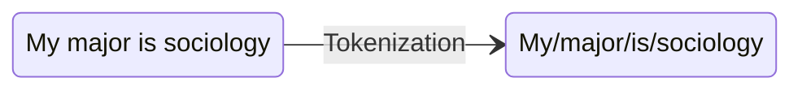

      

        
「良い」単語分散表現とは
          <ul>
            <li>単語とベクトルの対応関係</li>
            <li>ベクトルは単語の意味情報を表現することができる</li>
          </ul>
        

      

  

</v-click>

  

  
人文社会科学特別科目「計算的手法によりウェルビーイングを測る」06

---

  
自然言語処理の基礎

  <h2 class="claim wide">単語分散表現の作成方法：One-hot Encoding</h2>
  
語彙に含まれる全単語を列挙し、各単語を「その単語の位置だけ 1、他は全て 0」のベクトルで表す

  <v-clicks depth="2">

- 次の英語文を例に考える："I like NLP and AI"
- テキスト内の各単語から語彙表を作成し、それぞれの単語に一意のインデックスを割り当てる
- 各ベクトルでは、その単語に対応する位置だけが 1 となり、それ以外は 0 となる

| 単語   | One-hot Encoding        |
|--------|------------------------|
| I      | [1, 0, 0, 0, 0]        |
| like   | [0, 1, 0, 0, 0]        |
| NLP    | [0, 0, 1, 0, 0]        |
| and    | [0, 0, 0, 1, 0]        |
| AI     | [0, 0, 0, 0, 1]        |

</v-clicks>

  
人文社会科学特別科目「計算的手法によりウェルビーイングを測る」06

---

  
自然言語処理の基礎

  <h2 class="claim wide">単語分散表現の作成方法：One-hot Encoding</h2>
  
One-hot Encodingの問題点

  

    <ul class="body-list">
      <li v-click="1">計算の効率性上の問題
        <ul>
          <li v-click="2">高次元で疎なベクトルであるため、学習効率が低くなりやすい</li>
          <li v-click="2">語彙数が増えるほどベクトルが大きくなる</li>
        </ul>
      </li>
      <li v-click="3">意味関係を反映できない
        <ul>
          <li v-click="4">ベクトル間の距離や角度は、語の意味的な類似性や関係性を反映できない</li>
          <li v-click="4">語と語の意味関係は、ベクトル演算によって表現できない</li>
        </ul>
      </li>
    </ul>
    

      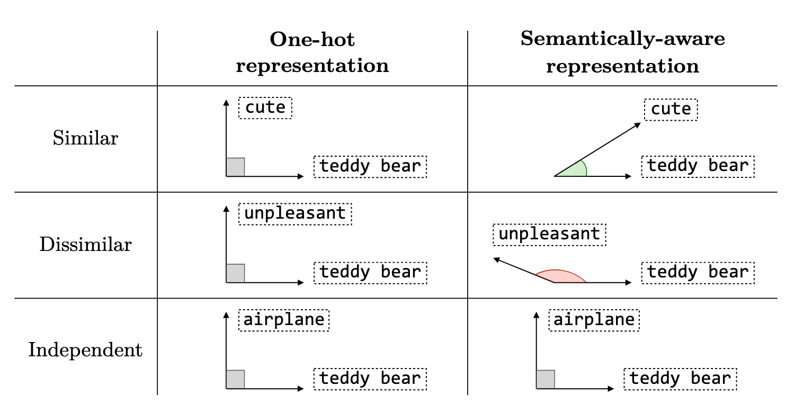
    

  

  
人文社会科学特別科目「計算的手法によりウェルビーイングを測る」06

---

  
自然言語処理の基礎

  <h2 class="claim wide">単語分散表現の作成方法：Word2Vec</h2>
  
Word2Vecでは、単語の意味をベクトル空間上の位置関係として表現できる

  

      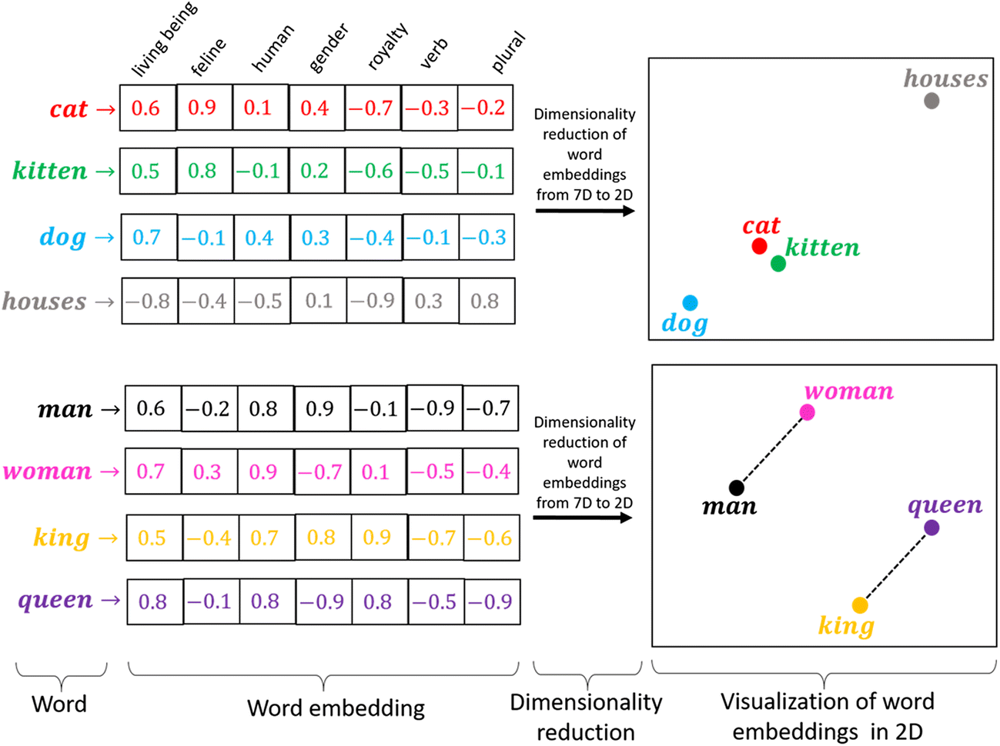
    

  
人文社会科学特別科目「計算的手法によりウェルビーイングを測る」06

---

  
自然言語処理の基礎

  <h2 class="claim wide">Word2Vecの原理</h2>
  
Word2Vecでは、分布仮説に基づいて単語の意味を学習するアルゴリズムが設計されている

  > "You shall know a word by the company it keeps（単語はその周囲の文脈語から理解できる）"

  

    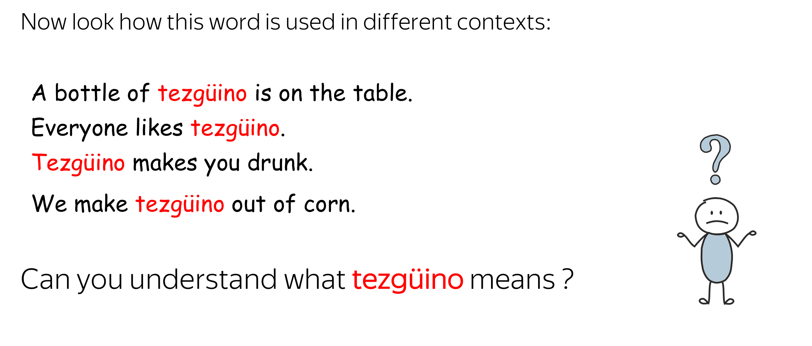
  

  

    
  

  

    
  

  

    
  

  
人文社会科学特別科目「計算的手法によりウェルビーイングを測る」06

---

  
自然言語処理の基礎

  <h2 class="claim wide">Word2Vecの原理</h2>
  
ニューラルネットワークを用いて単語の予測問題を解く学習の過程で、各単語に対応するベクトルが少しずつ更新され、結果として、似た文脈で使われる単語は、ベクトル空間上でも近い位置に配置される

  

    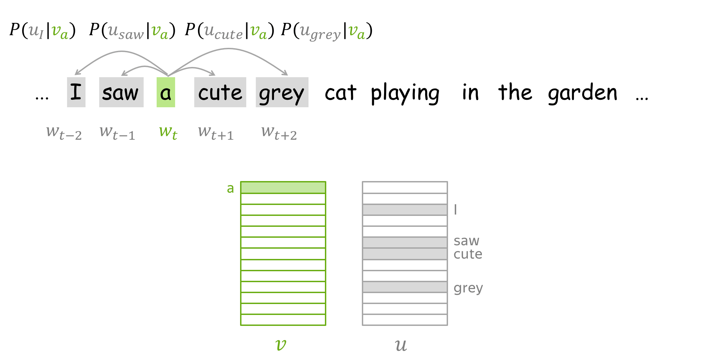
  

  

    
  

  

    
  

  

    
  

  
人文社会科学特別科目「計算的手法によりウェルビーイングを測る」06

---

  
Word2Vecの社会科学における応用

  <h2 class="claim wide">Word2Vecの社会科学研究における新たな手法としての応用可能性</h2>
  

  

    

      
01

      

        
Word2Vecによるテキスト解析

        
単語をベクトル表現に変換することで、テキストの意味的情報を捉え、様々な自然言語処理タスクに応用する

      

    

    

      
02

      

        
Word2Vecを用いた概念の理解

        

          <ul>
            <li>Word2Vecでは、複雑な概念を系統的に解析することができる</li>
            <ul>
                <li>単語をベクトルとして表現することで、ベクトル間の計算を通じて、意味構造や関係性を定量的に分析できる</li>
              </ul>
            <li>Word2Vecの単語ベクトル表現は学習コーパスに依存し、コーパス中に現れる単語の共起パターンと意味関係を反映する
              <ul>
                <li>異なる時代のコーパスは、その時代的背景における特定概念の意味的特質を反映できる</li>
              </ul>
            </li>
          </ul>
        

      

    

  

  
人文社会科学特別科目「計算的手法によりウェルビーイングを測る」02

---

  
Word2Vecの社会科学における応用

  <h2 class="claim wide">Word2Vecに基づく意味変化の解析 <a href="https://www.pnas.org/doi/10.1073/pnas.1720347115" target="_blank" rel="noopener noreferrer">(Garg et al., 2018)</a></h2>
  
単語分散表現を用いて、過去100年間のアメリカ社会におけるジェンダーおよび人種に関するステレオタイプの変化を定量的に分析した

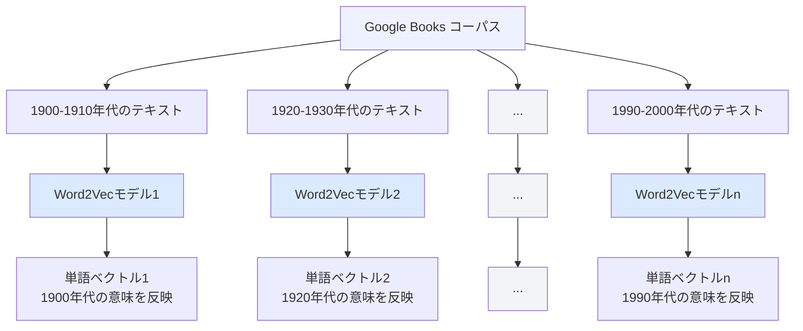

  
人文社会科学特別科目「計算的手法によりウェルビーイングを測る」03

---

  
Word2Vecの社会科学における応用

  <h2 class="claim wide">Word2Vecに基づく意味変化の解析 <a href="https://www.pnas.org/doi/10.1073/pnas.1720347115" target="_blank" rel="noopener noreferrer">(Garg et al., 2018)</a></h2>
  
単語分散表現を用いてステレオタイプを定量的に測定する

  <ul class="body-list">
    <li v-click="1">
      Relative Norm Distance = Σvm ∈ M ( ||vm - v1||2 - ||vm - v2||2 )
      <ul>
        <li>M: 参照対象語（例：職業名や形容詞）のベクトル集合</li>
        <li>vm: 集合 M に含まれる各参照対象語の単語ベクトル</li>
        <li>v1: 第1の集団（例：男性）の代表ベクトル</li>
        <li>v2: 第2の集団（例：女性）の代表ベクトル</li>
      </ul>
    </li>
    <li v-click="3">指標の意味
      <ul>
        <li>負の値は、参照対象語が第1の集団（男性）とより強く関連していることを示す</li>
        <li>正の値は、参照対象語が第2の集団（女性）とより強く関連していることを示す</li>
        <li><mark>絶対値は、いずれかの集団との関連の強さを表す</mark></li>
      </ul>
    </li>
  </ul>

  
人文社会科学特別科目「計算的手法によりウェルビーイングを測る」03

---

  
Word2Vecの社会科学における応用

  <h2 class="claim wide">Word2Vecに基づく意味変化の解析 <a href="https://www.pnas.org/doi/10.1073/pnas.1720347115" target="_blank" rel="noopener noreferrer">(Garg et al., 2018)</a></h2>
  
単語ベクトルの意味空間において、女性と男性は特定の職業と結びつきやすいのか？

  

    

      <input id="pnas-fig-zoom-1" class="zoom-check" type="checkbox" />
      <label for="pnas-fig-zoom-1" class="zoom-label">
        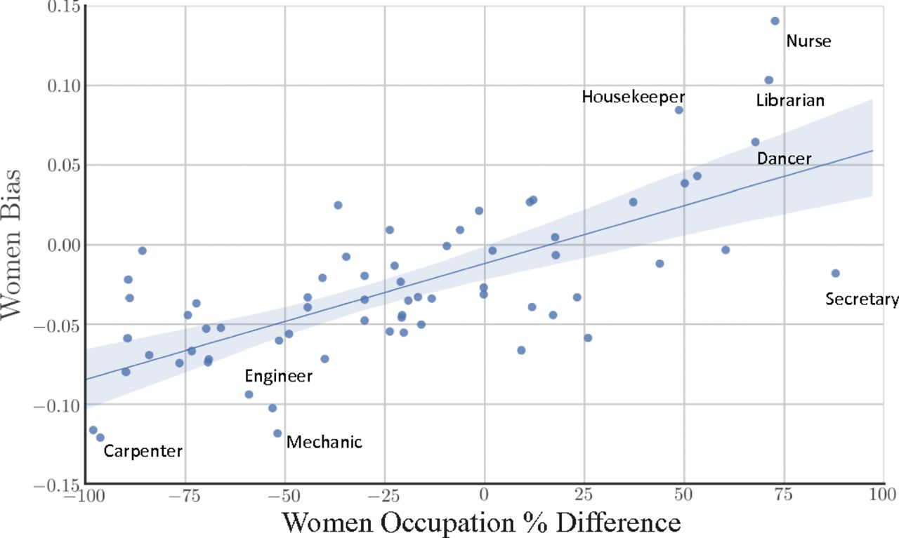
      </label>
      <ul class="body-list compact">
        <li>単語ベクトルに反映された職業に関するステレオタイプ傾向を、職業の性別比率と比較する</li>
      </ul>
    

    

      <input id="pnas-fig-zoom-2" class="zoom-check" type="checkbox" />
      <label for="pnas-fig-zoom-2" class="zoom-label">
        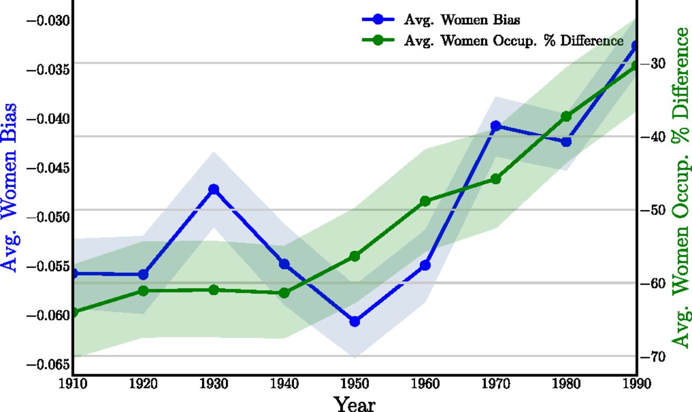
      </label>
      <ul class="body-list compact">
        <li>単語ベクトルに反映された職業に関するステレオタイプ傾向と、職業の性別比率の差の変化を比較する</li>
      </ul>
    

  

  
人文社会科学特別科目「計算的手法によりウェルビーイングを測る」03

---

  
Word2Vecの社会科学における応用

  <h2 class="claim wide">Word2Vecに基づく概念構造の解析 <a href="https://journals.sagepub.com/doi/full/10.1177/0003122419877135" target="_blank" rel="noopener noreferrer">(Kozlowski et al., 2019)</a></h2>
  
Word2Vecを用いて、抽象的な概念を構成する意味的要素を抽出し、概念内部の構成と関係を分析

  
「社会階層」の構成要素、関係と変化に注目

  

    

      
01

      

        
社会階層の多次元性

        

          <ul>
            <li>社会階層は、単一の指標によって捉えられるものではなく、所得、職業、教育達成、社会的地位などが相互に関連する複雑かつ多次元的な概念</li>
          </ul>
        

      

    

    

      
02

      

        
社会階層の概念変化

        
社会階層概念は、社会経済構造の変化に伴い、その捉え方が変容してきた

      

    

  

  
人文社会科学特別科目「計算的手法によりウェルビーイングを測る」03

---

  
Word2Vecの社会科学における応用

  <h2 class="claim wide">Word2Vecに基づく概念構造の解析 <a href="https://journals.sagepub.com/doi/full/10.1177/0003122419877135" target="_blank" rel="noopener noreferrer">(Kozlowski et al., 2019)</a></h2>
  
Word2Vecを用いて、抽象的な概念を構成する意味的要素を抽出し、概念内部の構成と関係を分析

  

    <ul class="body-list wide">
      <li v-click="1"><b>次元の構築</b>: 反対の意味をもつ語のペア集合について、単語ベクトル差の平均を計算する
        <ul>
          <li>「富裕」次元を構築する例: rich - poor、priceless - worthless などの語ペアのベクトル差を平均する</li>
        </ul>
      </li>
      <li v-click="2"><b>構成要素次元への語の投影</b>: 他の語のベクトルと次元ベクトルの余弦類似度を計算し、その語が特定の構成要素次元とどの程度関連しているかを測定する
        <ul>
          <li>ある語のベクトルと構成要素的次元ベクトルの余弦類似度が高いほど、両者の関係がより強いことを示す</li>
        </ul>
      </li>
    </ul>
    

      <input id="kozlowski-zoom" class="zoom-check" type="checkbox" />
      <label for="kozlowski-zoom" class="zoom-label">
        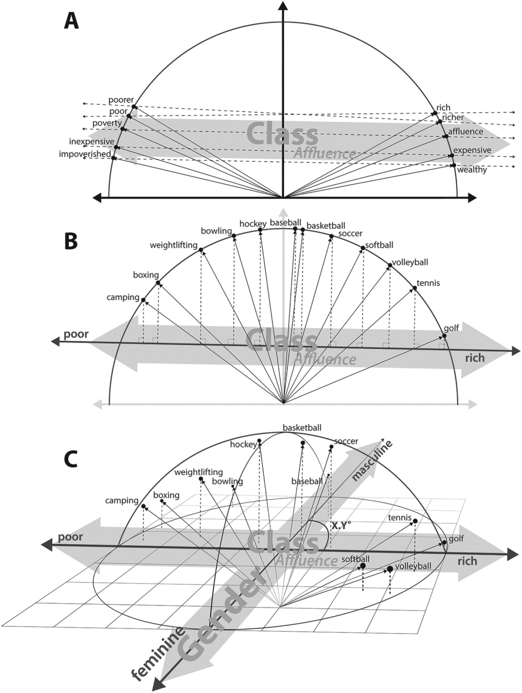
      </label>
    

  

  
人文社会科学特別科目「計算的手法によりウェルビーイングを測る」03

---

  
Word2Vecの社会科学における応用

  <h2 class="claim wide">Word2Vecに基づく概念構造の解析 <a href="https://journals.sagepub.com/doi/full/10.1177/0003122419877135" target="_blank" rel="noopener noreferrer">(Kozlowski et al., 2019)</a></h2>
  
異なる時代のコーパスを用いて学習したモデルの計算結果を比較し、構成要素次元の関係変化を解析

  

    <ul class="body-list wide">
      <li v-click="1">異なる時期のコーパスで学習した単語ベクトルモデルとベクトル演算に基づき、次元間の関係がどのように変化してきたかを理解する
        <ul>
          <li><em>「富裕」次元は、20世紀初頭には「文化的教養」や「地位」の次元とより強く結びついていた</em></li>
          <li><em>「富裕」次元と「教育」次元との関連は、次第に強まっている</em></li>
        </ul>
      </li>
    </ul>
    

      <input id="kozlowski-zoom-2" class="zoom-check" type="checkbox" />
      <label for="kozlowski-zoom-2" class="zoom-label">
        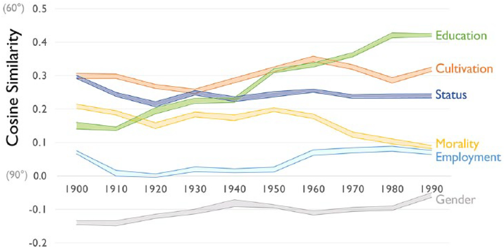
      </label>
    

  

  
人文社会科学特別科目「計算的手法によりウェルビーイングを測る」03

---

  
ウェルビーイングの解析

  <h2 class="claim wide">Word2Vecによるウェルビーイングの解析</h2>
  
<a href="https://journals.sagepub.com/doi/full/10.1177/0003122419877135" target="_blank" rel="noopener noreferrer">Kozlowski et al (2019)</a>の手法を、ウェルビーイングの構成要素、関係と変化の解析に応用

  

    

      
問題関心

      

        
ウェルビーイングの多次元性

        

          <ul>
            <li>「ウェルビーイング」はどのような要素によって構成されるのか</li>
          </ul>
        

        
時代・社会的背景に伴うウェルビーイングの変化

        

          <ul>
            <li>異なる時代・社会的背景において、人々のウェルビーイングに対する認知がどのように変化するのか</li>
          </ul>
        

      

    

    

      
データと方法

      

        
日本語の大規模コーパスを用いたWord2Vecモデルの学習と応用

        

          <ul>
            <li><a href="https://lab.ndl.go.jp/ngramviewer/" target="_blank" rel="noopener noreferrer">国立国会図書館</a>が提供する、1910年代〜1990年代に出版された雑誌・書籍・官報を含むコーパスを使用</li>
            <li>年ごとに分割し、各時間帯に対応する単語ベクトルモデルを訓練する</li>
          </ul>
        

      

    

  

  
人文社会科学特別科目「計算的手法によりウェルビーイングを測る」03

---

  
ウェルビーイングの解析

  <h2 class="claim wide">Word2Vecによるウェルビーイングの解析</h2>

  

    

      
01

      
Word2Vecの学習

      
年ごとに分割し、各時間帯に対応する単語ベクトルモデルを訓練する

      
各年の単語ベクトルは、該当する時代の単語の意味をうまく表現できることが期待される

    

    
→

    

      
02

      
意味軸の構築

      
対義語のペアを用意し、ペア単語ベクトルの計算で埋め込み空間における意味軸を特定する

      
例えば、V(富)-V(貧困)という単語ベクトルの計算で「裕福」の意味軸を特定する

      
各意味軸は複数のペア単語を用いた平均の結果を採用する

    

    
→

    

      
03

      
意味軸の計算による構造と関係への理解

      
意味軸同士のベクトル類似性が高いほど、該当する要素間での関連が強いと言える

      
「幸福」軸と他の構成要素の軸との関係および変化に着目

    

  

  
人文社会科学特別科目「計算的手法によりウェルビーイングを測る」05

---

  
ウェルビーイングの解析

  <h2 class="claim wide">日本におけるウェルビーイングの構成と変化</h2>
  
異なる年のWord2Vecモデルを用いて意味軸間の計算を行い、その結果を年ごとに集計する

  

    <ul class="body-list wide">
      <li v-click="1">ウェルビーイングに関連する要素の特定
        <ul>
          <li><em>物質・身体的ウェルビーイング：「Affluence」「Health」「Play」</em></li>
          <li><em>社会的ウェルビーイング：「Affiliation」</em></li>
          <li><em>制度的ウェルビーイング：「Peace」「Democracy」</em></li>
        </ul>
      </li>
      <li v-click="2">ウェルビーイングに関連する各要素の変化
        <ul>
          <li><em>長年にわたって安定している構成要素：「Health」</em></li>
          <li><em>時代とともに変化した構成要素：「Play」「Democracy」</em></li>
        </ul>
      </li>
    </ul>
    

      <input id="similarity-dynamics-zoom" class="zoom-check" type="checkbox" />
      <label for="similarity-dynamics-zoom" class="zoom-label">
        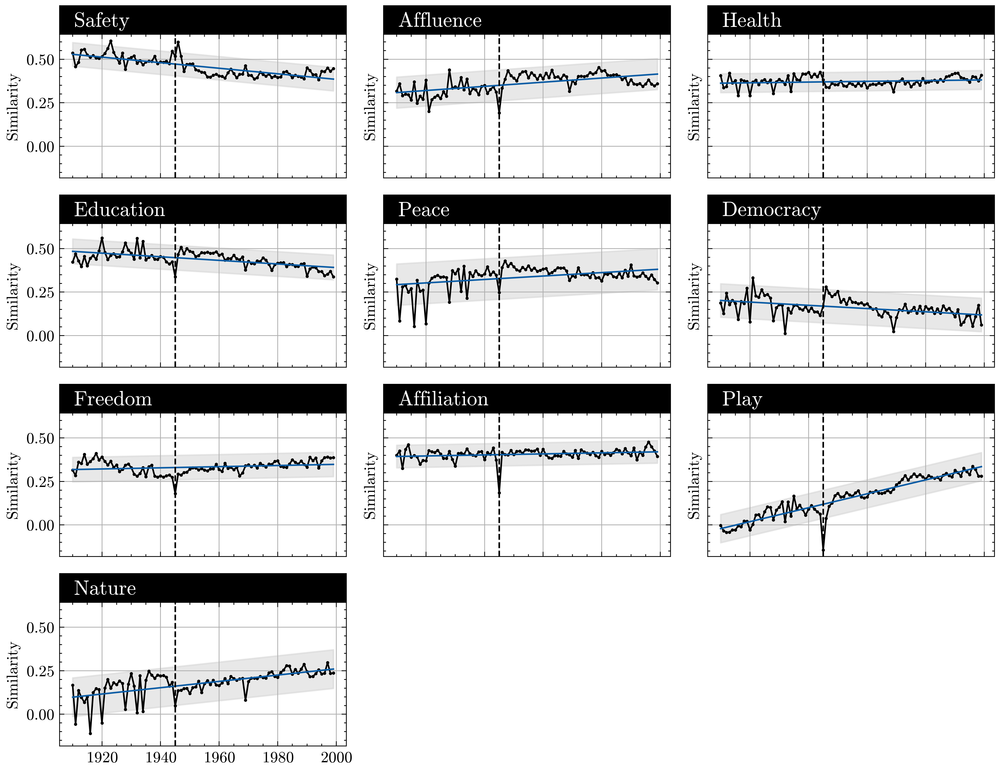
      </label>
    

  

  
人文社会科学特別科目「計算的手法によりウェルビーイングを測る」03

---

  
ウェルビーイングの解析

  <h2 class="claim wide">日本におけるウェルビーイングの構成と変化</h2>
  
戦後の変化傾向に注目

  

    <ul class="body-list wide">
      <li v-click="1">「Play」とウェルビーイングの関連が強まった
        <ul>
          <li><em>余暇・娯楽・趣味・スポーツ・旅行などが、単なる休息ではなく、生活の質や自己実現を支える重要な要素として認識される</em></li>
        </ul>
      </li>
      <li v-click="2">「Education」とウェルビーイングの関連が弱まった
        <ul>
          <li><em>教育は、社会移動や安定した職業への主要な経路であり、幸福や豊かな生活とも強く結びついていたが、教育拡大と高学歴化が進むにつれて、教育はかつてのように社会移動や幸福達成をもたらす明確な手段としての影響力を弱めていった</em></li>
        </ul>
      </li>
    </ul>
    

      <input id="similarity-dynamics-zoom" class="zoom-check" type="checkbox" />
      <label for="similarity-dynamics-zoom" class="zoom-label">
        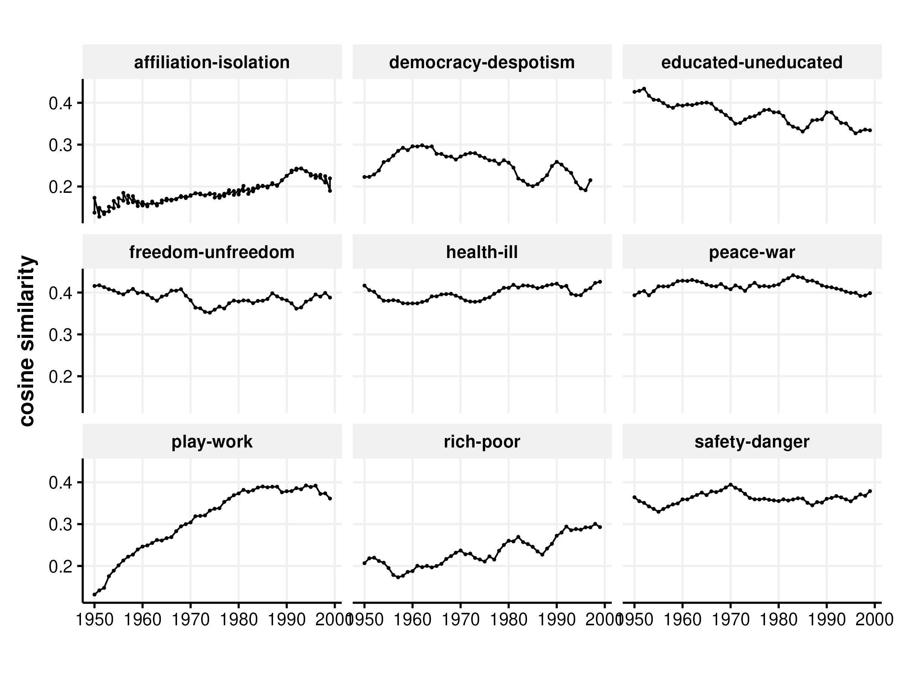
      </label>
    

  

  
人文社会科学特別科目「計算的手法によりウェルビーイングを測る」03

---

  
まとめ

  <h2 class="claim wide">計算的手法によるウェルビーイングの解析方法を解説した</h2>

  

    

      
示唆

      
従来の手法では考察することが難しい構造関係や時代的変化について、新たな知見を提供した

    

    

      
方法の拡張性

      
複雑な概念を理解するための手法として、多様な分野の研究テーマに応用することが可能である

    

  

  
人文社会科学特別科目「計算的手法によりウェルビーイングを測る」08

