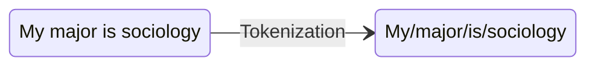
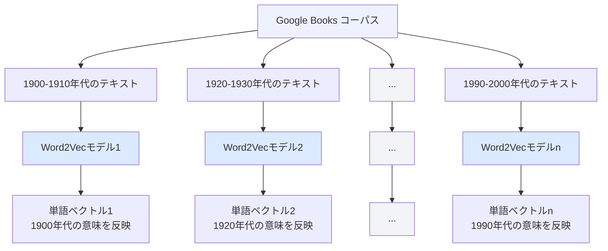

  
  
人文社会科学特別科目

  

    <h1 class="claim wide" style="font-size:58px; color:#000000; font-weight:800;">計算的手法によりウェルビーイングを測る</h1>
    

    
東北大学文学研究科　計算人文社会学

    
呂沢宇

  

  
 
    2026年6月25日
  

<!--
Opening note:
Introduce the lecture question and why well-being matters for today's audience.
-->

---

  
イントロ

  <h2 class="claim wide">ウェルビーイングとは</h2>
  
ウェルビーイングは、多様な構成要素や側面から成り立つ

  

    

      <h3>精神的ウェルビーイング</h3>
      <ul>
        <li>主観的幸福感（SWB）</li>
        <li>人生の目的</li>
      </ul>
    

    

      <h3>物質・身体的ウェルビーイング</h3>
      <ul>
        <li>経済的豊かさ</li>
        <li>身体的健康</li>
      </ul>
    

  

  

    

      <h3>社会的ウェルビーイング</h3>
      <ul>
        <li>社会的つながり</li>
        <li>人間関係</li>
      </ul>
    

    

      <h3>制度的ウェルビーイング</h3>
      <ul>
        <li>平和</li>
        <li>民主主義・公正</li>
      </ul>
    

  

  
人文社会科学特別科目「計算的手法によりウェルビーイングを測る」03

<!--
まず、「ウェルビーイング」という言葉についておさらいしましょう。

ウェルビーイングとは、単に「幸せ」を意味するのではなく、人間の生活全体の充実した状態を指す、非常に幅広い概念です。日本語では「よく在ること」や「幸福」と訳されることもありますが、英語のwell-beingの方が、その多面的な性質をよく表しています。

【クリック1】まず一つ目は、「精神的ウェルビーイング」です。自分の人生に満足しているか、あるいは喜びや充実感を日常的に感じているかという「主観的幸福感（SWB）」と、自分の存在に意味や目的があると感じられるかという「人生の目的」が含まれます。

【クリック2】次は「物質・身体的ウェルビーイング」です。経済的な豊かさや、身体的な健康状態がここに含まれます。生活の物質的な基盤が整っているかという側面です。

【クリック3】三つ目は「社会的ウェルビーイング」です。家族や友人、地域コミュニティとのつながり、良好な人間関係を持てているかどうかという側面です。孤独感の少なさや社会への帰属感もここに含まれます。

【クリック4】最後は「制度的ウェルビーイング」です。自分が暮らす社会が平和であること、民主主義や公正が機能していること、つまり社会制度の質がウェルビーイングに影響するという視点です。

このように、ウェルビーイングは「精神」「物質・身体」「社会」「制度」という四つの側面から成り立ちます。これらは互いに独立しているのではなく、相互に関連しています。たとえば、経済的に安定していても孤独であれば、ウェルビーイングは高いとは言えません。

では、こうした多面的なウェルビーイングを、実際にどのように測定するのでしょうか。
-->

---

  
イントロ

  <h2 class="claim wide">ウェルビーイングの測定</h2>
  
ウェルビーイングは多面的かつ主観的な概念であるため、多様な尺度で測定する必要がある

  

    
ウェルビーイングの構成側面

    
代表的な尺度・指標

    
主観的ウェルビーイング

    
生活満足度尺度（SWLS）、Cantril Ladder

    
精神的ウェルビーイング

    
PANAS、日々のポジティブ・ネガティブ感情

    
社会的ウェルビーイング

    
社会的支援、孤独感尺度、地域への信頼

    
身体的ウェルビーイング

    
主観的健康感、SF-12 / SF-36、睡眠・運動指標

  

  
人文社会科学特別科目「計算的手法によりウェルビーイングを測る」04

<!--
では、こうした多面的なウェルビーイングを、実際にどのように測定するのでしょうか。

ウェルビーイング研究では、主にアンケートや調査票を用いた「自己申告式」の測定方法が使われてきました。ここでは代表的な尺度をいくつか紹介します。

【クリック1】まず「主観的ウェルビーイング」の測定です。最もよく使われるのが「生活満足度尺度（SWLS）」です。SWLSは「自分の人生に満足している」といった項目に1〜7点で評価する、5項目の質問票です。もう一つの「Cantril Ladder」は、「ハシゴの一番上が最高の生活、一番下が最悪の生活だとすると、今あなたは何段目にいますか？」と0〜10点で評価する方法で、国際比較にもよく用いられます。

【クリック2】「精神的ウェルビーイング」の測定には「PANAS」がよく使われます。PANASは「ポジティブ感情・ネガティブ感情尺度」の略で、「今週、どれくらい活気を感じましたか？」「不安を感じましたか？」といった日常的な感情体験を問う質問票です。

【クリック3】「社会的ウェルビーイング」の測定では、困ったときに助けてくれる人がいるかという「社会的支援」、孤独感の程度を問う「孤独感尺度」、地域社会への信頼感などが指標として使われます。

【クリック4】「身体的ウェルビーイング」については、「自分の健康状態は良いと思いますか？」という「主観的健康感」のほか、「SF-12」「SF-36」という健康関連QOL（生活の質）尺度も広く用いられています。睡眠時間や運動頻度といった行動指標が組み合わされることもあります。

このように、ウェルビーイングの各側面ごとに様々な尺度が開発されています。しかし、こうした従来の測定方法には、いくつかの重要な問題点があります。次のスライドで確認しましょう。
-->

---

  
イントロ

  <h2 class="claim wide">ウェルビーイング測定における問題点</h2>
  
既存研究で多く用いられる自己申告形式の測定方法では問題点がある

  

    

      

        
自己申告には回答バイアスが生じやすい<small>社会的望ましさ、記憶の誤差、質問文の解釈差に影響される</small>

      

    

    

      

        
長期的な変化を捉えにくい<small>一時点の回答では、ライフコースや歴史上の変化が見えにくい</small>

      

    

    

      

        
研究者が事前に指定したカテゴリに限定される<small>回答者自身の言葉や予期しないウェルビーイングの側面を取りこぼす可能性がある</small>

      

    

  

  
人文社会科学特別科目「計算的手法によりウェルビーイングを測る」06

<!--
先ほど紹介したような自己申告式の測定方法は、ウェルビーイング研究で広く使われてきましたが、いくつかの重要な限界があります。

【クリック1】一つ目は「回答バイアス」の問題です。アンケートに回答する際、人は必ずしも自分の正直な気持ちを答えているわけではありません。たとえば「社会的望ましさバイアス」として、「幸せですか？」と聞かれたとき、実際よりも幸せに見せようとする傾向があります。また、過去の出来事についての記憶は曖昧になりやすく、「先週は楽しかったですか？」という問いに正確に答えるのは難しい。さらに、同じ質問文でも、人によって解釈が異なる場合があります。

【クリック2】二つ目は「長期的変化を捉えにくい」という問題です。アンケート調査は基本的に「今この瞬間」の状態を測るものです。しかし、人生全体の幸福感の変化や、社会・文化的背景の変化に伴うウェルビーイングの推移を追うためには、何十年にもわたる継続的なデータが必要です。また、明治時代の人と現代の人が「幸せ」という言葉に込める意味は、必ずしも同じではありません。このような歴史的・文化的変化は、一時点の調査では捉えることができません。

【クリック3】三つ目は「カテゴリの制約」の問題です。アンケートは、研究者がある程度重要だと考えた項目しか質問できません。つまり、回答者が実際に感じているウェルビーイングの重要な側面でも、研究者が想定していなければ質問票には入りません。たとえば、「ペットとの関係」や「推し活」のような現代的な幸福の源泉は、従来の尺度には含まれていない可能性があります。

こうした限界を乗り越えるための新たなアプローチとして、計算的手法が注目されています。次のスライドで、この講義全体のテーマである「計算的手法によるウェルビーイングの測定」について紹介します。
-->

---

  
イントロ

  <h2 class="claim wide">計算的手法によるウェルビーイングの測定</h2>
  
計算人文社会科学は、社会や文化、言語、歴史、人間行動に関する問題を、デジタルデータや計算モデルを用いて分析する

  <ul class="body-list">
    <li v-click="1">計算的手法によるウェルビーイングの測定方法と研究事例
      <ul>
        <li>大規模データと自然言語処理技術を用いてウェルビーイングを測定する</li>
        <li>計算的手法の適用により、ウェルビーイングの理解と分析に新たな視点を提示し、既存研究の知見を検証・補完する</li>
      </ul>
    </li>
    <li v-click="2">講義の目的と達成目標
      <ul>
        <li>計算人文社会科学の研究パラダイムに対する基本的な理解</li>
        <li>自然言語処理技術を用いて複雑な概念を測定する方法を理解し、その応用可能性を把握する</li>
      </ul>
    </li>
  </ul>

  
人文社会科学特別科目「計算的手法によりウェルビーイングを測る」06

<!--
ここまで、ウェルビーイングの概念と従来の測定方法、その限界を確認してきました。

本講義が扱うのは「計算人文社会科学」という研究分野です。これは、人文・社会科学が伝統的に扱ってきた問い、つまり「社会とは何か」「文化はどのように変化するか」「人間の幸福とは何か」といったテーマを、デジタルデータや計算モデルを使って分析する新しい学問分野です。

【クリック1】今回の講義では、特に「自然言語処理（NLP）」という計算技術に注目します。SNSの投稿、新聞記事、書籍など、大量のテキストデータをコンピュータで分析することで、アンケートでは見えなかったウェルビーイングの側面を探ることができます。また、計算的手法は既存の研究成果と対立するものではなく、それを補完・検証する役割を担います。計算によって見えてきたパターンが、従来の社会科学的知見と一致するかどうかを確かめることも重要な研究課題です。

【クリック2】この講義の達成目標は二つあります。一つは「計算人文社会科学」という研究パラダイムの基本的な発想を理解すること。もう一つは、自然言語処理技術を使って「幸福」「階層」「ステレオタイプ」のような抽象的・複雑な概念を定量的に測定する方法を理解し、その可能性と限界を把握することです。

では、本題に入る前に、計算的手法の中核となる「自然言語処理」の基礎について確認しましょう。
-->

---

  
自然言語処理の基礎

  <h2 class="claim wide">自然言語処理の基本概念</h2>
  
自然言語処理は、人間が日常的に使っている自然言語をコンピュータに処理させる技術

  <ul class="body-list">
    <li v-click="1">言語は人間にとって自然なものであっても、コンピュータにとっては処理が難しい
      <ul>
        <li>自然言語は大量の非構造化データとして現れる</li>
        <li>意味の解釈には、常に明確な規則があるわけではない</li>
      </ul>
    </li>
  </ul>

  <ul class="body-list">
    <li v-click="2">言語をコンピュータが扱える数値表現に変換する必要がある
      <ul>
        <li>テキストを数値化することで、深層学習モデルに入力し、多様な自然言語処理タスクを実装することができる</li>
        <li>一般的には、ベクトルで表現することが多い</li>
      </ul>
    </li>
    <li v-click="2">しかし、言語の数値化は簡単なことではない
    </li>
  </ul>

  
人文社会科学特別科目「計算的手法によりウェルビーイングを測る」06

<!--
では、計算的手法の核となる「自然言語処理」について解説します。

自然言語処理（NLP: Natural Language Processing）とは、人間が日常会話や文章で使う言語、つまり「自然言語」を、コンピュータに理解・処理させるための技術の総称です。

【クリック1】言語は人間にとって非常に自然なものです。皆さんは今、この説明を聞いて意味を理解していますが、これをコンピュータにやらせようとすると途端に難しくなります。

理由は二つあります。一つは、言語が「非構造化データ」だということです。数字や表のように整然と並んでいるわけではなく、文章は文脈、文体、語順など様々な要素が絡み合っています。もう一つは、意味の曖昧さです。たとえば「彼は橋の上で踊った」という文の「橋」が何を指すのかは文脈によります。「良い先生」と言っても、「教え方が上手」なのか「人柄が良い」のかは文脈に依存します。このような曖昧さに対処する明確なルールを作ることは非常に困難です。

【クリック2】そこで、コンピュータが言語を扱えるようにするためには、テキストを数値に変換する必要があります。コンピュータが得意なのは数値計算ですから、言語を数値のかたち、具体的には「ベクトル」として表現することで、機械学習や深層学習のモデルに入力できるようになります。

ただし、これは決して簡単ではありません。単純に数値を割り当てるだけでは、単語の「意味」や「関係性」を表現できないからです。では、どのようにして意味を持った数値表現を作るのでしょうか。次のスライドで確認しましょう。
-->

---

  
自然言語処理の基礎

  <h2 class="claim wide">単語分散表現</h2>
  
単語分散表現とは、単語の意味を数値ベクトルとして表現する方法である

  <ul class="body-list">
    <li v-click="1">テキストを、より小さい単位である単語に分割してから数値化の方法を検討
      <ul>
        <li>単語のベクトル表現を組み合わせて、テキスト全体の表現を構築することができる</li>
      </ul>
    </li>
  </ul>

<v-click>

      

        
「良い」単語分散表現とは
          <ul>
            <li>単語とベクトルの対応関係</li>
            <li>ベクトルは単語の意味情報を表現することができる</li>
          </ul>
        

      

  

</v-click>

  

  
人文社会科学特別科目「計算的手法によりウェルビーイングを測る」06

<!--
先ほど、言語を数値に変換する必要があると説明しました。実際どのようにするのでしょうか。

まず考えるのは、テキスト全体を一度に数値化しようとするのではなく、より小さな単位に分解するアプローチです。

【クリック1】その最も基本的な単位が「単語」です。文章をまず単語に分割する操作を「トークン化（Tokenization）」と呼びます。図に示したように、"My major is sociology" という文を "My / major / is / sociology" という4つの単語に分割します。これにより、各単語を個別にベクトルとして表現し、それらを組み合わせることで文章全体の数値表現を作ることができます。

では、「良い単語ベクトル」とはどのようなものでしょうか？二つの条件があります。一つは「単語とベクトルが一対一に対応していること」、もう一つは「そのベクトルが単語の意味情報を反映していること」です。

特に重要なのは二番目の条件です。たとえば「猫」と「犬」は意味的に近い単語ですから、それぞれのベクトルも近い位置にあってほしい。「猫」と「自動車」は意味的に遠いので、ベクトルも離れているべきです。このように、意味的な近さ・遠さがベクトル間の距離として表現できることが、良い単語ベクトルの条件です。

では、具体的にどのような方法で単語をベクトルに変換するのでしょうか。まずは最もシンプルな方法から見ていきましょう。
-->

---

  
自然言語処理の基礎

  <h2 class="claim wide">単語分散表現の作成方法：One-hot Encoding</h2>
  
語彙に含まれる全単語を列挙し、各単語を「その単語の位置だけ 1、他は全て 0」のベクトルで表す

  <v-clicks depth="2">

- 次の英語文を例に考える："I like NLP and AI"
- テキスト内の各単語から語彙表を作成し、それぞれの単語に一意のインデックスを割り当てる
- 各ベクトルでは、その単語に対応する位置だけが 1 となり、それ以外は 0 となる

| 単語   | One-hot Encoding        |
|--------|------------------------|
| I      | [1, 0, 0, 0, 0]        |
| like   | [0, 1, 0, 0, 0]        |
| NLP    | [0, 0, 1, 0, 0]        |
| and    | [0, 0, 0, 1, 0]        |
| AI     | [0, 0, 0, 0, 1]        |

</v-clicks>

  
人文社会科学特別科目「計算的手法によりウェルビーイングを測る」06

<!--
まず最もシンプルな方法として「One-hot Encoding」を紹介します。

One-hot Encodingとは、テキスト中に登場する全ての単語をリストアップし、各単語を「自分に対応する位置だけ1、それ以外は全て0」というベクトルで表現する方法です。

具体例で見てみましょう。"I like NLP and AI" という5単語からなる文を考えます。

【クリック1】まずこの5単語から語彙表を作ります。それぞれに番号（インデックス）を割り当てます：I=1番、like=2番、NLP=3番、and=4番、AI=5番、という具合です。

次に、各単語をベクトルとして表現します。語彙が5単語なので、全てのベクトルは5次元になります。「I」は1番目の単語なので [1, 0, 0, 0, 0]、「like」は2番目なので [0, 1, 0, 0, 0] となります。スライドの表がそれを示しています。

この方法のポイントは、ある単語を表すベクトルは「その単語の番号の位置だけが1で、残り全てが0」という非常にシンプルな構造を持つことです。

One-hot Encodingは実装が簡単で直感的ですが、重大な問題があります。次のスライドで確認しましょう。
-->

---

  
自然言語処理の基礎

  <h2 class="claim wide">単語分散表現の作成方法：One-hot Encoding</h2>
  
One-hot Encodingの問題点

  

    <ul class="body-list">
      <li v-click="1">計算の効率性上の問題
        <ul>
          <li v-click="2">高次元で疎なベクトルであるため、学習効率が低くなりやすい</li>
          <li v-click="2">語彙数が増えるほどベクトルが大きくなる</li>
        </ul>
      </li>
      <li v-click="3">意味関係を反映できない
        <ul>
          <li v-click="4">ベクトル間の距離や角度は、語の意味的な類似性や関係性を反映できない</li>
          <li v-click="4">語と語の意味関係は、ベクトル演算によって表現できない</li>
        </ul>
      </li>
    </ul>
    

      
    

  

  
人文社会科学特別科目「計算的手法によりウェルビーイングを測る」06

<!--
One-hot Encodingは直感的でわかりやすい方法ですが、実用上は二つの深刻な問題があります。

【クリック1・2】一つ目は「計算効率の問題」です。現実の自然言語処理では、語彙として何万、何十万という単語を扱います。One-hot Encodingでは、語彙に単語が10万個あれば、各単語のベクトルも10万次元になります。しかも、その10万次元のうち1か所だけが1で、残り99,999か所は全て0という、非常に「スカスカ」なベクトルです。このような「高次元で疎なベクトル」は、計算量が大きくなり、学習効率が著しく低下します。

【クリック3・4・5】二つ目は、より本質的な問題です。One-hot Encodingでは、単語間の意味的な関係を全く表現できません。たとえば「犬」と「猫」は意味的に近い単語ですが、それぞれのOne-hotベクトルを比べると、全次元で0か1かが異なり、数学的な距離は全ての単語ペアで同じになってしまいます。つまり「犬と猫の距離」も「犬と自動車の距離」も数学的には同じなのです。

右側の図がこの問題を視覚的に示しています。One-hot Encodingのベクトル空間では、全ての単語が互いに直交しており、どの単語ペアも同じ距離にあります。これでは「意味的に近い単語は近くにある」という理想のベクトル空間を実現できません。

この問題を解決したのが「Word2Vec」です。次のスライドで紹介します。
-->

---

  
自然言語処理の基礎

  <h2 class="claim wide">単語分散表現の作成方法：Word2Vec</h2>
  
Word2Vecでは、単語の意味をベクトル空間上の位置関係として表現できる

  

      
    

  
人文社会科学特別科目「計算的手法によりウェルビーイングを測る」06

<!--
One-hot Encodingの問題を克服したのが「Word2Vec」です。

Word2Vec（ワード・トゥ・ベック）は、2013年にGoogleの研究者Mikolovらによって発表された単語ベクトル化の手法です。

スライドの図を見てください。Word2Vecでは、単語をベクトル空間上の点として表現します。この図の中で、「猫（cat）」「犬（dog）」「ハムスター（hamster）」といった動物に関する単語は空間上で互いに近い位置にあり、「王（king）」「女王（queen）」「男性（man）」「女性（woman）」といった単語は別の領域でまとまっています。

さらに注目すべき点は、Word2Vecのベクトルでは「ベクトル演算」で意味的な関係を表現できることです。有名な例として、「King − Man + Woman ≈ Queen」という計算が成り立ちます。「王」から「男性」の要素を引いて「女性」を加えると「女王」に近いベクトルになる、ということです。

このように、Word2Vecは単語の意味的な近さや関係性をベクトル空間上で表現できるという点でOne-hot Encodingとは根本的に異なります。では、Word2Vecはどのようにして、こうした意味を持ったベクトルを作るのでしょうか。次のスライドでその原理を見てみましょう。
-->

---

  
自然言語処理の基礎

  <h2 class="claim wide">Word2Vecの原理</h2>
  
Word2Vecでは、分布仮説に基づいて単語の意味を学習するアルゴリズムが設計されている

  > "You shall know a word by the company it keeps（単語はその周囲の文脈語から理解できる）"

  

    
  

  

    
  

  

    
  

  

    
  

  
人文社会科学特別科目「計算的手法によりウェルビーイングを測る」06

<!--
Word2Vecはなぜ意味を持ったベクトルを学習できるのでしょうか。その鍵となるのが「分布仮説」という言語学の考え方です。

スライドに引用した言葉を見てください。「You shall know a word by the company it keeps」——「単語はその周囲の文脈語から理解できる」という意味です。これはイギリスの言語学者J.R.Firthが1957年に述べた言葉で、Word2Vecの設計思想の根幹をなしています。

【クリック1〜4】図はこの考え方を「tezguino」という聞き慣れない単語を例にして示しています。みなさんはこの単語を知らないかもしれませんが、この単語が実際にどんな文脈で使われているかを見ると、意味が推測できます。

「tezguino is made from corn」「people drink tezguino at parties」「tezguino causes intoxication」——こうした文脈語を見ると、tezguinoはトウモロコシから作られるアルコール飲料の一種だとわかります。実際にこれはメキシコ先住民の発酵酒です。

つまり、ある単語の意味は、その単語が「どんな単語と一緒に現れるか」によって定まるのです。Word2Vecはこの分布仮説に基づき、大量のテキストデータから「どの単語がどの文脈で現れやすいか」を学習することで、意味を反映したベクトルを作ります。

では、具体的な学習の仕組みを次のスライドで見てみましょう。
-->

---

  
自然言語処理の基礎

  <h2 class="claim wide">Word2Vecの原理</h2>
  
ニューラルネットワークを用いて単語の予測問題を解く学習の過程で、各単語に対応するベクトルが少しずつ更新され、結果として、似た文脈で使われる単語は、ベクトル空間上でも近い位置に配置される

  

    
  

  

    
  

  

    
  

  

    
  

  
人文社会科学特別科目「計算的手法によりウェルビーイングを測る」06

<!--
では、Word2Vecが実際にどのように単語ベクトルを学習するのかを見ていきましょう。やや技術的な内容ですが、イメージをつかんでいただければ十分です。

【クリック1】まず重要な概念が「スライディングウィンドウ」です。大量のテキストデータの中を、一定の幅の「窓」がスライドしながら移動していきます。この窓の中央にある単語を「ターゲット語」、その周囲にある単語を「文脈語」と呼びます。たとえばウィンドウ幅が2の場合、"I like NLP and AI" という文で "NLP" がターゲット語なら、"I"・"like"・"and"・"AI" が文脈語となります。

【クリック2】次に、このターゲット語と文脈語のペアを使って学習タスクを設定します。Skip-gramという方式では「この単語（ターゲット語）が与えられたとき、周囲にどんな単語（文脈語）が現れるか？」を予測するタスクを解きます。ニューラルネットワークはこの予測を繰り返し行い、正しく予測できるようベクトルを少しずつ更新していきます。

【クリック3】学習の過程で、似た文脈に現れる単語のベクトルは互いに引き寄せられ、異なる文脈に現れる単語のベクトルは離れていきます。損失関数はこの「引き合いと反発」を数式で表したものです。

【クリック4】最終的に学習が収束すると、ニューラルネットワークの「埋め込み層」に格納されているベクトルが、各単語の分散表現となります。数百万から数十億の文から学習することで、このベクトルは単語の意味的関係を豊かに反映するようになります。

これがWord2Vecの基本的な仕組みです。次のセクションでは、このWord2Vecを社会科学研究にどのように応用できるかを見ていきましょう。
-->

---

  
Word2Vecの社会科学における応用

  <h2 class="claim wide">Word2Vecの社会科学研究における新たな手法としての応用可能性</h2>
  

  

    

      
01

      

        
Word2Vecによるテキスト解析

        
単語をベクトル表現に変換することで、テキストの意味的情報を捉え、様々な自然言語処理タスクに応用する

      

    

    

      
02

      

        
Word2Vecを用いた概念の理解

        

          <ul>
            <li>Word2Vecでは、複雑な概念を系統的に解析することができる</li>
            <ul>
                <li>単語をベクトルとして表現することで、ベクトル間の計算を通じて、意味構造や関係性を定量的に分析できる</li>
              </ul>
            <li>Word2Vecの単語ベクトル表現は学習コーパスに依存し、コーパス中に現れる単語の共起パターンと意味関係を反映する
              <ul>
                <li>異なる時代のコーパスは、その時代的背景における特定概念の意味的特質を反映できる</li>
              </ul>
            </li>
          </ul>
        

      

    

  

  
人文社会科学特別科目「計算的手法によりウェルビーイングを測る」02

<!--
ここからは、Word2Vecを社会科学研究に応用する可能性について考えていきます。

【クリック1】まず基本的な応用として、大量のテキストデータをWord2Vecで分析することで、テキスト中の意味的情報を定量的に捉えることができます。感情分析、トピック分類、類似文書検索など、様々なタスクに利用できます。

【クリック2】より重要なのは「概念の理解」への応用です。社会科学では「幸福」「平等」「階層」といった抽象的な概念を扱います。これらをWord2Vecのベクトルとして表現することで、従来の質的研究や尺度では難しかった定量的な分析が可能になります。

たとえば「幸福」という単語のベクトルと、「健康」「富」「友情」などのベクトルを比較することで、幸福がどのような概念と意味的に近いかを数値で測ることができます。

さらに重要なのは「時代による変化」を分析できる点です。Word2Vecは学習に使うテキストデータ（コーパス）によって、そのベクトルの内容が変わります。1900年代のテキストで学習したモデルと2000年代のテキストで学習したモデルでは、同じ「幸福」という単語でも、関連する概念が異なる可能性があります。つまり、時代ごとのコーパスでモデルを作ることで、概念の意味変化を定量的に追跡できるのです。

この考え方を具体的に応用した研究を二つ紹介します。まず、ジェンダーステレオタイプの変化を分析したGarg et al. (2018)です。
-->

---

  
Word2Vecの社会科学における応用

  <h2 class="claim wide">Word2Vecに基づく意味変化の解析 <a href="https://www.pnas.org/doi/10.1073/pnas.1720347115" target="_blank" rel="noopener noreferrer">(Garg et al., 2018)</a></h2>
  
単語分散表現を用いて、過去100年間のアメリカ社会におけるジェンダーおよび人種に関するステレオタイプの変化を定量的に分析した

  
人文社会科学特別科目「計算的手法によりウェルビーイングを測る」03

<!--
この研究はアメリカの社会科学者・コンピュータ科学者のチームによって行われ、2018年にPNAS（米国科学アカデミー紀要）に掲載されました。

研究の問いは、「過去100年間で、アメリカ社会のジェンダーや人種に関するステレオタイプはどのように変化したか？」というものです。

方法のポイントは、時代ごとのコーパスで学習した複数のWord2Vecモデルを比較することです。スライドの図が示すように、Google Booksというデータベースから、1900年代〜1990年代の各年代のテキストを取得し、各年代のテキストで別々にWord2Vecモデルを学習します。

1900年代のテキストで学習したモデルは1900年代の人々の言語使用を反映し、1990年代のモデルは1990年代の言語使用を反映します。これにより、「同じ職業名（doctor, lawyerなど）が、男性・女性のどちらのベクトルに近いか」という傾向が、時代によってどのように変化したかを定量的に追跡できます。

つまり、この研究では「テキストデータの中の言語パターン ＝ 社会的ステレオタイプの反映」という仮定のもとで、社会の変化を数値的に記録しています。次のスライドで、具体的な測定指標を見てみましょう。
-->

---

  
Word2Vecの社会科学における応用

  <h2 class="claim wide">Word2Vecに基づく意味変化の解析 <a href="https://www.pnas.org/doi/10.1073/pnas.1720347115" target="_blank" rel="noopener noreferrer">(Garg et al., 2018)</a></h2>
  
単語分散表現を用いてステレオタイプを定量的に測定する

  <ul class="body-list">
    <li v-click="1">
      Relative Norm Distance = Σvm ∈ M ( ||vm - v1||2 - ||vm - v2||2 )
      <ul>
        <li>M: 参照対象語（例：職業名や形容詞）のベクトル集合</li>
        <li>vm: 集合 M に含まれる各参照対象語の単語ベクトル</li>
        <li>v1: 第1の集団（例：男性）の代表ベクトル</li>
        <li>v2: 第2の集団（例：女性）の代表ベクトル</li>
      </ul>
    </li>
    <li v-click="3">指標の意味
      <ul>
        <li>負の値は、参照対象語が第1の集団（男性）とより強く関連していることを示す</li>
        <li>正の値は、参照対象語が第2の集団（女性）とより強く関連していることを示す</li>
        <li><mark>絶対値は、いずれかの集団との関連の強さを表す</mark></li>
      </ul>
    </li>
  </ul>

  
人文社会科学特別科目「計算的手法によりウェルビーイングを測る」03

<!--
ステレオタイプを数値化するために、Garg et al.は「Relative Norm Distance（相対ノルム距離）」という指標を定義しました。数式が出てきますが、直感的なイメージを説明します。

【クリック1・2】この指標の計算方法を順を追って説明します。まず「職業名」のような参照対象語をリストアップします（M）。次に、「男性」を代表する単語群（man、he、his など）の平均ベクトルをv_1、「女性」を代表する単語群（woman、she、her など）の平均ベクトルをv_2とします。

そして各職業語のベクトルv_mについて、男性ベクトルまでの距離から女性ベクトルまでの距離を引きます。全職業語でこれを合計したものがRelative Norm Distanceです。

【クリック3・4】この指標の解釈はシンプルです。たとえば「doctor（医師）」という職業語のRelative Norm Distanceが負の値であれば、医師という職業は女性より男性のベクトルに近い、つまりテキスト上でより男性と関連付けられていることを意味します。正の値なら女性との関連が強いということです。絶対値が大きいほど、いずれかの性別との偏りが強いことを示します。

この指標を使えば、「1900年代の医師は男性と強く結びついていたが、1980年代になるとその偏りが弱まった」といった変化を定量的に追跡できます。次のスライドで実際の結果を見てみましょう。
-->

---

  
Word2Vecの社会科学における応用

  <h2 class="claim wide">Word2Vecに基づく意味変化の解析 <a href="https://www.pnas.org/doi/10.1073/pnas.1720347115" target="_blank" rel="noopener noreferrer">(Garg et al., 2018)</a></h2>
  
単語ベクトルの意味空間において、女性と男性は特定の職業と結びつきやすいのか？

  

    

      <input id="pnas-fig-zoom-1" class="zoom-check" type="checkbox" />
      <label for="pnas-fig-zoom-1" class="zoom-label">
        
      </label>
      <ul class="body-list compact">
        <li>単語ベクトルに反映された職業に関するステレオタイプ傾向を、職業の性別比率と比較する</li>
      </ul>
    

    

      <input id="pnas-fig-zoom-2" class="zoom-check" type="checkbox" />
      <label for="pnas-fig-zoom-2" class="zoom-label">
        
      </label>
      <ul class="body-list compact">
        <li>単語ベクトルに反映された職業に関するステレオタイプ傾向と、職業の性別比率の差の変化を比較する</li>
      </ul>
    

  

  
人文社会科学特別科目「計算的手法によりウェルビーイングを測る」03

<!--
それでは、Garg et al. (2018)の実際の結果を見てみましょう。

【クリック1】左の図をご覧ください。縦軸が「職業の実際の女性比率」、横軸が「Word2Vecによって計算されたステレオタイプ指標（Relative Norm Distance）」です。点が右上にあるほど「実際に女性が多く、かつテキスト上でも女性と関連付けられた職業」、左下にあるほど「実際に男性が多く、テキスト上でも男性と関連付けられた職業」を示します。

図を見ると、医師（doctor）や弁護士（lawyer）は左下（男性よりの点）に位置する一方、看護師（nurse）は右上（女性よりの点）に位置しています。さらに重要なのは、実際の性別比率とテキスト上のステレオタイプが高い相関を示している点です。つまりWord2Vecは、現実の社会的パターンをテキストから正確に反映できていることがわかります。

【クリック2】右の図は時代変化を示しています。縦軸はステレオタイプ指標と実際の性別比率の「差」、横軸は年代です。この差が小さくなるほど、テキストのステレオタイプと現実が一致している、つまりステレオタイプが現実を追いかけていることを意味します。

1900年代から1980年代にかけて、多くの職業でこのギャップが縮小しています。女性が多くの職業に進出するにつれ、テキスト上でのステレオタイプも変化したことが読み取れます。

次は、同様の手法をより複雑な概念分析に応用したKozlowski et al. (2019)の研究を見ていきましょう。
-->

---

  
Word2Vecの社会科学における応用

  <h2 class="claim wide">Word2Vecに基づく概念構造の解析 <a href="https://journals.sagepub.com/doi/full/10.1177/0003122419877135" target="_blank" rel="noopener noreferrer">(Kozlowski et al., 2019)</a></h2>
  
Word2Vecを用いて、抽象的な概念を構成する意味的要素を抽出し、概念内部の構成と関係を分析

  
「社会階層」の構成要素、関係と変化に注目

  

    

      
01

      

        
社会階層の多次元性

        

          <ul>
            <li>社会階層は、単一の指標によって捉えられるものではなく、所得、職業、教育達成、社会的地位などが相互に関連する複雑かつ多次元的な概念</li>
          </ul>
        

      

    

    

      
02

      

        
社会階層の概念変化

        
社会階層概念は、社会経済構造の変化に伴い、その捉え方が変容してきた

      

    

  

  
人文社会科学特別科目「計算的手法によりウェルビーイングを測る」03

<!--
次はKozlowski et al. (2019)の研究を紹介します。この研究はアメリカ社会学会誌（American Sociological Review）に掲載された、社会科学者によるWord2Vec活用の代表的な研究です。

Garg et al.が「ステレオタイプ」という比較的明確な概念を扱ったのに対し、この研究が取り上げたのは「社会階層（social class）」という、より複雑な多次元概念です。

【クリック1・2】まず研究の出発点として、社会階層の多次元性に注目します。「社会階層」とは何かと聞かれたとき、「お金持ち・中流・貧しい」という単純な軸だけでは捉えられません。所得、職業の種類、学歴、社会的な評判や人脈など、複数の次元が絡み合って「階層」が構成されています。

【クリック3】しかも、社会階層の意味は歴史的に変化してきます。19世紀には「上流階層」というと貴族や土地を持つ家柄を指しましたが、20世紀に入ると産業資本家や専門職が台頭し、さらに後半には教育や資格が重要な地位決定要因になりました。

この研究の問いは、「Word2Vecのベクトル計算で、こうした社会階層の多次元構造や歴史的変化を定量的に捉えられるか？」というものです。次のスライドで具体的な方法を見てみましょう。
-->

---

  
Word2Vecの社会科学における応用

  <h2 class="claim wide">Word2Vecに基づく概念構造の解析 <a href="https://journals.sagepub.com/doi/full/10.1177/0003122419877135" target="_blank" rel="noopener noreferrer">(Kozlowski et al., 2019)</a></h2>
  
Word2Vecを用いて、抽象的な概念を構成する意味的要素を抽出し、概念内部の構成と関係を分析

  

    <ul class="body-list wide">
      <li v-click="1"><b>次元の構築</b>: 反対の意味をもつ語のペア集合について、単語ベクトル差の平均を計算する
        <ul>
          <li>「富裕」次元を構築する例: rich - poor、priceless - worthless などの語ペアのベクトル差を平均する</li>
        </ul>
      </li>
      <li v-click="2"><b>構成要素次元への語の投影</b>: 他の語のベクトルと次元ベクトルの余弦類似度を計算し、その語が特定の構成要素次元とどの程度関連しているかを測定する
        <ul>
          <li>ある語のベクトルと構成要素的次元ベクトルの余弦類似度が高いほど、両者の関係がより強いことを示す</li>
        </ul>
      </li>
    </ul>
    

      <input id="kozlowski-zoom" class="zoom-check" type="checkbox" />
      <label for="kozlowski-zoom" class="zoom-label">
        
      </label>
    

  

  
人文社会科学特別科目「計算的手法によりウェルビーイングを測る」03

<!--
Kozlowskiらが開発した手法の核心は「意味次元の構築」と「投影」です。二段階で説明します。

【クリック1】まず「意味次元の構築」です。「富裕か貧困か」という軸を作りたい場合、対義語ペアを複数用意します。たとえば「rich（富）－ poor（貧）」「affluent（裕福）－ impoverished（困窮）」「priceless（価値ある）－ worthless（価値なし）」などのペアです。各ペアについて「一方の単語ベクトル − 他方の単語ベクトル」を計算し、その差ベクトルを全ペアで平均します。これにより「富裕方向を指す軸ベクトル」が得られます。

【クリック2・3】次に「投影」です。別の単語、たとえば「doctor（医師）」「janitor（清掃員）」「banker（銀行家）」のベクトルを、先ほど作った「富裕」軸ベクトルと比較します。具体的には「余弦類似度」という指標を使います。余弦類似度が高い（＝ベクトルの向きが近い）ほど、その職業は「富裕」という次元と強く関連していることを意味します。

右の図（Kozlowski-1）はこの概念を視覚化しています。縦軸が「富裕－貧困」軸、横軸が別の意味軸で、各職業名がどの位置に配置されるかが示されています。

この方法の応用可能性が非常に広く、「富裕」以外にも「地位」「文化的教養」「教育」「権力」など、様々な概念軸を構築して分析できます。次のスライドで、時代変化の結果を見てみましょう。
-->

---

  
Word2Vecの社会科学における応用

  <h2 class="claim wide">Word2Vecに基づく概念構造の解析 <a href="https://journals.sagepub.com/doi/full/10.1177/0003122419877135" target="_blank" rel="noopener noreferrer">(Kozlowski et al., 2019)</a></h2>
  
異なる時代のコーパスを用いて学習したモデルの計算結果を比較し、構成要素次元の関係変化を解析

  

    <ul class="body-list wide">
      <li v-click="1">異なる時期のコーパスで学習した単語ベクトルモデルとベクトル演算に基づき、次元間の関係がどのように変化してきたかを理解する
        <ul>
          <li><em>「富裕」次元は、20世紀初頭には「文化的教養」や「地位」の次元とより強く結びついていた</em></li>
          <li><em>「富裕」次元と「教育」次元との関連は、次第に強まっている</em></li>
        </ul>
      </li>
    </ul>
    

      <input id="kozlowski-zoom-2" class="zoom-check" type="checkbox" />
      <label for="kozlowski-zoom-2" class="zoom-label">
        
      </label>
    

  

  
人文社会科学特別科目「計算的手法によりウェルビーイングを測る」03

<!--
【クリック1】ここでは、Kozlowskiらの最も重要な結果を見ていきます。同じ「富裕（Affluence）」という意味軸が、20世紀を通じて他の次元とどのように関係を変えてきたかです。

まず「富裕と文化的教養の関係」についてです。20世紀初頭、豊かさと文化的素養は強く結びついていました。裕福であることは、芸術・文学・洗練された趣味を持つこととほぼイコールだったのです。しかし20世紀後半になるにつれ、この関係は弱まっています。お金持ちでも文化的素養が必ずしも伴わなくなってきた、ということが言語データから読み取れます。

一方、「富裕と教育の関係」は逆の変化を示しています。20世紀初頭は富裕と教育の関連はそれほど強くありませんでした（富は家柄・土地・伝統から来るものだったから）。しかし20世紀後半にかけて、富裕と教育の関連が強まっています。高学歴が経済的成功を生む「メリトクラシー（能力主義社会）」への移行が、テキストの言語パターンにも反映されているのです。

【クリック4】右の図（Kozlowski-2）はこの変化を時系列で示しています。縦軸が次元間の余弦類似度（関連の強さ）、横軸が年代です。

これらの発見は、社会学や歴史学が定性的に論じてきた「アメリカ社会のメリトクラシー化」を、テキストデータから定量的に確認したものとして高く評価されています。

では、こうした手法を「ウェルビーイング」の分析にどう応用するか、私たち自身の研究を紹介します。
-->

---

  
ウェルビーイングの解析

  <h2 class="claim wide">Word2Vecによるウェルビーイングの解析</h2>
  
<a href="https://journals.sagepub.com/doi/full/10.1177/0003122419877135" target="_blank" rel="noopener noreferrer">Kozlowski et al (2019)</a>の手法を、ウェルビーイングの構成要素、関係と変化の解析に応用

  

    

      
問題関心

      

        
ウェルビーイングの多次元性

        

          <ul>
            <li>「ウェルビーイング」はどのような要素によって構成されるのか</li>
          </ul>
        

        
時代・社会的背景に伴うウェルビーイングの変化

        

          <ul>
            <li>異なる時代・社会的背景において、人々のウェルビーイングに対する認知がどのように変化するのか</li>
          </ul>
        

      

    

    

      
データと方法

      

        
日本語の大規模コーパスを用いたWord2Vecモデルの学習と応用

        

          <ul>
            <li><a href="https://lab.ndl.go.jp/ngramviewer/" target="_blank" rel="noopener noreferrer">国立国会図書館</a>が提供する、1910年代〜1990年代に出版された雑誌・書籍・官報を含むコーパスを使用</li>
            <li>年ごとに分割し、各時間帯に対応する単語ベクトルモデルを訓練する</li>
          </ul>
        

      

    

  

  
人文社会科学特別科目「計算的手法によりウェルビーイングを測る」03

<!--
ここからは、Kozlowskiらの手法を「ウェルビーイング」の分析に応用した、私自身の研究を紹介します。

【クリック1・問題関心】この研究の問いは二つです。まず一つ目が「ウェルビーイングの多次元性」の問いです。「幸せ」とはどのような要素によって成り立っているのか？健康なのか、お金があることなのか、友達がいることなのか——これらがどの程度「幸福」と結びついているかを、テキストデータから定量的に探ります。

二つ目は「時代変化」の問いです。何が「幸福」を構成するかは、時代や社会によって異なると考えられます。高度経済成長期の日本で「幸せ」といえば何が思い浮かぶでしょうか？おそらく「安定した仕事」「マイホーム」「家族」——戦後の価値観が反映されているはずです。では現代ではどうでしょうか。この変化を数値で追うことがこの研究の目的です。

【クリック2・データ】データとして、国立国会図書館が公開している日本語テキストコーパスを使用しました。これは1910年代から1990年代にかけて出版された日本語の書籍、雑誌、官報を大量にデジタル化したものです。このデータを10年ごとに分割し、それぞれの時代のWord2Vecモデルを学習させます。

アメリカ英語コーパスを使ったKozlowskiの研究と異なり、日本語コーパスを使うことで「日本社会における」幸福観の変遷を分析できます。

では、具体的な分析の流れを次のスライドで確認しましょう。
-->

---

  
ウェルビーイングの解析

  <h2 class="claim wide">Word2Vecによるウェルビーイングの解析</h2>

  

    

      
01

      
Word2Vecの学習

      
年ごとに分割し、各時間帯に対応する単語ベクトルモデルを訓練する

      
各年の単語ベクトルは、該当する時代の単語の意味をうまく表現できることが期待される

    

    
→

    

      
02

      
意味軸の構築

      
対義語のペアを用意し、ペア単語ベクトルの計算で埋め込み空間における意味軸を特定する

      
例えば、V(富)-V(貧困)という単語ベクトルの計算で「裕福」の意味軸を特定する

      
各意味軸は複数のペア単語を用いた平均の結果を採用する

    

    
→

    

      
03

      
意味軸の計算による構造と関係への理解

      
意味軸同士のベクトル類似性が高いほど、該当する要素間での関連が強いと言える

      
「幸福」軸と他の構成要素の軸との関係および変化に着目

    

  

  
人文社会科学特別科目「計算的手法によりウェルビーイングを測る」05

<!--
分析は三つのステップで行います。それぞれ簡単に確認しましょう。

【クリック1】まずステップ01「Word2Vecの学習」です。国立国会図書館のコーパスを1年ごとに分割し、各年のテキストデータで別々のWord2Vecモデルを学習させます。たとえば1920年のモデルは1920年に出版されたテキストの言語パターンを反映し、1970年のモデルは1970年の言語パターンを反映します。これにより、各年における単語の意味的位置を把握できます。

【クリック2】次にステップ02「意味軸の構築」です。先ほどKozlowskiの方法で説明したように、対義語ペアのベクトル差の平均をとって意味軸を作ります。たとえば「幸福軸」を作るには「幸せ－悲しい」「喜び－悲しみ」「充実－空虚」などの対義語ペアを複数用意し、各ペアのベクトル差を平均します。同様に「健康軸」「富裕軸」「平和軸」なども構築します。

【クリック3】最後にステップ03「関係の計算」です。「幸福軸」と「健康軸」の余弦類似度が高ければ「その年の日本語テキストでは、幸福と健康は意味的に近い」ということになります。これを年ごとに計算し、時系列でグラフにプロットすることで、各要素とウェルビーイングの関係がどのように変化してきたかを可視化できます。

次のスライドで実際の結果を見てみましょう。
-->

---

  
ウェルビーイングの解析

  <h2 class="claim wide">日本におけるウェルビーイングの構成と変化</h2>
  
異なる年のWord2Vecモデルを用いて意味軸間の計算を行い、その結果を年ごとに集計する

  

    <ul class="body-list wide">
      <li v-click="1">ウェルビーイングに関連する要素の特定
        <ul>
          <li><em>物質・身体的ウェルビーイング：「Affluence」「Health」「Play」</em></li>
          <li><em>社会的ウェルビーイング：「Affiliation」</em></li>
          <li><em>制度的ウェルビーイング：「Peace」「Democracy」</em></li>
        </ul>
      </li>
      <li v-click="2">ウェルビーイングに関連する各要素の変化
        <ul>
          <li><em>長年にわたって安定している構成要素：「Health」</em></li>
          <li><em>時代とともに変化した構成要素：「Play」「Democracy」</em></li>
        </ul>
      </li>
    </ul>
    

      <input id="similarity-dynamics-zoom" class="zoom-check" type="checkbox" />
      <label for="similarity-dynamics-zoom" class="zoom-label">
        
      </label>
    

  

  
人文社会科学特別科目「計算的手法によりウェルビーイングを測る」03

<!--
それでは結果を見ていきましょう。右側のグラフが今回の分析結果です。縦軸が「幸福軸と各構成要素軸の余弦類似度」、つまり幸福との意味的な近さ、横軸が年代です。

【クリック1・ウェルビーイングの構成要素の特定】まず全体として、「幸福」とある程度安定して関連している要素を確認できます。

物質・身体的側面では「Affluence（富裕）」「Health（健康）」「Play（余暇・遊び）」、社会的側面では「Affiliation（社会的つながり）」、制度的側面では「Peace（平和）」「Democracy（民主主義）」が、幸福と意味的に関連する軸として特定されました。これは講義の最初に紹介したウェルビーイングの4つの側面（精神的・物質身体的・社会的・制度的）と概ね対応しており、このアプローチが理論的に妥当であることを示唆しています。

【クリック2・時代変化】次に時代変化について見てみましょう。長年にわたって比較的安定しているのが「Health（健康）」です。健康であることは時代を問わず幸福の基盤として認識されてきた、ということが読み取れます。

一方、「Play（遊び・余暇）」や「Democracy（民主主義）」は時代によって変化が見られます。どのように変化したのかについては、次のスライドでより詳しく見ていきます。
-->

---

  
ウェルビーイングの解析

  <h2 class="claim wide">日本におけるウェルビーイングの構成と変化</h2>
  
戦後の変化傾向に注目

  

    <ul class="body-list wide">
      <li v-click="1">「Play」とウェルビーイングの関連が強まった
        <ul>
          <li><em>余暇・娯楽・趣味・スポーツ・旅行などが、単なる休息ではなく、生活の質や自己実現を支える重要な要素として認識される</em></li>
        </ul>
      </li>
      <li v-click="2">「Education」とウェルビーイングの関連が弱まった
        <ul>
          <li><em>教育は、社会移動や安定した職業への主要な経路であり、幸福や豊かな生活とも強く結びついていたが、教育拡大と高学歴化が進むにつれて、教育はかつてのように社会移動や幸福達成をもたらす明確な手段としての影響力を弱めていった</em></li>
        </ul>
      </li>
    </ul>
    

      <input id="similarity-dynamics-zoom" class="zoom-check" type="checkbox" />
      <label for="similarity-dynamics-zoom" class="zoom-label">
        
      </label>
    

  

  
人文社会科学特別科目「計算的手法によりウェルビーイングを測る」03

<!--
戦後（1945年以降）の変化傾向に絞って、より詳しく見ていきましょう。

【クリック1・Playの上昇】グラフで戦後から「Play（余暇・遊び）」の軸と幸福軸の類似度が上昇しています。これはどういうことを意味するのでしょうか。

戦前・戦中の日本では、余暇や遊びは「怠惰」や「贅沢」とみなされる傾向がありました。しかし、戦後の高度経済成長を経て、1960〜70年代以降、「余暇を楽しむ」ことが豊かな生活の証として肯定的に捉えられるようになります。観光・旅行・スポーツ・趣味活動が大衆化し、「遊ぶことが幸福の一部」という認識が社会的に広まっていったことが、テキストデータにも反映されているわけです。これは先に見たKozlowskiのアメリカの知見とも対応する興味深い発見です。

【クリック2・Educationの低下】一方、「Education（教育）」とウェルビーイングの関連は戦後に弱まる傾向が見られます。

戦前・戦後しばらくは、「学歴を得ること」が豊かな生活・社会的上昇の確実な手段として、幸福と強く結びついていました。しかし、教育の大衆化・高学歴化が進むにつれて、大卒は「当たり前」になっていきます。全員が大卒になると、学歴がかつてほどの社会移動の効果をもたなくなる。これを社会学では「学歴インフレ（credential inflation）」と呼びます。このような社会変化が、言語空間においても「教育と幸福」の関連の弱まりとして表れているのです。

これらの発見は、アンケートでは難しかった長期的な社会変化の定量的追跡を可能にした、計算的手法の有用性を示しています。では最後に、講義全体のまとめをしましょう。
-->

---

  
まとめ

  <h2 class="claim wide">計算的手法によるウェルビーイングの解析方法を解説した</h2>

  

    

      
示唆

      
従来の手法では考察することが難しい構造関係や時代的変化について、新たな知見を提供した

    

    

      
方法の拡張性

      
複雑な概念を理解するための手法として、多様な分野の研究テーマに応用することが可能である

    

  

  
人文社会科学特別科目「計算的手法によりウェルビーイングを測る」08

<!--
それでは、本日の講義をまとめましょう。

本日の講義では、計算的手法を用いてウェルビーイングを測定・分析する方法について、基礎から応用までを解説しました。

前半では、ウェルビーイングが精神的・物質身体的・社会的・制度的という多次元的な概念であること、そして従来のアンケート調査には「回答バイアス」「長期変化の捉えにくさ」「カテゴリの制約」という限界があることを確認しました。

中盤では、その限界を乗り越えるための計算的手法として、自然言語処理と単語分散表現（Word2Vec）を解説しました。One-hot Encodingの問題点、分布仮説に基づくWord2Vecの原理、そして学習アルゴリズムの流れを理解していただきました。

後半では、社会科学へのWord2Vecの応用として、Garg et al. (2018)のジェンダーステレオタイプ研究とKozlowski et al. (2019)の社会階層の概念分析を紹介しました。そして、その手法を日本語コーパスにおけるウェルビーイング分析に応用した私自身の研究を紹介しました。

【示唆】この研究が示すのは、従来のアンケート調査では難しかった「長期的な変化」や「多次元的な構造関係」を、計算的手法によって定量的に捉えられるということです。これは既存研究を否定するものではなく、補完・拡張するアプローチです。

【方法の拡張性】今日紹介した手法は「ウェルビーイング」だけでなく、「正義」「自由」「美しさ」「家族」など、あらゆる抽象的・文化的概念の分析に応用できます。皆さんが文学、歴史、社会学、心理学などの分野で関心を持つ概念に、このアプローチを適用することも可能です。

本日の講義で計算人文社会科学という研究パラダイムの可能性を感じていただけたなら幸いです。何か質問があればどうぞ。
-->
