# 院ゼミガイダンス

研究発表の心得と修論・博論のプロジェクト管理

呂沢宇

東北大学 計算人文社会学

<div class="absolute bottom-10">
  <span class="font-700">
    2026年4月13日
  </span>
</div>


---
layout: default
---

# 本日の内容

## 研究発表の心得

- 発表資料作成の注意点
- 発表の注意点

## 修論・博論のプロジェクト管理

- LaTexで修論・卒論を書くメリット
- Git/Githubで修論・博論の管理

---
layout: section
---

# 発表資料の作成

---
layout: default
---

# 発表スライドの構成

発表スライドを作る際に考えて欲しいこと

- **最も伝えたいことを明確にする**
  - 提案する手法の強み
  - 既存理論に対する新しい見解の提示
- **話す順番を考える**
  - トップダウン：まず全体を説明し、各部分へと展開する
  - 最も見せたい印象を付ける順番に構成する
- **内容量を絞る**
  - 目安：1~2分1ページ、文章はできるだけ簡潔に
  - スライドはあくまでも口頭を印象付ける存在
- **各ページのタイトルを工夫する**
  - タイトルを見ただけで内容がわかるとよい

---
layout: default
---

# 発表スライドのデザイン

基本原則

- **背景はシンプルに**
  - 本論から目立つデザイン・文字にかぶる背景は避ける
  - 白または淡い色をベースにすると文字が読みやすい
- **可読性を高める**
  - 強調は太字・色の変更でメリハリをつける
  - 図やグラフを積極的に活用する
  - タイトル・本文・図のレイアウトは統一感を保つ
- **文章を短く**
  - 目安：**3行以内**の箇条書きにまとめる
  - 長文を丸ごとにスライドに載せるのは基本的にNG

---
layout: section
---

# 発表の準備

---
layout: default
---

# 発表の練習

初心者は台本を書いて

- 発表内容を論理的に整理し、スムーズに進められるようにする
- **話しやすい言葉**で発表する
    - 論文の文体とは区別する
- 発表時間を事前に測定する
  - 全体だけでなく、**各部分の時間**も把握しておく
- **「読む」ではなく「発表する」**
  - 台本の棒読みを避ける
- 外国語での発表
   - 口が回らなくなる単語を事前にチェックし、論文より**簡単な単語**に置き換えてよい


---
layout: section
---

# 発表の内容


---
layout: default
---

# 発表内容のあらすじを提示する

<p class="text-base text-gray-700 -mt-2 mb-2">聴衆に研究の<strong>位置付け</strong>と<strong>意義</strong>を伝えることが重要</p>

- 研究全体の**ストーリー**を短く提示する
- 「何のための研究?」「何の役に立つの?」という疑念を生まないように

<div class="grid grid-cols-2 gap-6 mt-4">

<div v-click class="border border-red-300 bg-red-50 rounded-xl px-5 py-3">

<p class="text-xl font-bold mb-1">❌ よくない例</p>

<p class="text-sm">近年、SNSにおける意見の対立が深刻化しており、本研究は意見対立のメカニズムについて解析する</p>

<hr class="my-2 border-red-200"/>

<ul class="text-l space-y-1 mt-1">
  <li>❓ なぜ重要か</li>
  <li>🔍 既存研究の何が足りないか</li>
  <li>🎯 何を明らかにするか</li>
</ul>

</div>

<div v-click class="border border-green-300 bg-green-50 rounded-xl px-5 py-3">

<p class="text-xl font-bold mb-2">✅ いい例</p>

<p class="text-sm leading-relaxed"><span :class="$clicks >= 3 ? 'bg-blue-200 rounded px-0.5' : ''">SNS上での意見対立は政治的分極化の一因として注目されているが</span>、<span :class="$clicks >= 4 ? 'bg-yellow-200 rounded px-0.5' : ''">LLMエージェントがこの対立に与える影響に関する<strong>実証的検証は不十分</strong>である</span>。<span :class="$clicks >= 5 ? 'bg-green-200 rounded px-0.5' : ''">本研究では、LLMエージェントと人間が意見交換を行う実験環境を構築し、発話スタイルが意見変容に与える影響を検証した。</span><span :class="$clicks >= 6 ? 'bg-orange-200 rounded px-0.5' : ''">その結果、中立的なトーンは収束を促し、対立的なトーンは分極化を加速させることが示された。</span></p>

<hr class="my-3 border-green-200"/>

<div class="flex flex-wrap gap-2">
  <span v-click="3" class="text-xs font-semibold bg-blue-100 border border-blue-300 text-blue-700 px-2 py-1 rounded-full">研究背景</span>
  <span v-click="4" class="text-xs font-semibold bg-yellow-100 border border-yellow-300 text-yellow-700 px-2 py-1 rounded-full">問題意識</span>
  <span v-click="5" class="text-xs font-semibold bg-green-100 border border-green-300 text-green-700 px-2 py-1 rounded-full">研究手法</span>
  <span v-click="6" class="text-xs font-semibold bg-orange-100 border border-orange-300 text-orange-700 px-2 py-1 rounded-full">結果</span>
</div>

</div>

</div>

---
layout: default
---

# 分析結果の提示と考察

- 可能な限り**表やグラフ**でまとめる
- 単に結果を見せるだけでなく**どこがよかったのか**、**どのような示唆があるのか**を明確に説明する

<div class="relative mt-4" style="height: 300px;">
  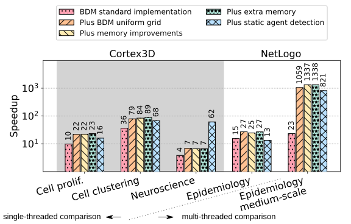
  
  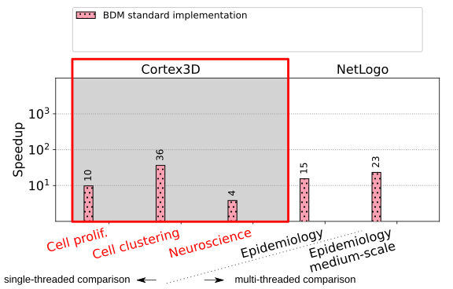
  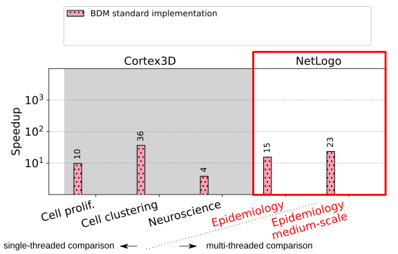
  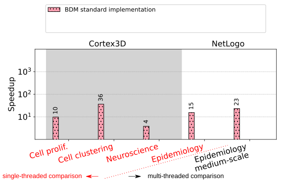
  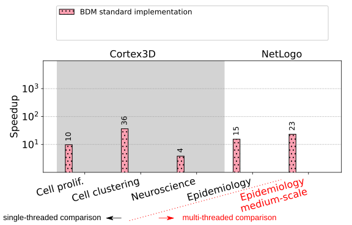
  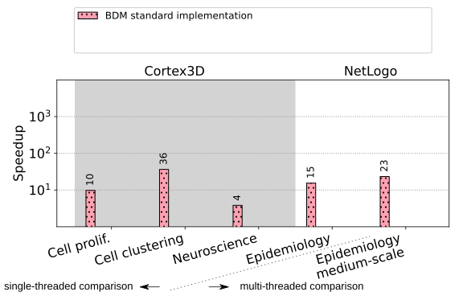
  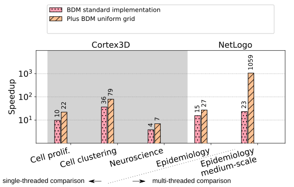
  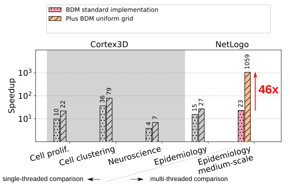
  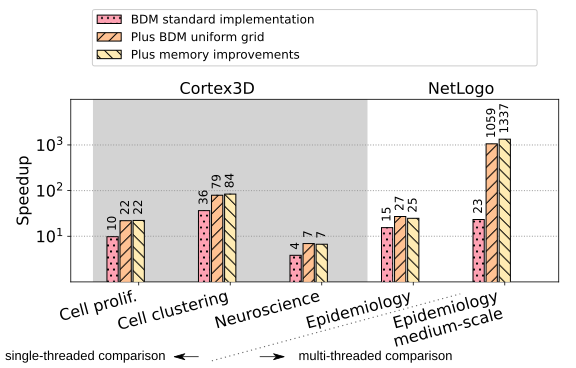
  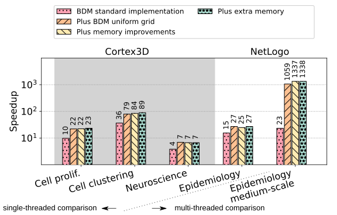
  
  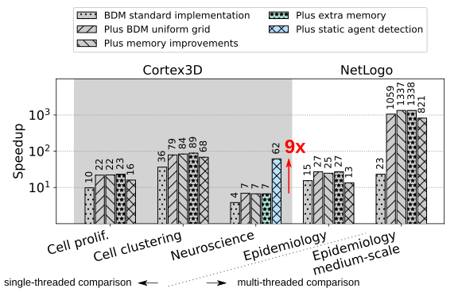
  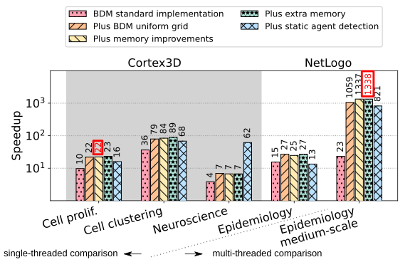
</div>

---
layout: section
---

# 発表の質疑応答

---
layout: default
---

# 発表の質疑応答

発表して終わりではない

<div class="grid grid-cols-2 gap-8 mt-6">
<div class="bg-gray-50 rounded-xl p-6">

**質問に備える**

- 想定される質問への**回答を事前に準備**する
  - 発表では使わないスライドも質疑用に用意しておく
- 質問者には**誠実に対応**する
  - 「今後の課題」の一言で逃げないようにする

</div>
<div class="bg-gray-50 rounded-xl p-6">

**まとめと反省**

- コメントを精査し、意見を整理する
- 質疑後に沈黙が続く場合の典型的な原因：
  - 専門用語が多すぎた
  - 基礎的な説明が不足していた
  - 結果の解釈がわかりにくかった

</div>
</div>

---
layout: section
---

# 修論・博論のプロジェクト管理

---
layout: default
---

# LaTeX とは？

「コードで書く」文書組版システム

<div class="grid grid-cols-2 gap-6 mt-3">
<div>

```latex {|1-3|5-10|11,17|14-16}
\documentclass[12pt]{article}
\usepackage{amsmath}
\usepackage{graphicx}

\title{論　文　題　目}
\date{2024 年度}
\IDnumber{学修番号}
\Bauthor{氏　　名}
\advisor{呂 沢宇}
\submissiondate{2025年1月2日}
\begin{document}
\maketitle
本文をここに書く。
\begin{equation}
  \hat{H}\psi = E\psi
\end{equation}
\end{document}
```

<div class="grid grid-cols-4 gap-2 mt-2 text-xs text-center">
  <div v-click="1"><span class="font-bold text-blue-600">プリアンブル</span><br/>クラスとパッケージを宣言</div>
  <div v-click="2"><span class="font-bold text-green-600">メタデータ</span><br/>題目・学修番号・氏名・指導教員・提出日</div>
  <div v-click="3"><span class="font-bold text-amber-600">本文環境</span><br/><code>\begin{document}</code> で全内容を囲む</div>
  <div v-click="4"><span class="font-bold text-purple-600">数式環境</span><br/><code>\begin{equation}</code> で数式を記述</div>
</div>

</div>
<div>
<iframe src="./template.pdf" class="w-full h-[400px] border-0" />
</div>
</div>


---
layout: default
---

# LaTeXで多様な資料・文書を作成することが可能

<div class="grid grid-cols-3 gap-4 mt-4">
  <div>
    <iframe src="./template1.pdf" class="w-full h-[400px] border-0" />
  </div>
  <div>
    <iframe src="./template2.pdf" class="w-full h-[400px] border-0" />
  </div>
  <div>
    <iframe src="./template3.pdf" class="w-full h-[400px] border-0" />
  </div>
</div>


---
layout: default
---

# LaTeX の優位性

なぜ修論・博論に LaTeX が向いているか

<div class="grid grid-cols-2 gap-x-12 gap-y-5 mt-6">

<div v-click>

**数式・記号の美しい表現**
- 数式、ギリシャ文字、特殊記号を高品質で出力
- Word の数式エディタと比べ圧倒的に使いやすい

</div>

<div v-click>

**構造の自動管理**
- 章・節番号、図表番号、参照番号を自動更新
- 図番号が変わっても参照箇所を手動修正する必要なし

</div>

<div v-click>

**参考文献の一元管理**
- BibTeX / BibLaTeX で文献リストを自動生成
- 引用スタイル（APA・IEEE 等）の切り替えが容易

</div>

<div v-click>

**バージョン管理との親和性**
- テキストファイルなので Git で差分管理が可能
- コメントや修正履歴を明確に残せる

</div>

</div>

---
layout: default
---

# LaTeX の使い方

目的・環境に合わせて選べる選択肢

<div class="grid grid-cols-2 gap-x-12 gap-y-6 mt-6">

<div v-click>

**ローカル環境**

TeX Live（Windows / Linux）または MacTeX（macOS）をインストール
- 完全オフラインで動作
- エディタ：VS Code + LaTeX Workshop 推奨

</div>

<div v-click>

**Overleaf**

ブラウザで動くオンライン LaTeX エディタ
- インストール不要、どこからでも編集可能
- 指導教員との共同編集・コメント機能あり

</div>

<div v-click>

**Prism**/ **Claude Prism**

AI を活用した LaTeX 執筆支援機能が実装されているツール

</div>

<div v-click class="border-l-4 border-blue-400 pl-4 py-1 text-gray-600">

LLMs と組み合わせることで LaTeX の執筆体験はさらに向上している。最初は慣れないかもしれないが、慣れれば快適に使える(はず)。

</div>

</div>

---
layout: section
---

# Git/GitHubで修論・博論の管理

---
layout: default
---

# バージョン管理していないと…


<div class="grid grid-cols-2 gap-8 mt-6">


<div v-click class="border rounded-xl px-4 py-3 text-sm font-mono">

<p class="text-base font-bold mb-2">📁 ファイルが増えてカオスに…</p>

```
thesis/
├── 論文_draft.docx
├── 論文_v2.docx
├── 論文_v2_修正.docx
├── 論文_最終.docx
├── 論文_最終_先生コメント反映.docx
├── 論文_最終_本当の最終.docx
└── 論文_提出用_これが最終.docx
```

<div v-click class="bg-gray-100 rounded-xl px-3 py-2 text-base mt-2">

- どれが最新版かわからない
- 以前の書き方に戻したいが差分がわからない
- もらったコメントがどこに反映されたか追えない

</div>

</div>

<div class="flex flex-col gap-3 justify-center">

<div v-click class="border border-red-300 bg-red-50 rounded-xl px-4 py-3 text-sm">

<p class="text-base font-bold mb-2">💀 バックアップなしで起きること</p>

- 上書き保存で数日分の修正が**永久に消える**
- 「前の方が良かった」と気づいても**戻せない**
- PC 故障・紛失でデータが**すべて失う**

</div>

<div v-click class="border border-green-300 bg-green-50 rounded-xl px-4 py-3 text-sm">

<p class="text-base font-bold mb-2">✅ Git/GitHub を使えば</p>

- すべての変更が**自動で記録**・いつでも**巻き戻し可能**
- GitHub に push すれば**クラウドバックアップ**にもなる

</div>

</div>
</div>


---
layout: two-cols-header
---

# Git / GitHub とは


::left::

- **いつ・誰が・何を**変えたか自動で記録
- コミットメッセージで変更の理由も残せる
- 変更前後を比較できる
    - 追加行は <span class="text-green-600 font-bold">緑</span>、削除行は <span class="text-red-600 font-bold">赤</span> で表示

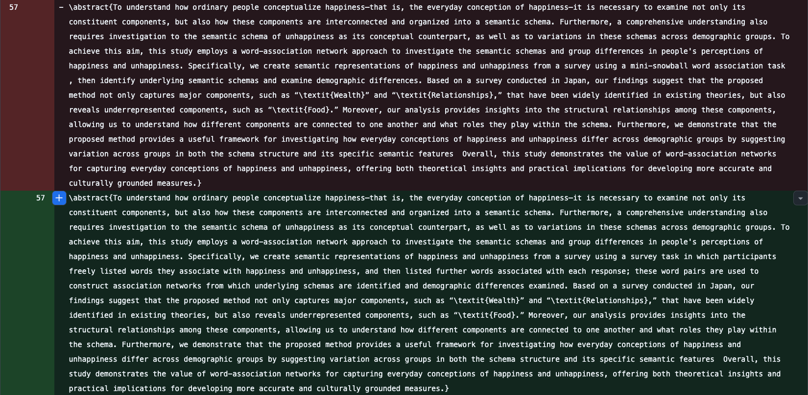

::right::

- リモートバックアップとして機能
- 指導教員・共著者とのコード・ファイル共有
- Issue でタスク・コメントを整理できる


---
layout: default
---

# Git/GitHubをベースにプロジェクトを一元管理する

一つのフォルダで全てを完結させる

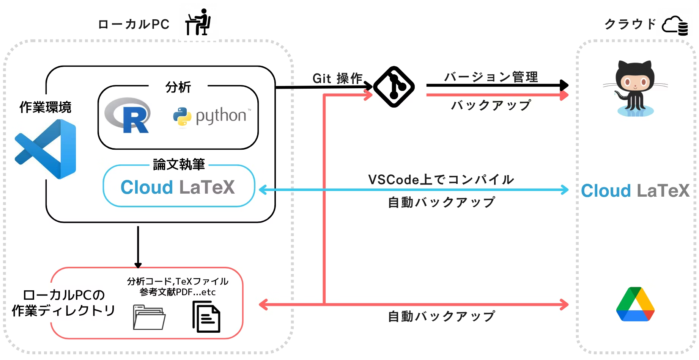


---
layout: default
---

# Git/Githubの使い方

- 前期の水曜3限「行動科学演習・計算人文社会学研究演習」で2〜3回目の授業でGit/Githubの使い方を説明する
    - [資料](https://lvzeyu.github.io/css_tohoku/python_css/git.html)は公開されている
    - ネット上でも参考になる資料はたくさんある
        - [Learn GitHub within GitHub](https://learn.github.com/skills)
        - [Learn Git Branching](https://learngitbranching.js.org/?locale=ja)

- VSCode、CopilotやClaude Codeなどを組み合わせる使用するとさらに快適になる
    - (2026年4月時点)学生も含む教育関係者なら[無料でCopilot Proを使える](https://qiita.com/melonsode/items/3602ea6441ca82e43c5a)！
