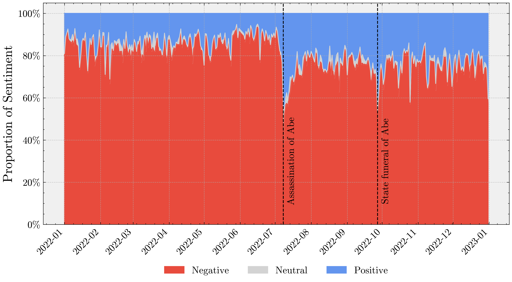
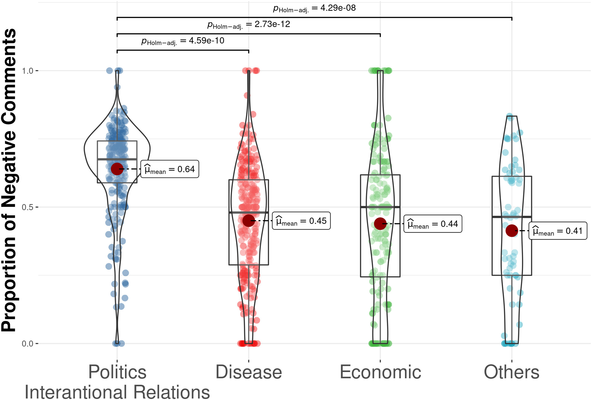
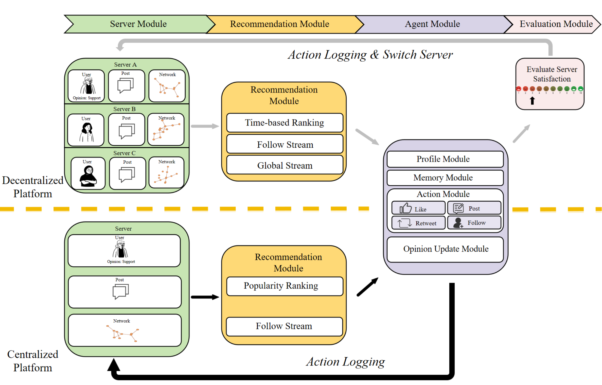
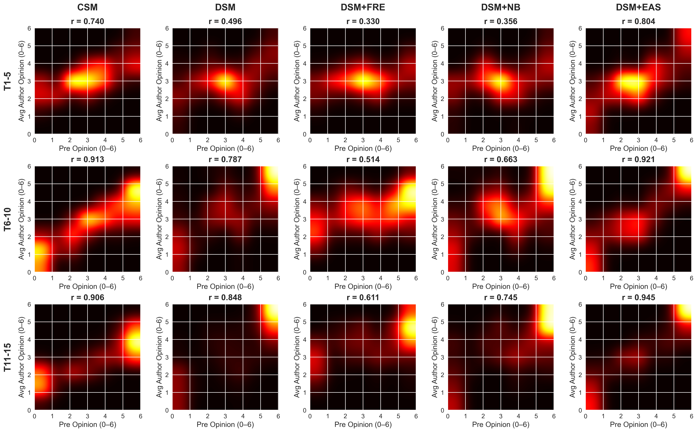
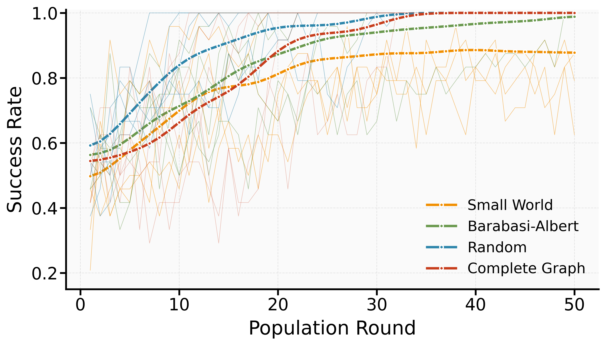
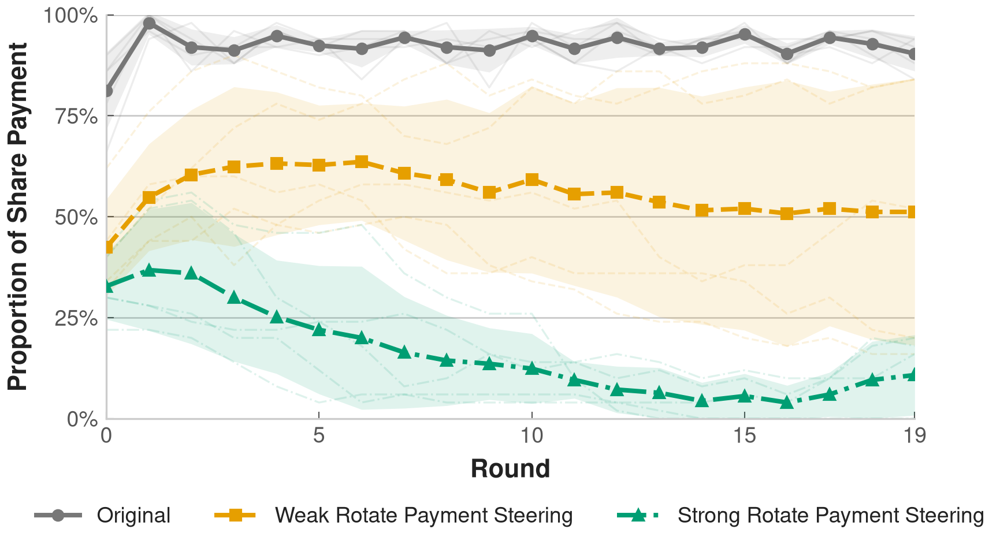
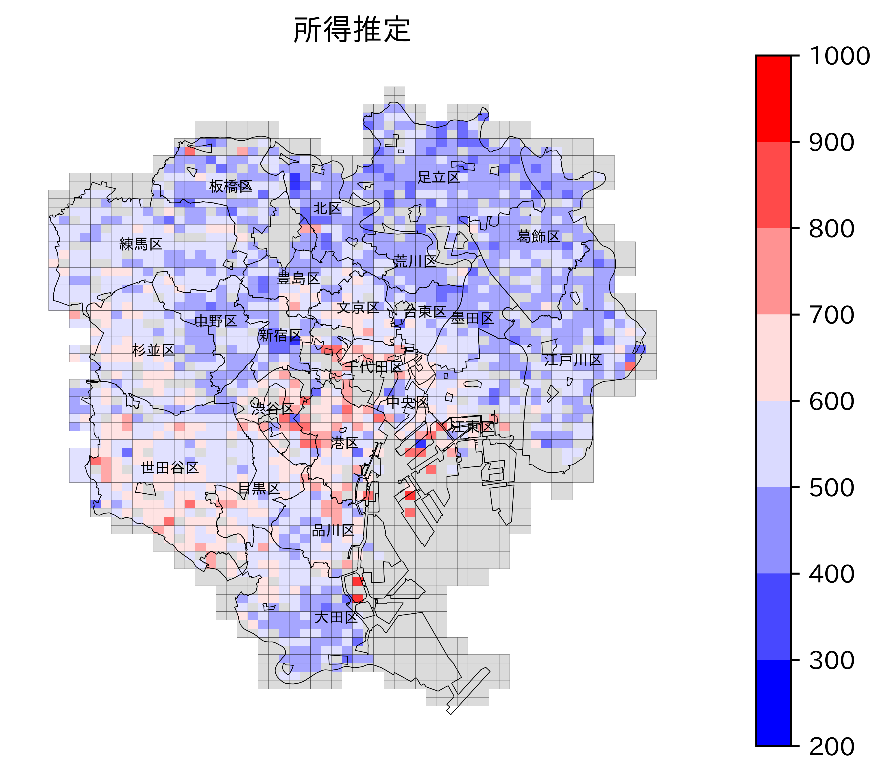
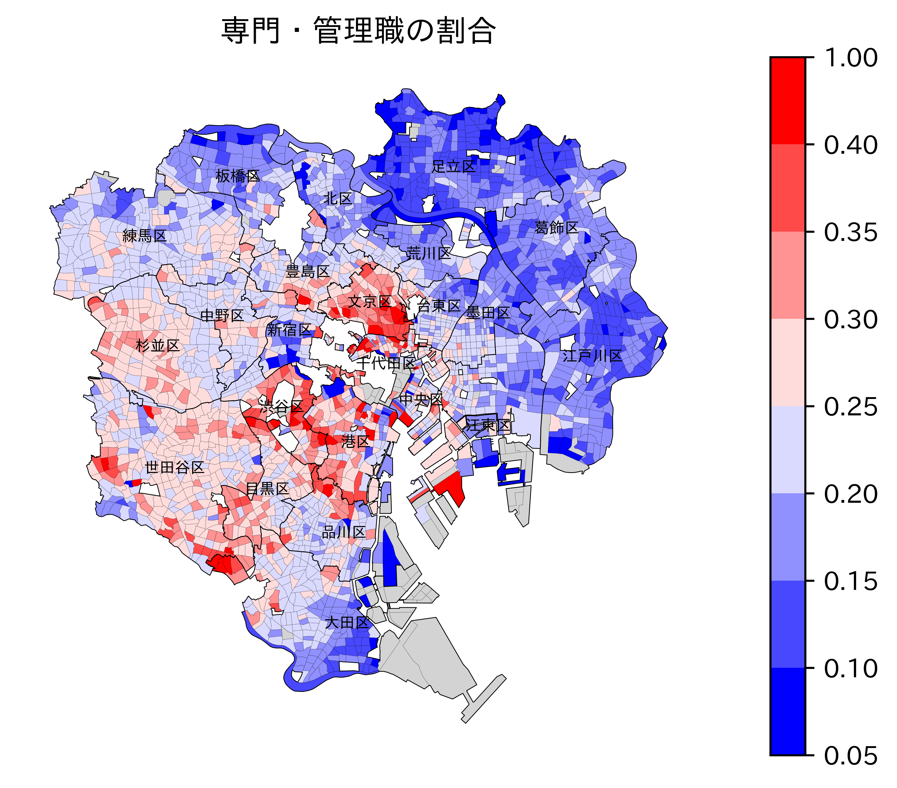
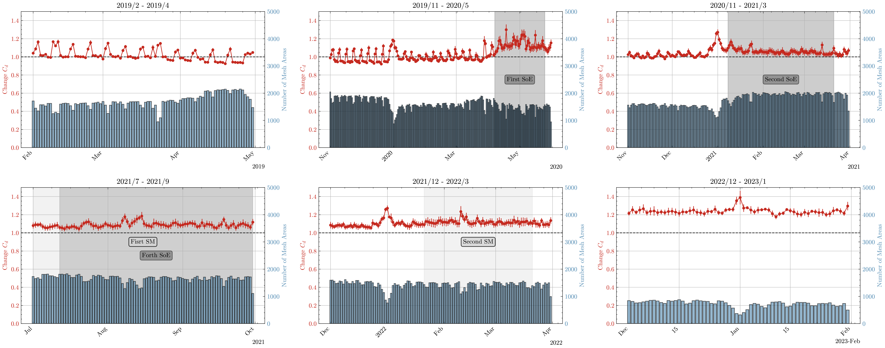

  
  

    
LAB INTRODUCTION · 2026

    <h1 style="font-family:'Noto Serif JP',Georgia,serif; font-size:60px; font-weight:800; color:#243033; line-height:1.08; margin:0;">Computational Humanities & Social Sciences Lab</h1>
  

  

    Graduate School and Faculty of Arts and Letters, Tohoku University 
    Zeyu Lyu
    

      <a href="https://lvzeyu.github.io/" aria-label="Homepage" title="Homepage" style="display:inline-flex; color:#2563eb;"><svg width="21" height="21" viewBox="0 0 24 24" fill="none" stroke="currentColor" stroke-width="1.8" stroke-linecap="round" stroke-linejoin="round"><circle cx="12" cy="12" r="9"></circle><path d="M3 12h18M12 3c2.4 2.5 3.6 5.5 3.6 9S14.4 18.5 12 21c-2.4-2.5-3.6-5.5-3.6-9S9.6 5.5 12 3"></path></svg></a>
      <a href="https://scholar.google.com/citations?user=W1k3wDIAAAAJ" aria-label="Google Scholar" title="Google Scholar" style="display:inline-flex; color:#2563eb;"><svg width="23" height="21" viewBox="0 0 24 24" fill="none" stroke="currentColor" stroke-width="1.8" stroke-linecap="round" stroke-linejoin="round"><path d="m2 10 10-5 10 5-10 5L2 10Z"></path><path d="M6 12.2V16c2.9 2.7 9.1 2.7 12 0v-3.8M22 10v6"></path></svg></a>
      <a href="https://github.com/lvzeyu" aria-label="GitHub" title="GitHub" style="display:inline-flex; color:#2563eb;"><svg width="21" height="21" viewBox="0 0 24 24" fill="currentColor"><path d="M12 2C6.48 2 2 6.58 2 12.23c0 4.52 2.87 8.35 6.84 9.7.5.1.68-.22.68-.49 0-.24-.01-1.04-.01-1.89-2.78.62-3.37-1.2-3.37-1.2-.45-1.18-1.11-1.49-1.11-1.49-.91-.64.07-.63.07-.63 1 .07 1.53 1.06 1.53 1.06.9 1.57 2.35 1.12 2.92.86.09-.67.35-1.12.64-1.38-2.22-.26-4.56-1.15-4.56-5.11 0-1.13.39-2.05 1.04-2.78-.1-.26-.45-1.32.1-2.75 0 0 .85-.28 2.75 1.06A9.28 9.28 0 0 1 12 6.38c.85 0 1.71.12 2.51.34 1.9-1.34 2.74-1.06 2.74-1.06.55 1.43.2 2.49.1 2.75.65.73 1.04 1.65 1.04 2.78 0 3.97-2.34 4.84-4.57 5.1.36.32.68.94.68 1.9 0 1.37-.01 2.47-.01 2.81 0 .27.18.59.69.49A10.23 10.23 0 0 0 22 12.23C22 6.58 17.52 2 12 2Z"></path></svg></a>
      <a href="mailto:lyu.zeyu.e8@tohoku.ac.jp" aria-label="Email" title="lyu.zeyu.e8@tohoku.ac.jp" style="display:inline-flex; color:#2563eb;"><svg width="22" height="21" viewBox="0 0 24 24" fill="none" stroke="currentColor" stroke-width="1.8" stroke-linecap="round" stroke-linejoin="round"><rect x="3" y="5" width="18" height="14" rx="2"></rect><path d="m3 7 9 6 9-6"></path></svg></a>
    

  

<!--
Welcome. This short introduction presents the questions we study, the evidence we use, and four current research directions in the lab.

The projects differ in subject and method, but they share one aim: to make complex social processes observable, testable, and open to revision.
-->

---

FIELD & MISSION

## Integration of Social Science Theory and Computational Methods

  

    

Social questions

Opinion dynmacis, Polarization, Social norm, Segregation, Gender inequality

    
×

    

Digital evidence

NLP, Network, Digital experiment, Simulation, Behavioral data et.,al

  

  
→

  

    
Theoretical &amp; Empirical Implications

    <ol class="explanation-list">
      <li>Explain mechanisms behind behavior and social phenomena</li>
      <li>Build testable social-science theories</li>
      <li>Address real-world problems through prediction</li>
    </ol>
  

<!--

-->

---

Research Interest: Opinion Dynamics · Polarization

<h2 class="single-line-title">Empirical Analysis of Opinion Dynamics and Polarization</h2>

  

    <ul>
      <li><b>Network analysis of relational structures among users</b>
        <ul><li>Identify segregated interaction networks between users with different political orientations <a href="https://www.jstage.jst.go.jp/article/ojjams/35/2/35_170/_article/-char/ja">(Lyu, 2020)</a>Lyu, Z. (2020). Ideological and behavioral perspectives on online political polarization: Evidence from Japan. <em>Sociological Theory and Methods, 35</em>(2), 170–183. https://doi.org/10.11218/ojjams.35.170.</li></ul>
      </li>
      <li><b>Textual analysis of discussions to understand opinion change</b>
        <ul><li>Use topic modeling to identify discussion content across different contexts (<a href="https://dl.acm.org/doi/abs/10.1145/3358695.3360922">Lyu, 2019</a>Lyu, Z. (2019). Towards an understanding of online extremism in Japan. In <em>Proceedings of the 2019 IEEE/WIC/ACM International Conference on Web Intelligence Workshops</em> (pp. 7–13). Association for Computing Machinery. https://doi.org/10.1145/3358695.3360922; <a href="https://www.jstage.jst.go.jp/article/bunken/73/4/73_26/_article/-char/en">Nagayoshi et al., 2023</a>Nagayoshi, K., Takikawa, H., Lyu, Z., Shimokubo, T., Watanabe, S., &amp; Nakamura, Y. (2023). Computational social science approach to social media analysis: Topic model analysis of Twitter posts on Prime Minister Abe Shinzo from January to his resignation. <em>The NHK Monthly Report on Broadcast Research, 73</em>(4), 26–43. https://doi.org/10.24634/bunken.73.4_26; <a href="https://journals.plos.org/plosone/article?id=10.1371/journal.pone.0352688">Pei et al., 2026</a>Pei, R., Lyu, Z., &amp; Wang, G. (2026). Transformer-driven automated analysis of social media narrative structure: An exploration based on sentiment framing and thematic agenda. <em>PLOS ONE, 21</em>(6), Article e0352688. https://doi.org/10.1371/journal.pone.0352688).</li></ul>
      </li>
      <li><b>Employ NLP to detect sentiment and stance in posts to understand opinion change</b>
        <ul><li>Measure changes in sentiment and stance over time and around major events (<a href="https://www.cell.com/heliyon/fulltext/S2405-8440(22)01707-8?uuid=uuid%3Af3bbdac8-dbb8-47b4-a967-e228029d8006">Lyu &amp; Takikawa, 2022</a>Lyu, Z., &amp; Takikawa, H. (2022). Media framing and expression of anti-China sentiment in COVID-19-related news discourse: An analysis using deep learning methods. <em>Heliyon, 8</em>(8), Article e10419. https://doi.org/10.1016/j.heliyon.2022.e10419; <a href="https://www.jstage.jst.go.jp/article/bunken/73/3/73_70/_article/-char/en">Takikawa et al., 2023</a>Takikawa, H., Nagayoshi, K., Lyu, Z., Shimokubo, T., Watanabe, S., &amp; Nakamura, Y. (2023). Computational social science approach to social media analysis: Sentiment analysis of Twitter posts on Prime Minister Abe Shinzo from January 2020 to his resignation. <em>The NHK Monthly Report on Broadcast Research, 73</em>(3), 70–85. https://doi.org/10.24634/bunken.73.3_70; <a href="https://journals.sagepub.com/doi/abs/10.1177/14614448231180654">Lyu, 2025</a>Lyu, Z. (2025). Cross-cutting interaction, inter-party hostility, and partisan identity: Analysis of offensive speech in social media. <em>New Media &amp; Society, 27</em>(2), 595–613. https://doi.org/10.1177/14614448231180654; <a href="https://papers.ssrn.com/sol3/papers.cfm?abstract_id=5512197">Lyu et al., 2025</a>Lyu, Z., Takikawa, H., &amp; Shimokubo, T. (2025). <em>Breaking the spiral of silence? Investigating the influence of opinion reversal events on opinion expression on social media</em> [Preprint]. SSRN. https://doi.org/10.2139/ssrn.5512197).</li></ul>
      </li>
    </ul>
  

  

    <figure><figcaption>Sentiment trends in online discourse around major events.</figcaption></figure>
    <figure><figcaption>Negative comment proportions across issue domains.</figcaption></figure>
  

Introduction of Computational Humanities and Social Sciences Lab05

---

Research Interest: Opinion Dynamics · Polarization

<h2 class="single-line-title">Simulation of Opinion Dynamics and Polarization</h2>

LLM-based agents simulate individual interactions, opinion change, and decision making, allowing us to examine mechanisms of opinion dynamics and polarization.

  <figure></figure>
  <figure></figure>

LLM agents based simulation for explaining why polarization emerges even in decentralized social media.

Introduction of Computational Humanities and Social Sciences Lab06

<!--
This text-primary layout is useful when the research argument matters more than the figure.

The project asks how communication across political boundaries relates to hostility and partisan identity. NLP measures language at scale, network analysis captures exposure, and statistical models connect those layers.

The published paper shown here is one concrete output. The adjacent figure is an example of the broader longitudinal analysis workflow, not a figure from that article.
-->

---

Research Interest: Social Norm

<h2 class="single-line-title">Simulation of Norm Emergence and Change</h2>

LLM-based agents simulate how micro-level interactions among individuals form and transform macro-level social norm.

  <figure>
    
    <figcaption>How network structures and initial stance distributions shape the emergence of social norm.</figcaption>
  </figure>
  <figure>
    
    <figcaption>Representation engineering adjusts internal LLM representations to create diverse simulation scenarios.</figcaption>
  </figure>

Introduction of Computational Humanities and Social Sciences Lab07

<!--
This simulation examines how micro-level interaction can form and change macro-level social order.

The left figure shows how network structure and the initial distribution of stances condition collective outcomes. The right figure shows how representation engineering can vary internal LLM tendencies to construct contrasting simulation scenarios.

These are results from an artificial model system. They do not, by themselves, establish claims about human populations.
-->

---

Research Interest: Social Norm

<h2 class="single-line-title">Digital Experiments on Social Norms</h2>

How does AI affect norms in an AI–human society?

  <figure>
    
    <figcaption>How LLM-assisted tools influence people’s behavior and interaction. This study is part of <a href="https://kaken.nii.ac.jp/en/grant/KAKENHI-PROJECT-24K21436/">KAKENHI 24K21436</a>.</figcaption>
  </figure>
  <figure>
    
    <figcaption>Experiments on a custom forum examine how LLM agents and people establish and change conventions through communication and interaction. This study is part of <a href="https://kaken.nii.ac.jp/en/grant/KAKENHI-PROJECT-26K00394/">KAKENHI 26K00394</a>.</figcaption>
  </figure>

Introduction of Computational Humanities and Social Sciences Lab08

<!--
This digital-experiment stream examines how AI–human interaction may affect social norms.

The first interface illustrates LLM-assisted tools that can alter how people express themselves and engage with one another. The second is a custom forum environment for experimentally studying how conventions form and change through interactions between people and LLM agents.
-->

---

Research Interest: Space and Urban Sociology

<h2 class="single-line-title">Spatial Inequality and Segregation</h2>

Geographic and mobility data are used to analyze spatial inequality and segregation (<a href="https://medinform.jmir.org/2022/3/e31557">Lyu &amp; Takikawa, 2022</a>Lyu, Z., &amp; Takikawa, H. (2022). The disparity and dynamics of social distancing behaviors in Japan: An investigation of mobile phone mobility data. <em>JMIR Medical Informatics, 10</em>(3), Article e31557. https://doi.org/10.2196/31557).

<ul class="spatial-data-list">
  <li>Hourly stay-population information for every 500 m mesh area in Japan, 2016–2026 [<a href="https://mobaku.jp/">More details</a>]</li>
  <li>Mobility trajectories of approximately 7 million people across Japan’s major cities, 2019–2023</li>
</ul>

  

    <figure></figure>
    <figure></figure>
  

  <figure class="geoanalysis-right"></figure>

This study is part of <a href="https://kaken.nii.ac.jp/en/grant/KAKENHI-PROJECT-25K16783/">KAKENHI 25K16783</a>.

Introduction of Computational Humanities and Social Sciences Lab09

<!--
This research examines spatial inequality and segregation using high-resolution geographic and mobility data.

The data combine hourly stay-population estimates for Japan-wide 500 m mesh areas with trajectories from approximately seven million people in major Japanese cities.
-->

---

OTHER RESEARCH INTERESTS

## Broad Interests in Empirical Social Science and Social Science Methodology

  
  

    
01 · QUANTITATIVE SOCIOLOGY<h3>Survey-based analysis</h3>
Conduct empirical analysis using secondary data and original surveys (<a href="https://www.sciencedirect.com/science/article/pii/S027795362030736X">Ye &amp; Lyu, 2020</a>Ye, M., &amp; Lyu, Z. (2020). Trust, risk perception, and COVID-19 infections: Evidence from multilevel analyses of combined original dataset in China. <em>Social Science &amp; Medicine, 265</em>, Article 113517. https://doi.org/10.1016/j.socscimed.2020.113517; <a href="https://academic.oup.com/poq/article/90/2/518/8524077">Lyu &amp; Cato, 2026</a>Lyu, Z., &amp; Cato, S. (2026). How empathy and partisanship affected attitude changes following the assassination of Shinzo Abe: Evidence from panel surveys. <em>Public Opinion Quarterly, 90</em>(2), 518–535. https://doi.org/10.1093/poq/nfag008).

    
02 · SCIENCE OF SCIENCE<h3>Inequality in academia</h3>
Use large-scale data to study inequality in academia (<a href="https://www.nature.com/articles/s41598-026-54562-5">Pei et al., 2026</a>Pei, R., Lyu, Z., Wang, G., Wang, Z., Ye, M., &amp; Fan, X. (2026). Gender inequality in academic promotion trajectories in Japan. <em>Scientific Reports, 16</em>, Article 25230. https://doi.org/10.1038/s41598-026-54562-5).

    
03 · AI FOR SOCIAL SCIENCE<h3>Reliable LLM applications</h3>
Develop fine-tuning and representation-engineering methods to improve the reproducibility, interpretability, and explainability of LLM applications in social science.

    
04 · WELL-BEING<h3>Computational approaches to well-being</h3>
Use network analysis and NLP to examine the semantic meaning of well-being, historical change, and group differences.

  

Introduction of Computational Humanities and Social Sciences Lab10

<!--
This slide presents research directions beyond the core project portfolio.

The lab applies survey data to empirical sociology, scholarly records to science-of-science questions, and AI methods to improve the reliability of computational social research.
-->

---

CURRENT MEMBERS

## Lab Members and Reseach Interests

<table class="roster-table">
  <thead><tr><th>Name</th><th>Year &amp; Program</th><th>Research interests</th></tr></thead>
  <tbody>
    <tr><td><b>Rongkang Pei</b></td><td>D3 · <a href="https://www.jst.go.jp/jisedai/spring/en/index.html">SPRING</a></td><td>Science of Science</td></tr>
    <tr><td><b><a href="https://neowangzc.github.io/">Zhichao Wang</a></b></td><td>D2 · <a href="https://www.jsps.go.jp/english/e-pd/">JSPS DC2</a> · <a href="https://www.aie.tohoku.ac.jp/">AIE</a></td><td>Online Labor-Market Inequality; LLM-Based Simulation; Cultural Sociology</td></tr>
    <tr><td><b><a href="https://ymgc19.github.io/">Yuhei Yamakuchi</a></b></td><td>D2 · <a href="https://www.jsps.go.jp/english/e-pd/">JSPS DC2</a> · <a href="https://www.aie.tohoku.ac.jp/">AIE</a> · <a href="https://web.tohoku.ac.jp/diare/">DIARE</a></td><td>Mobility-Data Analysis; Satellite Data; Mathematical Modeling</td></tr>
    <tr><td><b>NASAAI Masngut</b></td><td>D2 · <a href="https://syde.tohoku.ac.jp/english/">SYDE</a> · <a href="https://www.mext.go.jp/en/policy/education/highered/title02/detail02/sdetail02/1373897.htm">MEXT</a></td><td>Disaster Sociology; Public Opinion on Nuclear Energy</td></tr>
    <tr><td><b>Hanhan Sun</b></td><td>D1 · <a href="https://web.tohoku.ac.jp/diare/">DIARE</a> · <a href="https://www.mext.go.jp/en/policy/education/highered/title02/detail02/sdetail02/1373897.htm">MEXT</a></td><td>Feminism; Gender Issues in Social Media</td></tr>
    <tr><td><b>Dongxin Yan</b></td><td>D1</td><td>Cultural Sociology</td></tr>
    <tr><td><b>Rintaro Iwamura</b></td><td>M1</td><td>Polarization; Social Simulation</td></tr>
  </tbody>
</table>

Introduction of Computational Humanities and Social Sciences Lab11

