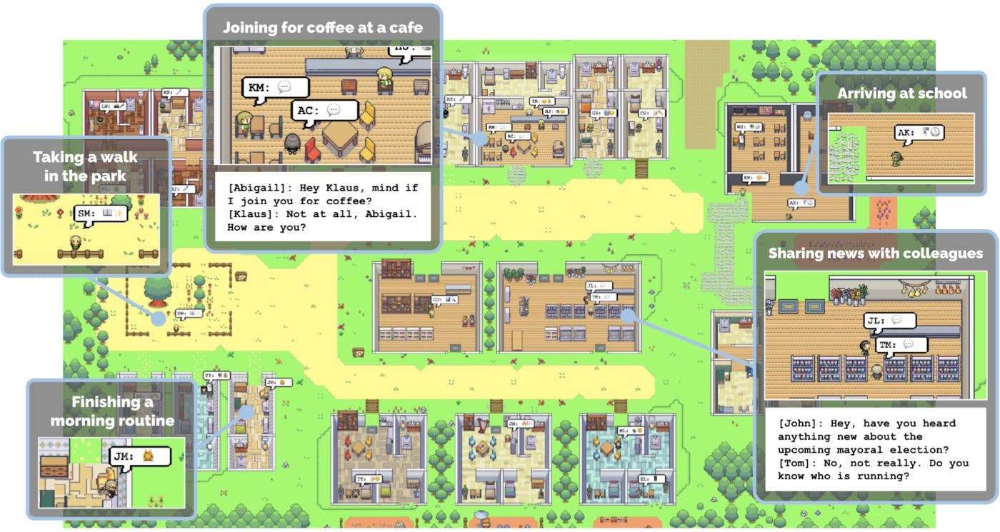

---
# try also 'default' to start simple
theme: neversink
# random image from a curated Unsplash collection by Anthony
# like them? see https://unsplash.com/collections/94734566/slidev
background: https://cover.sli.dev
# some information about your slides (markdown enabled)
title: 社会科学における大規模言語モデルの応用
drawings:
  persist: false
# slide transition: https://sli.dev/guide/animations.html#slide-transitions
transition: slide-left
# enable MDC Syntax: https://sli.dev/features/mdc
mdc: true
# duration of the presentation
duration: 20min
color: navy-light
layout: intro
colorSchema: light

fonts:
  sans: 'Noto Sans SC, -apple-system, BlinkMacSystemFont, "Segoe UI", Roboto, sans-serif'
  serif: 'Noto Serif SC, serif'
  mono: 'Roboto Mono, monospace'
  provider: google

css: unocss

mermaid:
  theme: neutral
  themeVariables:
    primaryColor: '#eef2ff'
    primaryTextColor: '#4338ca'
    primaryBorderColor: '#6366f1'
    lineColor: '#6366f1'
    secondaryColor: '#f0f9ff'
    tertiaryColor: '#fff'

---

<style src="./style.css"></style>


### 数理社会学会大会ワンステップアップ・セミナー

## 社会科学における大規模言語モデルの応用


### 吕 泽宇 / Zeyu Lyu <a href="https://researchmap.jp/lyuzeyu?lang=ja" class="ns-c-iconlink"><mdi-open-in-new /></a>  

2026年3月5日・日本大学

<div style="margin-top: 3rem;">
<QRCode value="https://lvzeyu.github.io/social_science_nlp_tutorial/southeastern_univ/" :size="100" render-as="svg" />
</div>

---
layout: top-title
color: indigo-light
align: lt
---
:: title ::

# 自我介绍

:: content ::

<script setup>
import { ref } from 'vue'
const showImage = ref(false)
const showImage2 = ref(false)
const showImage3 = ref(false)
const toggleImage = () => {
  showImage.value = !showImage.value
}
const toggleImage2 = () => {
  showImage2.value = !showImage2.value
}
const toggleImage3 = () => {
  showImage3.value = !showImage3.value
}
</script>

<div style="position: relative;">

<div :style="{ opacity: (showImage || showImage2 || showImage3) ? 0.1 : 1, transition: 'opacity 0.3s' }">


- **所属**: 東北大学 文学研究科 [计算人文社会学研究室](https://www.sal.tohoku.ac.jp/jp/research/researcher/profile/---id-190.html) 
- **経歴**: 東北大学大学院文学研究科博士後期課程修了。日本学術振興会特別研究員DC2、東京大学社会科学研究所特任研究員を経て、現職に至る。
- **研究関心**
    - 大規模移動データを用いて社会的空間隔離(Social Spatial Segregation)に関する実証分析とシミュレーション [(Lyu & Takikawa, 2022)](https://medinform.jmir.org/2022/3/e31557)
    - オンライン空間における意見形成と変化メカニズムに関する実証分析とシミュレーション([Lyu & Takikawa 2022](https://www.cell.com/heliyon/fulltext/S2405-8440(22)01707-8); [Lyu 2023](https://journals.sagepub.com/doi/abs/10.1177/14614448231180654))
    - <v-click><span style="position: relative; z-index: 1;">テキストマイニングに基づく文化ダイナミクスの解析<a @click="toggleImage3" class="ns-c-iconlink" style="cursor: pointer;"><mdi-graph /></a></span></v-click>


<style>
.normal {
  transition: color 0.5s ease-in-out;
}
.highlight {
  color: black !important;
  font-weight: bold;
  text-decoration: underline;
}
</style>


<div v-click style="position: absolute; top: 220px; left: 10px; right: 20px; height: 130px; background-color: rgba(99, 102, 241, 0.1); border-radius: 8px; z-index: 0;"></div>

<p v-click class="absolute bottom-1.5 left-135 transform" style="color: #6366f1; font-weight: bold;">
  社会科学における自然言語処理の応用
</p>


<style>
.normal {
  transition: color 0.5s ease-in-out;
}
.highlight {
  color: black !important;
  font-weight: bold;
  text-decoration: underline;
}
</style>


</div>

<div v-if="showImage3" @click="toggleImage3" style="position: absolute; top: 0; left: 0; right: 0; bottom: 0; cursor: pointer; display: flex; align-items: center; justify-content: center; z-index: 10; background-color: rgba(255, 255, 255, 0.95); padding: 2rem;">
  <div style="display: flex; flex-direction: column; max-width: 60%; max-height: 55vh;">
    
    <div style="background-color: rgba(238, 242, 255, 0.98); padding: 1rem 1.5rem; border-radius: 0 0 12px 12px; box-shadow: 0 8px 24px rgba(0, 0, 0, 0.15); border: 2px solid rgba(99, 102, 241, 0.3); border-top: none; flex-shrink: 0;">
      <h3 style="color: #4338ca; margin: 0; font-size: 1.2rem; font-weight: 600; text-align: center;">Word Embeddingを用いて文化概念の解析</h3>
    </div>
  </div>
</div>

</div>

---
layout: top-title
color: indigo-light
align: lt
---
:: title ::

# セミナーの概要

:: content ::

<v-clicks depth="2">

## 大規模言語モデルの基礎

- 大規模言語モデルの基本原理
- 大規模言語モデルに基づくエージェント

## 大規模言語モデルの応用

- 大規模言語モデルの取得
    - APIで大規模言語モデルの利用
- 大規模言語モデルの応用例
    - 大規模言語モデルによるテキスト分類
    - 大規模言語モデルによるシミュレーション

</v-clicks>


---
layout: section
color: indigo-light
---

# 大規模言語モデルの基礎

<hr>

大規模言語モデルの基本原理と概念への理解


---
layout: top-title-two-cols
columns: is-6
align: l-lt-lt
color: indigo-light
---

:: title ::

# 大規模言語モデルの基本概念


:: left ::

<div style="display: flex; justify-content: center;">
  
</div>

<div style="display: flex; justify-content: center;">
  
</div>


:: right ::

<v-click>

**自己回帰モデル**: 「次の1トークン」を過去のトークンから順番に予測して全体の確率を表すモデル


<div style="display: flex; justify-content: center;">
  
</div>

</v-click>

<v-click>

<Admonition title="大規模なモデルを構築するにネックがある" color="indigo-light" custom="text-lg font-bold" customTitle="text-red-500">
効率的に大規模言語モデルを学習するのは容易ではない
</Admonition>

</v-click>


---
layout: top-title-two-cols
columns: is-7
align: l-lt-lt
color: indigo-light
---


:: title ::

# 大規模言語モデルのコア技術:Transformer


:: left ::

<script setup>
import { ref } from 'vue'
const showSeq2SeqImage = ref(false)
const showAttentionImage = ref(false)
const toggleSeq2SeqImage = () => {
  showSeq2SeqImage.value = !showSeq2SeqImage.value
}
const toggleAttentionImage = () => {
  showAttentionImage.value = !showAttentionImage.value
}
</script>

<div style="position: relative;">

<div :style="{ opacity: (showSeq2SeqImage || showAttentionImage) ? 0.1 : 1, transition: 'opacity 0.3s' }">

- Transformerは、Attentionメカニズムに基づくSeq2Seqアーキテクチャである
- Seq2Seq <a @click="toggleSeq2SeqImage" class="ns-c-iconlink" style="cursor: pointer;"><mdi-graph /></a>
    - エンコーダ(Encoder): 入力系列(テキスト)を受け取り、意味を表す内部表現（ベクトル形式）に変換
    - デコーダ(Decoder): 内部表現を参照しながら、出力系列(テキスト)を1トークンずつ生成
- Attention <a @click="toggleAttentionImage" class="ns-c-iconlink" style="cursor: pointer;"><mdi-graph /></a>
    - 「いま処理している単語が、文中のどの単語をどれくらい参照すべきか」を重みとして計算し、全体にわたる依存関係を考慮する
    - 並列処理により効率よく学習でき、大規模化しやすい

</div>

<div v-if="showSeq2SeqImage" @click="toggleSeq2SeqImage" style="position: absolute; top: 0; left: 0; right: 0; bottom: 0; cursor: pointer; display: flex; align-items: center; justify-content: center; z-index: 10; background-color: rgba(255, 255, 255, 0.95); padding: 2rem;">
  <div style="display: flex; flex-direction: column; max-width: 95%; max-height: 70vh;">
    
    <div style="background-color: rgba(238, 242, 255, 0.98); padding: 1rem 1.5rem; border-radius: 0 0 12px 12px; box-shadow: 0 8px 24px rgba(0, 0, 0, 0.15); border: 2px solid rgba(99, 102, 241, 0.3); border-top: none; flex-shrink: 0;">
      <h3 style="color: #4338ca; margin: 0; font-size: 1.2rem; font-weight: 600; text-align: center;">Seq2Seqの基本構造</h3>
    </div>
  </div>
</div>

<div v-if="showAttentionImage" @click="toggleAttentionImage" style="position: absolute; top: 0; left: 0; right: 0; bottom: 0; cursor: pointer; display: flex; align-items: center; justify-content: center; z-index: 10; background-color: rgba(255, 255, 255, 0.95); padding: 2rem;">
  <div style="display: flex; flex-direction: column; max-width: 90%; max-height: 70vh;">
    <video autoplay loop muted style="max-width: 100%; max-height: 65vh; width: auto; height: auto; object-fit: contain; border-radius: 8px 8px 0 0; box-shadow: 0 8px 16px rgba(0, 0, 0, 0.2); display: block; margin: 0 auto;">
      <source src="./Figure/encoder_self_attention.mp4" type="video/mp4">
    </video>
    <div style="background-color: rgba(238, 242, 255, 0.98); padding: 1rem 1.5rem; border-radius: 0 0 12px 12px; box-shadow: 0 8px 24px rgba(0, 0, 0, 0.15); border: 2px solid rgba(99, 102, 241, 0.3); border-top: none; flex-shrink: 0;">
      <h3 style="color: #4338ca; margin: 0; font-size: 1.2rem; font-weight: 600; text-align: center;">Attention机制</h3>
    </div>
  </div>
</div>

</div>

:: right ::

<div style="display: flex; justify-content: center;">
  
</div>

<div v-click="1" style="position: absolute; top: 260px; left: 600px; right: 240px; height: 160px; background-color: rgba(99, 102, 241, 0.5); border-radius: 8px; z-index: 0; display: flex; align-items: center; justify-content: center; padding: 1rem;">
  <div style="background-color: #4338ca; padding: 0.5rem 1rem; border-radius: 6px;">
    <p style="color: white; font-weight: 600; font-size: 1.1rem; margin: 0; text-align: center;">Encoder</p>
  </div>
</div>


<div v-click="1" style="position: absolute; top: 120px; left: 740px; right: 100px; height: 310px; background-color: rgba(184, 241, 99, 0.5); border-radius: 8px; z-index: 0; display: flex; align-items: center; justify-content: center; padding: 1rem;">
  <div style="background-color: #506720ff; padding: 0.5rem 1rem; border-radius: 6px;">
    <p style="color: white; font-weight: 600; font-size: 1.1rem; margin: 0; text-align: center;">Decoder</p>
  </div>
</div>


---
layout: top-title
color: indigo-light
align: lt
---

:: title ::

# テキストマイニングツールとしての大規模言語モデル

:: content ::

> ほぼあらゆるNLPタスクは、テキスト生成問題として定式化できる [(Brown et al., 2020)](https://arxiv.org/abs/2005.14165)


| タスク    | 入力例                           | 出力例                           | プロンプト                              |
| ------ | ----------------------------- | ----------------------------- | --------------------------------------------- |
| テキスト分類 | テキスト：This movie is fantastic. | Positive                      | Text: This movie is fantastic. Sentiment: ___ |
| 質問応答   | 質問：Who wrote Hamlet?          | William Shakespeare           | Q: Who wrote Hamlet? A: ___                   |
| 翻訳     | 英文：How are you?               | 仏文：Comment ça va ?            | Translate English to French: How are you? ___ |
| 要約     | 文章：Artificial intelligence... | 簡潔な要約：AI is a branch of CS... | Summarize the following: Artificial... ___    |


---
layout: top-title
color: indigo-light
align: lt
---
:: title ::

# 社会シミュレーション：社会的事実の再現（？）

:: content ::

<div style="display: flex; justify-content: center;">
  
</div>

---
layout: top-title
color: indigo-light
align: lt
---

:: title ::

# 社会科学における社会シミュレーションの着目点

:: content ::

<div style="display: flex; justify-content: center;">
  
</div>

社会シミュレーションによるメカニズムを説明する([Hedström & Swedberg, 1998](https://www.cambridge.org/core/books/social-mechanisms/F54BB7A4A77F7308D5FEA7D9C0EAD086);[瀧川, 2019](https://www.jstage.jst.go.jp/article/ojjams/34/1/34_47/_article/-char/ja/))

- マクロレベルの制度・規範・文化・社会構造は個人行動に影響を与える
- 個体間の相互作用は集団的行動を生み出す
- 多数の個体行動が集積すると、新たなマクロ社会現象が形成される（bottom-up emergence）

---
layout: iframe-right
title: iframe Right Layout
# the web page source
url: http://nifty.stanford.edu/2014/mccown-schelling-model-segregation/

# a custom class name to the content
class: my-cool-content-on-the-right
slide_info: false
---

# 社会科学における社会シミュレーション手法: Agent based Model

- Agentは局所的ルールに従って独立に行動し、最終的にマクロな社会構造が生じる

- Agent=住民: 異なる人種の住民
  - 各住民は近傍における同類住民の割合を観察する
  - その割合が許容度を下回ると、住民は移動を選択する

<AdmonitionType type="important" width="300px">
Agentの特性と行動は数学的な形式化によって定義される
</AdmonitionType>


---
layout: top-title
color: indigo-light
align: lt
---

:: title ::

# 社会シミュレーションの目標

:: content ::

<script setup>
import { ref } from 'vue'
const showFrameworkImage = ref(false)
const toggleFrameworkImage = () => {
  showFrameworkImage.value = !showFrameworkImage.value
}
</script>

<div style="position: relative;">

<div :style="{ opacity: showFrameworkImage ? 0.1 : 1, transition: 'opacity 0.3s' }">

<v-clicks depth="4">

- 社会シミュレーションの異なる方向性
  - **予測的シミュレーション**: 事実状況を可能な限り再現するシミュレーションを構築し、社会現象の将来動向を予測する
    - 例: 災害発生時の人口避難経路の予測
  - **説明的シミュレーション**: シミュレーションを通じて社会現象の成因とメカニズムを理解・説明する
    - 例: Schellingモデルは、個人の選好が低くても高度に隔離された社会構造が生じうることを示した

- 計算社会科学の目標: solution-oriented[(Watts, 2017)](https://www.nature.com/articles/s41599-023-01577-2?fromPaywallRec=false); 説明と予測の統合 [(Hofman et al., 2021)](https://www.nature.com/articles/s41586-021-03659-0)


</v-clicks>

</div>

<div v-if="showFrameworkImage" @click="toggleFrameworkImage" style="position: absolute; top: 0; left: 0; right: 0; bottom: 0; cursor: pointer; display: flex; align-items: center; justify-content: center; z-index: 10; background-color: rgba(255, 255, 255, 0.95); padding: 2rem;">
  <div style="display: flex; flex-direction: column; max-width: 90%; max-height: 80vh;">
    
  </div>
</div>

</div>

---
layout: top-title-two-cols
color: indigo-light
align: l-lt-lb
---

:: title ::

# 大規模言語モデルに基づくエージェント (LLMs Agent)

:: left ::

🤖 **Agent: 環境を認識し、意思決定して行動する主体**

- LLMs Agent: 大規模言語モデルを中核として推論・意思決定・行動を行うエージェント
    - 記憶（Memory）：Agentが​過去経験を保存・検索する。​
    - 計画（Planning）：Agentが​日常計画を策定・調整し、環境変化に応答する。
    - ツール(Tool): Agentが呼び出すことができる外部機能
 

- LLM Agentは複雑なタスクを処理し、人間の意思決定過程に近い判断と行動を生成・実行することが期待される。

:: right ::

<div style="display: flex; justify-content: center;">
  
</div>


---
layout: top-title
color: indigo-light
align: lt
---

:: title ::

# LLMs Agentに基づく社会シミュレーション

:: content ::

<div grid="~ cols-2 gap-4">
<div>

- LLMs Agentを配置し、各エージェントにLLMsを通じて固有の背景情報・日常計画・行動目標を設定した [(Park et al., 2023)](https://dl.acm.org/doi/fullHtml/10.1145/3586183.3606763)。
  - 記憶（Memory）：​自然言語形式で過去経験を保存・検索する。​
  - 省察（Reflection）：​記憶を統合して高次の洞察を形成し、将来の行動を導く。​
  - 計画（Planning）：​日常計画を策定・調整し、環境変化に応答する。
- 事前に設定していなくても、エージェント間で自発的に社会的行動が生じた

<Admonition title="社会シミュレーションにおいて" color="indigo-light" custom="text-lg font-bold" customTitle="text-red-500">
Agentの行動と相互作用は、大規模言語モデルが生成する自然言語によって表現される
</Admonition>


</div>

<div>

<div style="display: flex; justify-content: center;">
  
</div>

<div style="display: flex; justify-content: center; margin-top: 2rem;">
  
</div>

</div>
</div>


<div class="abs-br m-6 text-xl">
  <a href="https://arxiv.org/abs/2304.03442" target="_blank" class="slidev-icon-btn">
    <carbon:document />
  </a>
</div>


---
layout: section
color: indigo-light
---

# `大規模言語モデル`の応用

<hr>

テキストマイニングと社会シミュレーションを例として


---
layout: two-cols-title
columns: is-6
align: l-lt-lt
---

:: title ::

# 大規模言語モデルの使用：ローカルLLM

:: left ::

- 自分のPC/サーバ上でLLMを動かして使う
    - [HuggingFace Hub](https://huggingface.co/)から多くのオープンソース LLMを取得可能
    - 一般的的にはGPUを使うことが前提になる
    - GPU環境は初期投資が大きいものの、利用量が増えるほど単価が下がり
- 近年、オープンソース LLM の性能向上(Llama,Deepseek,Qwen3など)
- 量子化技術を使うことで必要される計算リソースを大幅に減らせる
- 自分の要件に合わせてカスタマイズ
   - Parameter efficient fine-tuning手法の発展

:: right ::

VRAM別動かせるモデルの目安（[参照先](https://dev.classmethod.jp/articles/local-llm-guide-2026/)）

|   VRAM | 動かせるモデル                                        |  量子化 |
| -----: | ---------------------------------------------- | ---: |
|    8GB | Qwen3-1.7B、Qwen 7B                             | 4bit |
|   16GB | gpt-oss-20b、Qwen3-14B、Nemotron 3 Nano、Llama 8B | 8bit |
|   24GB | Llama 70B 、Gemma 3-27B、GLM-4.7-Flash     | 4bit |
|  48GB+ | Llama 405B                                     | 8bit |
| 150GB+ | Qwen3-Coder-480B                        | 4bit |


---
layout: top-title
color: indigo-light
align: lt
---

:: title ::

# 大規模言語モデルの使用：ローカルLLM

:: content ::

- Hugging Face の [Transformers](https://huggingface.co/docs/transformers/en/index)ライブラリで動かす
    - [HuggingFace Hub](https://huggingface.co/)からオープンソースLLMのリンクを取得
- `AutoModel`や`pipeline`などの機能で手軽にオープンソースLLMを実装
- [`bitsandbytes`](https://huggingface.co/docs/transformers/en/quantization/bitsandbytes) と組み合わせることで量子化を実装


````md magic-move {lines: true}

```py {3|4-9|10}
import torch
from transformers import pipeline
model_dir = "model_path"
gen = pipeline(
    task="text-generation",
    model=model_dir,
    torch_dtype=torch.float16, 
    device_map="auto",             # GPU/CPUへ自動割り当て
)
out = gen("日本語で自己紹介して。", max_new_tokens=128, do_sample=True, temperature=0.7)
```

```py {1-6|7}
from transformers import AutoTokenizer, AutoModelForCausalLM
model_dir = "model_path"
tok = AutoTokenizer.from_pretrained(model_dir)
model = AutoModelForCausalLM.from_pretrained(
    model_dir,
    device_map="auto",
    load_in_4bit=True,   # 4bit量子化
)
```
````


---
layout: top-title
color: indigo-light
align: lt
---

:: title ::

# 大規模言語モデルの使用：API

:: content ::

- OpenAIやGoogleなどの会社は、APIで独自のAIモデルを利用するサービスを提供している
   - 事前に発行したAPIキーをリクエストに添えて送る形で利用する権限を取得して呼び出す
   - 従量課金（pay-as-you-go）: 基本的には、入力トークンと出力トークンの長さによって課金される
       - 一部モデルでは内部推論に相当するトークンがあり、見えなくても出力側として課金対象になる
- Pythonライブラリで手軽に各社のLLMsサービスをAPIを経由して利用することができる

````md magic-move {lines: true}

```py {1-2|3-5|6-10|*}
# 公式SDKを読み込む
from openai import OpenAI
# OpenAI API キーを設定
api_key=XXX
client = OpenAI(api_key=api_key)
# LLMに入力を渡してテキスト生成を依頼する
resp = client.responses.create(
    model="gpt-4.1-mini",
    input="LLM APIの使い方を説明しなさい"
)
```
````

---
title: OpenAI APIキー作成手順
layout: top-title
color: indigo-light
align: lt
clicks: 3   # 0,1,2,3 共4个状态 => 需要3次点击
---

:: title ::

# APIキーの取得: OpenAI APIキー作成手順

:: content ::

<style>
.fit-img {
  width: 80%;
  max-height: 40vh;     
  object-fit: contain;
  display: block;
  margin-top: -50px;
}

.step-text {
  min-height: 12vh;    
}
</style>


<div class="step-text">
  <div v-if="$slidev.nav.clicks === 0">
    <p>
      ログインしたら上部メニューから「Dashboard」に移動し、左のメニューから「API keys」を選択します。ここでAPIキーの作成ができます。
    </p>
  </div>

  <div v-else-if="$slidev.nav.clicks === 1">
    <p>
      左メニューの「API keys」からキー管理画面へ。<br>
      作成自体は支払い情報を登録せずともできますが、利用にはAPI用のクレジットを購入する必要がある。
    </p>
  </div>

  <div v-else-if="$slidev.nav.clicks === 2">
    <p>
      「+ Create new secret key」をクリックするとAPIキーを作成する。
    </p>
  </div>

  <div v-else>
    <p>
      作成するAPIキーの設定を入力して作成します。<br>
      作成後に表示されるキーは再表示できないことが多いので、安全な場所に保存してください。
    </p>
  </div>
</div>

<div>
  
  
  
  
</div>


---
layout: top-title
color: indigo-light
align: lt
---

:: title ::

# APIキーの管理

:: content ::

## `.env`ファイルを使ってAPIキーをを環境変数として管理する

- プロジェクトのディレクトリ直下に`.env`ファイルを作成し、APIキーを記述
    - Gitで管理する場合、`.gitignore`にて`.env`ファイルを管理対象外に設定するのを忘れずに

````md magic-move {lines: true}

```ts {*}
OPENAI_API_KEY=<APIキー>
GOOGLE_API_KEY=<APIキー>
...
```
````

- `dotenv`というライブラリで`.env`ファイルに定義される環境変数を読み込み

````md magic-move {lines: true}

```py {1-3|4|5-6}
import os
from dotenv import load_dotenv
from openai import OpenAI
load_dotenv()  # .env ファイルから環境変数を読み込む
api_key = os.getenv("OPENAI_API_KEY")
client = OpenAI(api_key=api_key)
```

```py {*}
resp = client.responses.create(
    model="gpt-4.1-mini",
    input="LLM APIの使い方を簡潔に説明してください。",
)

print(resp.output_text)

```
````