---
# try also 'default' to start simple
theme: neversink
# random image from a curated Unsplash collection by Anthony
# like them? see https://unsplash.com/collections/94734566/slidev
background: https://cover.sli.dev
# some information about your slides (markdown enabled)
title: 社会科学における大規模言語モデルの応用
drawings:
  persist: false
# slide transition: https://sli.dev/guide/animations.html#slide-transitions
transition: slide-left
# enable MDC Syntax: https://sli.dev/features/mdc
mdc: true
# duration of the presentation
duration: 20min
color: navy-light
layout: intro
colorSchema: light

fonts:
  sans: 'Noto Sans SC, -apple-system, BlinkMacSystemFont, "Segoe UI", Roboto, sans-serif'
  serif: 'Noto Serif SC, serif'
  mono: 'Roboto Mono, monospace'
  provider: google

css: unocss

mermaid:
  theme: neutral
  themeVariables:
    primaryColor: '#eef2ff'
    primaryTextColor: '#4338ca'
    primaryBorderColor: '#6366f1'
    lineColor: '#6366f1'
    secondaryColor: '#f0f9ff'
    tertiaryColor: '#fff'

---

<style src="./style.css"></style>


### 数理社会学会大会ワンステップアップ・セミナー

## 社会科学における大規模言語モデルの応用


### 吕 泽宇 / Zeyu Lyu <a href="https://researchmap.jp/lyuzeyu?lang=ja" class="ns-c-iconlink"><mdi-open-in-new /></a>  

2026年3月6日・日本大学

<div style="margin-top: 3rem;">
<QRCode value="https://lvzeyu.github.io/Presentation/Tutorial/2026/JAMS_2026" :size="100" render-as="svg" />
</div>

---
layout: top-title
color: indigo-light
align: lt
---
:: title ::

# 自我介绍

:: content ::

<script setup>
import { ref } from 'vue'
const showImage = ref(false)
const showImage2 = ref(false)
const showImage3 = ref(false)
const toggleImage = () => {
  showImage.value = !showImage.value
}
const toggleImage2 = () => {
  showImage2.value = !showImage2.value
}
const toggleImage3 = () => {
  showImage3.value = !showImage3.value
}
</script>

<div style="position: relative;">

<div :style="{ opacity: (showImage || showImage2 || showImage3) ? 0.1 : 1, transition: 'opacity 0.3s' }">


- **所属**: 東北大学 文学研究科 [计算人文社会学研究室](https://www.sal.tohoku.ac.jp/jp/research/researcher/profile/---id-190.html) 
- **経歴**: 東北大学大学院文学研究科博士後期課程修了。日本学術振興会特別研究員DC2、東京大学社会科学研究所特任研究員を経て、現職に至る。
- **研究関心**
    - 大規模移動データを用いて社会的空間隔離(Social Spatial Segregation)に関する実証分析とシミュレーション [(Lyu & Takikawa, 2022)](https://medinform.jmir.org/2022/3/e31557)
    - オンライン空間における意見形成と変化メカニズムに関する実証分析とシミュレーション([Lyu & Takikawa 2022](https://www.cell.com/heliyon/fulltext/S2405-8440(22)01707-8); [Lyu 2023](https://journals.sagepub.com/doi/abs/10.1177/14614448231180654))
    - <v-click><span style="position: relative; z-index: 1;">テキストマイニングに基づく文化ダイナミクスの解析<a @click="toggleImage3" class="ns-c-iconlink" style="cursor: pointer;"><mdi-graph /></a></span></v-click>


<style>
.normal {
  transition: color 0.5s ease-in-out;
}
.highlight {
  color: black !important;
  font-weight: bold;
  text-decoration: underline;
}
</style>


<div v-click style="position: absolute; top: 220px; left: 10px; right: 20px; height: 130px; background-color: rgba(99, 102, 241, 0.1); border-radius: 8px; z-index: 0;"></div>

<p v-click class="absolute bottom-1.5 left-135 transform" style="color: #6366f1; font-weight: bold;">
  社会科学における自然言語処理の応用
</p>


<style>
.normal {
  transition: color 0.5s ease-in-out;
}
.highlight {
  color: black !important;
  font-weight: bold;
  text-decoration: underline;
}
</style>


</div>

<div v-if="showImage3" @click="toggleImage3" style="position: absolute; top: 0; left: 0; right: 0; bottom: 0; cursor: pointer; display: flex; align-items: center; justify-content: center; z-index: 10; background-color: rgba(255, 255, 255, 0.95); padding: 2rem;">
  <div style="display: flex; flex-direction: column; max-width: 60%; max-height: 55vh;">
    
    <div style="background-color: rgba(238, 242, 255, 0.98); padding: 1rem 1.5rem; border-radius: 0 0 12px 12px; box-shadow: 0 8px 24px rgba(0, 0, 0, 0.15); border: 2px solid rgba(99, 102, 241, 0.3); border-top: none; flex-shrink: 0;">
      <h3 style="color: #4338ca; margin: 0; font-size: 1.2rem; font-weight: 600; text-align: center;">Word Embeddingを用いて文化概念の解析</h3>
    </div>
  </div>
</div>

</div>

---
layout: top-title
color: indigo-light
align: lt
---
:: title ::

# セミナーの概要

:: content ::

<v-clicks depth="2">

## 大規模言語モデルの基礎

- 大規模言語モデルの基本原理
- 大規模言語モデルに基づくエージェント

## 大規模言語モデルの応用


- 大規模言語モデルによるテキスト分類
- 大規模言語モデルによるシミュレーション

</v-clicks>


---
layout: section
color: indigo-light
---

# 大規模言語モデルの基礎

<hr>

大規模言語モデルの基本原理と概念への理解

---
layout: full
---

<div style="display: flex; justify-content: center;">
  
</div>

---
layout: top-title
color: indigo-light
align: lt
---
:: title ::

# 大規模言語モデルの作成

:: content ::

- **事前学習**: 大量のテキストに基づき、汎用的な言語能力を備えた基盤モデル(base model)を作成
- **事後学習**: 基盤モデルを指示学習やアライメントを通じて特定な用途に適応したモデルを作成

<div style="display: flex; justify-content: center;">
  
</div>


---
layout: top-title-two-cols
columns: is-6
align: l-lt-lt
color: indigo-light
---

:: title ::

# 大規模言語モデルの基本概念


:: left ::

<div style="display: flex; justify-content: center;">
  
</div>

<div style="display: flex; justify-content: center;">
  
</div>


:: right ::

<v-click>

**自己回帰モデル**: 「次の1トークン」を過去のトークンから順番に予測して全体の確率を表すモデル


<div style="display: flex; justify-content: center;">
  
</div>

</v-click>

<v-click>

<Admonition title="大規模なモデルを構築するにネックがある" color="indigo-light" custom="text-lg font-bold" customTitle="text-red-500">
効率的に大規模言語モデルを学習するのは容易ではない
</Admonition>

</v-click>


---
layout: top-title-two-cols
columns: is-7
align: l-lt-lt
color: indigo-light
---


:: title ::

# 大規模言語モデルのコア技術:Transformer


:: left ::

<script setup>
import { ref } from 'vue'
const showSeq2SeqImage = ref(false)
const showAttentionImage = ref(false)
const showQkvImage = ref(false)
const toggleSeq2SeqImage = () => {
  showSeq2SeqImage.value = !showSeq2SeqImage.value
}
const toggleAttentionImage = () => {
  showAttentionImage.value = !showAttentionImage.value
}
const toggleQkvImage = () => {
  showQkvImage.value = !showQkvImage.value
}
</script>

<div style="position: relative;">

<div :style="{ opacity: (showSeq2SeqImage || showAttentionImage || showQkvImage) ? 0.1 : 1, transition: 'opacity 0.3s' }">

- `Transformer`は、`Attention`メカニズムに基づく`Seq2Seq`アーキテクチャである
- **Seq2Seq** <a @click="toggleSeq2SeqImage" class="ns-c-iconlink" style="cursor: pointer;"><mdi-graph /></a>
    - **エンコーダ(Encoder)**: 入力系列(テキスト)を受け取り、意味を表す内部表現（ベクトル形式）に変換
    - **デコーダ(Decoder)**: 内部表現を参照しながら、出力系列(テキスト)を1トークンずつ生成
- **Attention** <a @click="toggleAttentionImage" class="ns-c-iconlink" style="cursor: pointer;"><mdi-graph /></a>
  - 「いま処理している単語が、文中のどの単語をどれくらい参照すべきか」を重みとして計算し、**全体にわたる依存関係**を考慮する <a @click="toggleQkvImage" class="ns-c-iconlink" style="cursor: pointer;"><mdi-graph /></a>
    - **並列処理**が可能なため、学習効率が高く、大規模化しやすい

</div>

<div v-if="showSeq2SeqImage" @click="toggleSeq2SeqImage" style="position: absolute; top: 0; left: 0; right: 0; bottom: 0; cursor: pointer; display: flex; align-items: center; justify-content: center; z-index: 10; background-color: rgba(255, 255, 255, 0.95); padding: 2rem;">
  <div style="display: flex; flex-direction: column; max-width: 95%; max-height: 70vh;">
    <video autoplay loop muted playsinline style="max-width: 100%; max-height: 65vh; width: auto; height: auto; object-fit: contain; border-radius: 8px 8px 0 0; box-shadow: 0 8px 16px rgba(0, 0, 0, 0.2); display: block; margin: 0 auto;">
      <source src="./Figure/seq2seq_training_with_target.mp4" type="video/mp4">
    </video>
    <div style="background-color: rgba(238, 242, 255, 0.98); padding: 1rem 1.5rem; border-radius: 0 0 12px 12px; box-shadow: 0 8px 24px rgba(0, 0, 0, 0.15); border: 2px solid rgba(99, 102, 241, 0.3); border-top: none; flex-shrink: 0;">
      <h3 style="color: #4338ca; margin: 0; font-size: 1.2rem; font-weight: 600; text-align: center;">Seq2Seqの基本構造</h3>
    </div>
  </div>
</div>

<div v-if="showAttentionImage" @click="toggleAttentionImage" style="position: absolute; top: 0; left: 0; right: 0; bottom: 0; cursor: pointer; display: flex; align-items: center; justify-content: center; z-index: 10; background-color: rgba(255, 255, 255, 0.95); padding: 2rem;">
  <div style="display: flex; flex-direction: column; max-width: 90%; max-height: 70vh;">
    <video autoplay loop muted style="max-width: 100%; max-height: 65vh; width: auto; height: auto; object-fit: contain; border-radius: 8px 8px 0 0; box-shadow: 0 8px 16px rgba(0, 0, 0, 0.2); display: block; margin: 0 auto;">
      <source src="./Figure/encoder_self_attention.mp4" type="video/mp4">
    </video>
    <div style="background-color: rgba(238, 242, 255, 0.98); padding: 1rem 1.5rem; border-radius: 0 0 12px 12px; box-shadow: 0 8px 24px rgba(0, 0, 0, 0.15); border: 2px solid rgba(99, 102, 241, 0.3); border-top: none; flex-shrink: 0;">
      <h3 style="color: #4338ca; margin: 0; font-size: 1.2rem; font-weight: 600; text-align: center;">Attention機構</h3>
    </div>
  </div>
</div>

<div v-if="showQkvImage" @click="toggleQkvImage" style="position: absolute; top: 0; left: 0; right: 0; bottom: 0; cursor: pointer; display: flex; align-items: center; justify-content: center; z-index: 10; background-color: rgba(255, 255, 255, 0.95); padding: 2rem;">
  <div style="display: flex; flex-direction: column; max-width: 90%; max-height: 70vh;">
    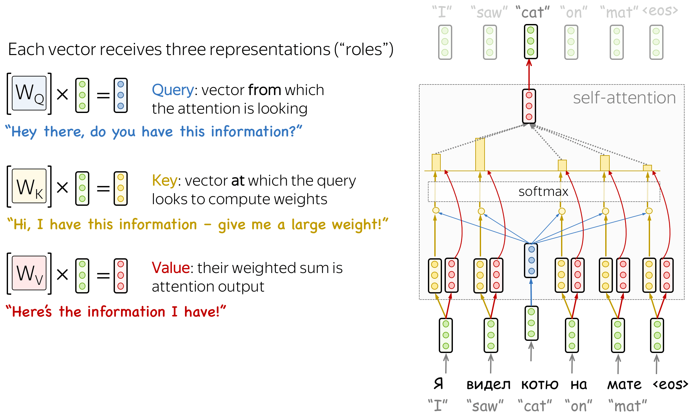
    <div style="background-color: rgba(238, 242, 255, 0.98); padding: 1rem 1.5rem; border-radius: 0 0 12px 12px; box-shadow: 0 8px 24px rgba(0, 0, 0, 0.15); border: 2px solid rgba(99, 102, 241, 0.3); border-top: none; flex-shrink: 0;">
      <h3 style="color: #4338ca; margin: 0; font-size: 1.2rem; font-weight: 600; text-align: center;">Attentionの計算</h3>
    </div>
  </div>
</div>

</div>

:: right ::

<div style="display: flex; justify-content: center;">
  
</div>

<div v-click="1" style="position: absolute; top: 260px; left: 600px; right: 240px; height: 160px; background-color: rgba(99, 102, 241, 0.5); border-radius: 8px; z-index: 0; display: flex; align-items: center; justify-content: center; padding: 1rem;">
  <div style="background-color: #4338ca; padding: 0.5rem 1rem; border-radius: 6px;">
    <p style="color: white; font-weight: 600; font-size: 1.1rem; margin: 0; text-align: center;">Encoder</p>
  </div>
</div>


<div v-click="1" style="position: absolute; top: 120px; left: 740px; right: 100px; height: 310px; background-color: rgba(184, 241, 99, 0.5); border-radius: 8px; z-index: 0; display: flex; align-items: center; justify-content: center; padding: 1rem;">
  <div style="background-color: #506720ff; padding: 0.5rem 1rem; border-radius: 6px;">
    <p style="color: white; font-weight: 600; font-size: 1.1rem; margin: 0; text-align: center;">Decoder</p>
  </div>
</div>


---
layout: top-title
color: indigo-light
align: lt
---

:: title ::

# 大規模言語モデルの事前学習

:: content ::

<div style="display: flex; justify-content: center;">
  
</div>


---
layout: top-title
color: indigo-light
align: lt
---

:: title ::

# 大規模言語モデルの事後学習（Post-training）

:: content ::

<v-clicks depth="2">

- 事前学習モデルは、あくまで「次に来る単語（トークン）を予測する」目的で学習されたもの
    - 次トークン予測 ≠ 相応しい応答
> **入力**：日本大学文理学部キャンパスはどこですか？

> **役にたつ出力**：東京都世田谷区桜上水3-25-40

> **自然に見える出力**: どのような学部がありますか

- Post-Trainingを通じて、大規模言語モデルが特定の業務やタスクにおいて**人間の要求に沿った回答**ができるように出力を整える能力を身につける
   - `指示学習`
   - `アライメント`

</v-clicks>


---
layout: top-title
color: indigo-light
align: lt
---

:: title ::

# 事後学習: 指示学習（Instruction Tuning）

:: content ::

<div class="relative w-full h-[520px]" style="margin-top: -5.5rem;">
  

  
</div>

---
layout: top-title
color: indigo-light
align: lt
---

:: title ::

# 事後学習: アライメント

:: content ::

<div style="display: flex; justify-content: center;">
  
</div>

<div style="display: flex; justify-content: center;">
  
</div>

---
layout: full
---

<div style="display: flex; justify-content: center;">
  
</div>


---
layout: top-title
color: indigo-light
align: lt
---

:: title ::

# 大規模言語モデルの問題点

:: content ::

<script setup>
import { ref } from 'vue'
const showStrawberryImage = ref(false)
const toggleStrawberryImage = () => {
  showStrawberryImage.value = !showStrawberryImage.value
}
</script>

<div style="position: relative;">

<div :style="{ opacity: showStrawberryImage ? 0.1 : 1, transition: 'opacity 0.3s' }">

<v-clicks depth="2">

- 大規模言語モデルの学習とファインチューニングでは多くの計算リソースと時間がかかる
- 最新情報・ローカル知識に弱い
- 計算や厳密処理の弱さ
    - strawberry問題 <a @click="toggleStrawberryImage" class="ns-c-iconlink" style="cursor: pointer;"><mdi-graph /></a>
- ハルシネーション(Hallucination)
    - Prompt: Tell me about the book The Lost City of Atlantis by John Doe.
    - 出力: The book The Lost City of Atlantis by John Doe explores the mythical city in great detail
        - ❌ その本はそもそも存在しない
    - LLMsの不適切な使用による学術研究にも問題を引き起こす：[GPTZero finds 100 new hallucinations in NeurIPS 2025 accepted papers](https://gptzero.me/news/neurips/)

</v-clicks>

</div>

<div v-if="showStrawberryImage" @click="toggleStrawberryImage" style="position: absolute; top: 0; left: 0; right: 0; bottom: 0; cursor: pointer; display: flex; align-items: center; justify-content: center; z-index: 10; background-color: rgba(255, 255, 255, 0.95); padding: 2rem;">
  <div style="display: flex; flex-direction: column; max-width: 90%; max-height: 70vh;">
    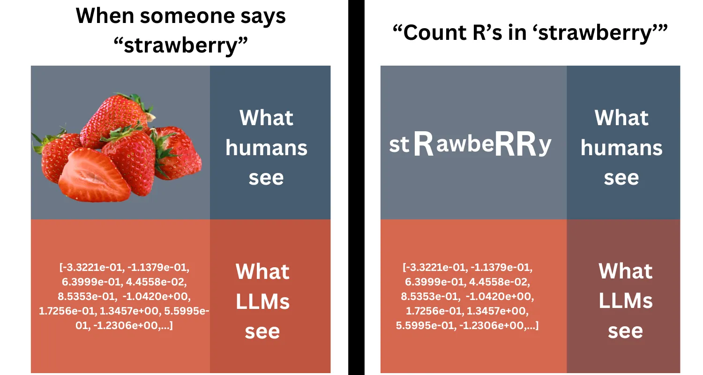
    <div style="background-color: rgba(238, 242, 255, 0.98); padding: 1rem 1.5rem; border-radius: 0 0 12px 12px; box-shadow: 0 8px 24px rgba(0, 0, 0, 0.15); border: 2px solid rgba(99, 102, 241, 0.3); border-top: none; flex-shrink: 0;">
      <h3 style="color: #4338ca; margin: 0; font-size: 1.2rem; font-weight: 600; text-align: center;">Strawberry問題</h3>
    </div>
  </div>
</div>

</div>

---
layout: top-title-two-cols
color: indigo-light
align: l-lt-lb
---

:: title ::

# 大規模言語モデルに基づくエージェント (LLMs Agent)

:: left ::

<script setup>
import { ref } from 'vue'
const showStrawberryToolImage = ref(false)
const showHallToolImage = ref(false)
const showReactPaperImage = ref(false)
const showChatgptMemoryImage = ref(false)
const toggleStrawberryToolImage = () => {
  showStrawberryToolImage.value = !showStrawberryToolImage.value
}
const toggleHallToolImage = () => {
  showHallToolImage.value = !showHallToolImage.value
}
const toggleReactPaperImage = () => {
  showReactPaperImage.value = !showReactPaperImage.value
}
const toggleChatgptMemoryImage = () => {
  showChatgptMemoryImage.value = !showChatgptMemoryImage.value
}
</script>

<div style="position: relative;">

<div :style="{ opacity: (showStrawberryToolImage || showHallToolImage || showReactPaperImage || showChatgptMemoryImage) ? 0.1 : 1, transition: 'opacity 0.3s' }">

<v-clicks depth="2">


🤖 **Agent: 環境を認識し、意思決定して行動する主体**

- LLMs Agent: 大規模言語モデルを中核として推論・意思決定・行動を行うエージェント
  - 記憶（Memory）：Agentが​過去経験を保存・検索する <a @click="toggleChatgptMemoryImage" class="ns-c-iconlink" style="cursor: pointer;"><mdi-graph /></a>
  - 計画（Planning）：Agentが​計画を策定・調整し、環境変化に応答する <a @click="toggleReactPaperImage" class="ns-c-iconlink" style="cursor: pointer;"><mdi-graph /></a>
  - ツール(Tool): Agentが呼び出すことができる外部機能 <a @click="toggleStrawberryToolImage" class="ns-c-iconlink" style="cursor: pointer;"><mdi-graph /></a> <a @click="toggleHallToolImage" class="ns-c-iconlink" style="cursor: pointer;"><mdi-graph /></a>
 

- LLM Agentは自律的に「目標達成のための一連の行動」を実行することで、複雑なタスクを対応することが可能となる

</v-clicks>

</div>

<div v-if="showChatgptMemoryImage" @click="toggleChatgptMemoryImage" style="position: absolute; top: 0; left: 0; right: 0; bottom: 0; cursor: pointer; display: flex; align-items: center; justify-content: center; z-index: 10; background-color: rgba(255, 255, 255, 0.95); padding: 2rem;">
  <div style="display: flex; flex-direction: column; max-width: 90%; max-height: 70vh;">
    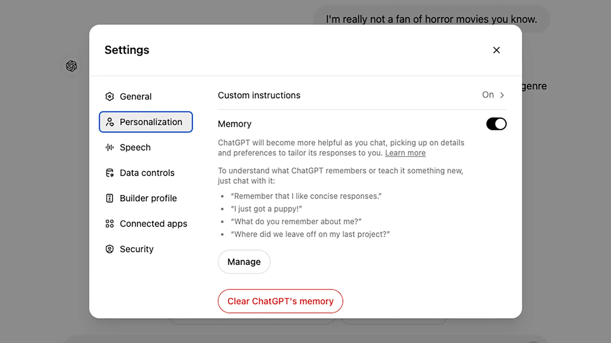
    <div style="background-color: rgba(238, 242, 255, 0.98); padding: 1rem 1.5rem; border-radius: 0 0 12px 12px; box-shadow: 0 8px 24px rgba(0, 0, 0, 0.15); border: 2px solid rgba(99, 102, 241, 0.3); border-top: none; flex-shrink: 0;">
      <h3 style="color: #4338ca; margin: 0; font-size: 1.2rem; font-weight: 600; text-align: center;">Memoryの例</h3>
    </div>
  </div>
</div>

<div v-if="showReactPaperImage" @click="toggleReactPaperImage" style="position: absolute; top: 0; left: 0; right: 0; bottom: 0; cursor: pointer; display: flex; align-items: center; justify-content: center; z-index: 10; background-color: rgba(255, 255, 255, 0.95); padding: 2rem;">
  <div style="display: flex; flex-direction: column; max-width: 96%; max-height: 82vh;">
    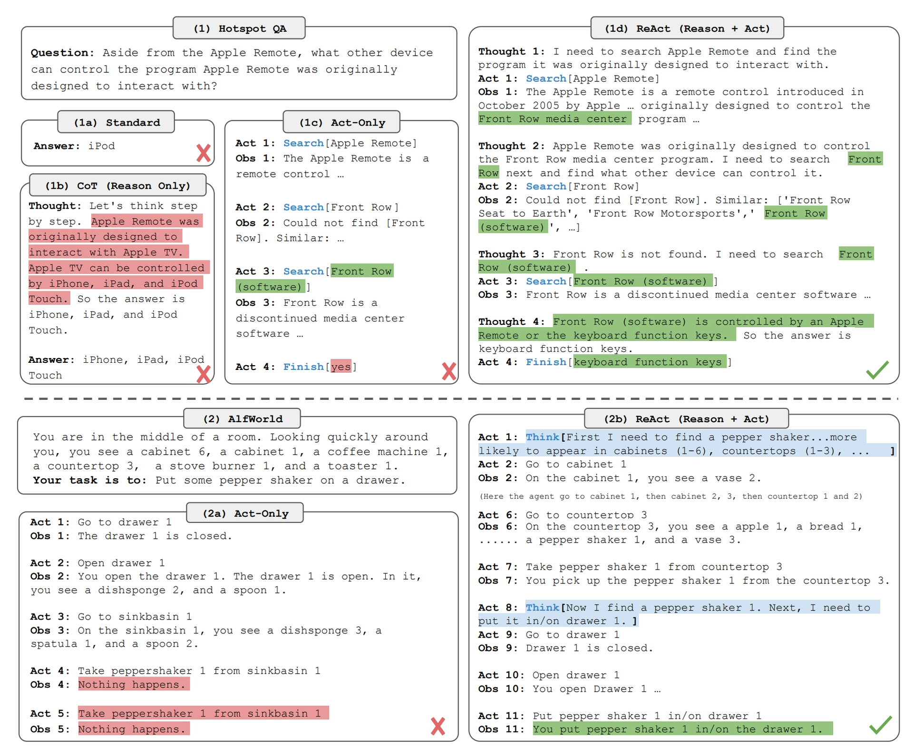
    <div style="background-color: rgba(238, 242, 255, 0.98); padding: 1rem 1.5rem; border-radius: 0 0 12px 12px; box-shadow: 0 8px 24px rgba(0, 0, 0, 0.15); border: 2px solid rgba(99, 102, 241, 0.3); border-top: none; flex-shrink: 0;">
      <h3 style="color: #4338ca; margin: 0; font-size: 1.2rem; font-weight: 600; text-align: center;">Planningの例</h3>
    </div>
  </div>
</div>

<div v-if="showStrawberryToolImage" @click="toggleStrawberryToolImage" style="position: absolute; top: 0; left: 0; right: 0; bottom: 0; cursor: pointer; display: flex; align-items: center; justify-content: center; z-index: 10; background-color: rgba(255, 255, 255, 0.95); padding: 2rem;">
  <div style="display: flex; flex-direction: column; max-width: 90%; max-height: 70vh;">
    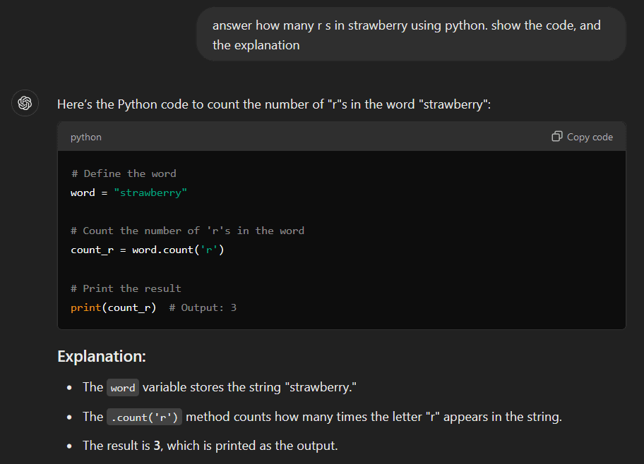
    <div style="background-color: rgba(238, 242, 255, 0.98); padding: 1rem 1.5rem; border-radius: 0 0 12px 12px; box-shadow: 0 8px 24px rgba(0, 0, 0, 0.15); border: 2px solid rgba(99, 102, 241, 0.3); border-top: none; flex-shrink: 0;">
      <h3 style="color: #4338ca; margin: 0; font-size: 1.2rem; font-weight: 600; text-align: center;">Toolの例 1</h3>
    </div>
  </div>
</div>

<div v-if="showHallToolImage" @click="toggleHallToolImage" style="position: absolute; top: 0; left: 0; right: 0; bottom: 0; cursor: pointer; display: flex; align-items: center; justify-content: center; z-index: 10; background-color: rgba(255, 255, 255, 0.95); padding: 2rem;">
  <div style="display: flex; flex-direction: column; max-width: 90%; max-height: 70vh;">
    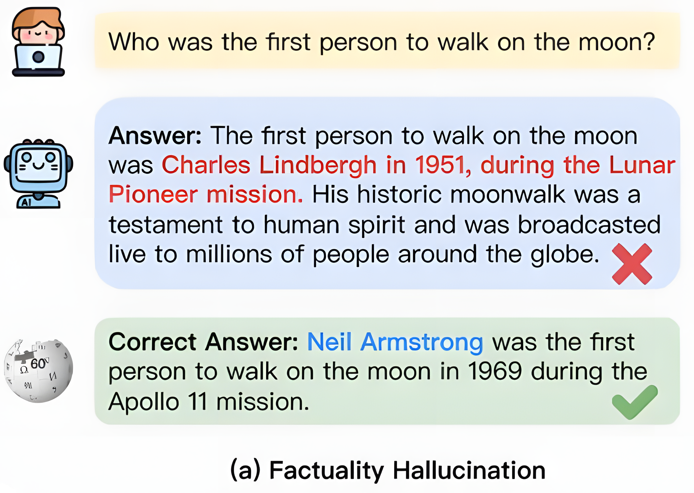
    <div style="background-color: rgba(238, 242, 255, 0.98); padding: 1rem 1.5rem; border-radius: 0 0 12px 12px; box-shadow: 0 8px 24px rgba(0, 0, 0, 0.15); border: 2px solid rgba(99, 102, 241, 0.3); border-top: none; flex-shrink: 0;">
      <h3 style="color: #4338ca; margin: 0; font-size: 1.2rem; font-weight: 600; text-align: center;">Toolの例 2</h3>
    </div>
  </div>
</div>

</div>

:: right ::

<div style="display: flex; justify-content: center;">
  
</div>


---
layout: section
color: indigo-light
---

### `大規模言語モデル`を用いるテキストマイニング

<hr>

---
layout: top-title-two-cols
color: indigo-light
align: l-lt-lb
columns: is-7
---

:: title ::

# 社会科学におけるテキストマイニング手法の応用

:: left ::

<v-clicks depth="2">

- SNS投稿、ニュース記事、議会会議録などに代表される言説データのデジタル化と蓄積により、人間行動および社会現象がテキストとして大規模に観測可能となった
- テキストマイニングは社会科学研究に新たな分析可能性をもたらしている
   - 従来は操作化・定量化が困難であった概念（態度、感情、フレーミング、道徳、社会規範など）を、言語表現に基づいて測定できるようになった
   - 高頻度かつ高粒度の時系列分析が可能となった
- 自然言語処理技術の発展と計算資源の高度化により、こうした手法は学術研究としても実装・運用可能な水準に達している
</v-clicks>


:: right ::

<div style="display: flex; justify-content: center;">
  
</div>

<div style="display: flex; justify-content: center;">
  
</div>


---
layout: top-title
color: indigo-light
align: lt
---

:: title ::

# テキスト分類

:: content ::

<script setup>
import { ref } from 'vue'
const showPretrainingAdaptationImage = ref(false)
const togglePretrainingAdaptationImage = () => {
  showPretrainingAdaptationImage.value = !showPretrainingAdaptationImage.value
}
</script>

<div style="position: relative;">

<div :style="{ opacity: showPretrainingAdaptationImage ? 0.1 : 1, transition: 'opacity 0.3s' }">

<v-clicks depth="2">

- **テキスト分類**は、社会科学における多様な研究課題に広く応用可能である
   - 感情分析・Stance Detection・Hate Speech Detection
- テキスト分類手法は、自然言語処理の発展に伴い、高度化・多様化してきた
   - 辞書ベース／ルールベース（〜2000年代）
   - 特徴量ベースの機械学習（2000年代後半〜2010年代前半）
   - 🌟転移学習（2018〜）  ([Wankmüller, 2022](https://journals.sagepub.com/doi/abs/10.1177/00491241221134527); [Wang, 2023](https://www.cambridge.org/core/journals/political-analysis/article/abs/topic-classification-for-political-texts-with-pretrained-language-models/9AA6401CAB1FA3D1EADC7A3D155BB265)) <a @click="togglePretrainingAdaptationImage" class="ns-c-iconlink" style="cursor: pointer;"><mdi-graph /></a>
      - 複雑なタスクに対応するためには、相応のアノテーション作業を人手で行い、学習データを作成する手間が必要となる。
   - ▶️ **LLMsを用いるテキスト分類** ([Griswold et al., 2025](https://www.cambridge.org/core/journals/political-analysis/article/stay-tuned-improving-sentiment-analysis-and-stance-detection-using-large-language-models/2D8F121012D3D1CB2259B6DD5EE32D0D);[Chae & Davidson, 2025](https://journals.sagepub.com/doi/abs/10.1177/00491241251325243))
</v-clicks>

</div>

<div v-if="showPretrainingAdaptationImage" @click="togglePretrainingAdaptationImage" style="position: absolute; top: 0; left: 0; right: 0; bottom: 0; cursor: pointer; display: flex; align-items: center; justify-content: center; z-index: 10; background-color: rgba(255, 255, 255, 0.95); padding: 2rem;">
  <div style="display: flex; flex-direction: column; max-width: 90%; max-height: 70vh;">
    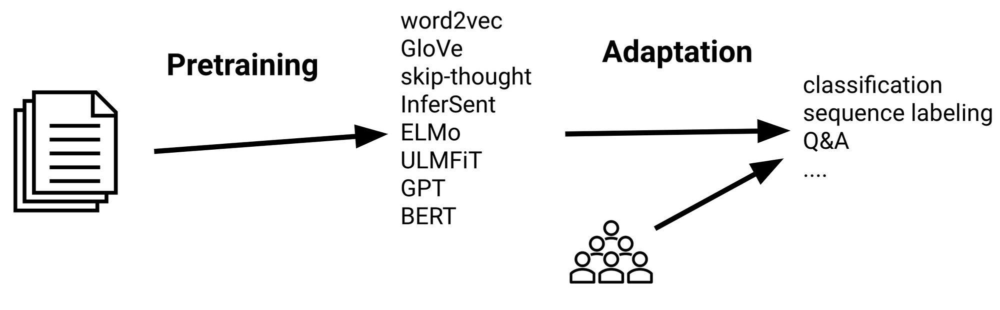
    <div style="background-color: rgba(238, 242, 255, 0.98); padding: 1rem 1.5rem; border-radius: 0 0 12px 12px; box-shadow: 0 8px 24px rgba(0, 0, 0, 0.15); border: 2px solid rgba(99, 102, 241, 0.3); border-top: none; flex-shrink: 0;">
      <h3 style="color: #4338ca; margin: 0; font-size: 1.2rem; font-weight: 600; text-align: center;">転移学習とドメイン適応</h3>
    </div>
  </div>
</div>

</div>

---
layout: top-title
color: indigo-light
align: lt
---

:: title ::

# テキストマイニングツールとしての大規模言語モデル

:: content ::

> ほぼあらゆるNLPタスクは、テキスト生成問題として定式化できる [(Brown et al., 2020)](https://arxiv.org/abs/2005.14165)


| タスク    | 入力例                           | 出力例                           | プロンプト                              |
| ------ | ----------------------------- | ----------------------------- | --------------------------------------------- |
| テキスト分類 | テキスト：This movie is fantastic. | Positive                      | Text: This movie is fantastic. Sentiment: ___ |
| 質問応答   | 質問：Who wrote Hamlet?          | William Shakespeare           | Q: Who wrote Hamlet? A: ___                   |
| 翻訳     | 英文：How are you?               | 仏文：Comment ça va ?            | Translate English to French: How are you? ___ |
| 要約     | 文章：Artificial intelligence... | 簡潔な要約：AI is a branch of CS... | Summarize the following: Artificial... ___    |


---
layout: two-cols-title
columns: is-6
align: l-lt-lt
---

:: title ::

# 大規模言語モデルの使用：ローカルLLM

:: left ::

<script setup>
import { ref } from 'vue'
const showPrecisionsImage = ref(false)
const showQuantizationImage = ref(false)
const togglePrecisionsImage = () => {
  showPrecisionsImage.value = !showPrecisionsImage.value
}
const toggleQuantizationImage = () => {
  showQuantizationImage.value = !showQuantizationImage.value
}
</script>

<div style="position: relative;">

<div :style="{ opacity: (showPrecisionsImage || showQuantizationImage) ? 0.1 : 1, transition: 'opacity 0.3s' }">

<v-clicks depth="2">

- 自分のPC/サーバ上でLLMを動かして使う
    - [HuggingFace Hub](https://huggingface.co/)から多くのオープンソース LLMを取得可能
    - 一般的的にはGPUを使うことが前提になる
    - GPU環境は初期投資が大きいものの、利用量が増えるほど単価が下がり
- 近年、オープンソース LLM の性能向上(Llama,Deepseek,Qwen3など)
- `量子化技術`を使うことで必要される計算リソースを大幅に減らせる <a @click="togglePrecisionsImage" class="ns-c-iconlink" style="cursor: pointer;"><mdi-graph /></a> <a @click="toggleQuantizationImage" class="ns-c-iconlink" style="cursor: pointer;"><mdi-graph /></a>
- 自分の要件に合わせてカスタマイズ
</v-clicks>

</div>

<div v-if="showPrecisionsImage" @click="togglePrecisionsImage" style="position: absolute; top: 0; left: 0; right: 0; bottom: 0; cursor: pointer; display: flex; align-items: center; justify-content: center; z-index: 10; background-color: rgba(255, 255, 255, 0.95); padding: 2rem;">
  <div style="display: flex; flex-direction: column; max-width: 90%; max-height: 70vh;">
    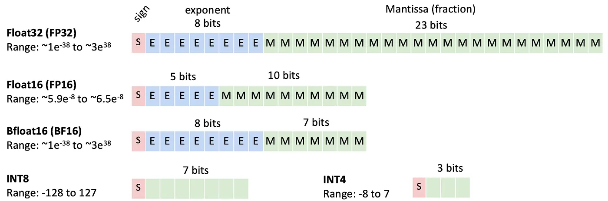
    <div style="background-color: rgba(238, 242, 255, 0.98); padding: 1rem 1.5rem; border-radius: 0 0 12px 12px; box-shadow: 0 8px 24px rgba(0, 0, 0, 0.15); border: 2px solid rgba(99, 102, 241, 0.3); border-top: none; flex-shrink: 0;">
      <h3 style="color: #4338ca; margin: 0; font-size: 1.2rem; font-weight: 600; text-align: center;">量子化精度の比較</h3>
    </div>
  </div>
</div>

<div v-if="showQuantizationImage" @click="toggleQuantizationImage" style="position: absolute; top: 0; left: 0; right: 0; bottom: 0; cursor: pointer; display: flex; align-items: center; justify-content: center; z-index: 10; background-color: rgba(255, 255, 255, 0.95); padding: 2rem;">
  <div style="display: flex; flex-direction: column; max-width: 90%; max-height: 70vh;">
    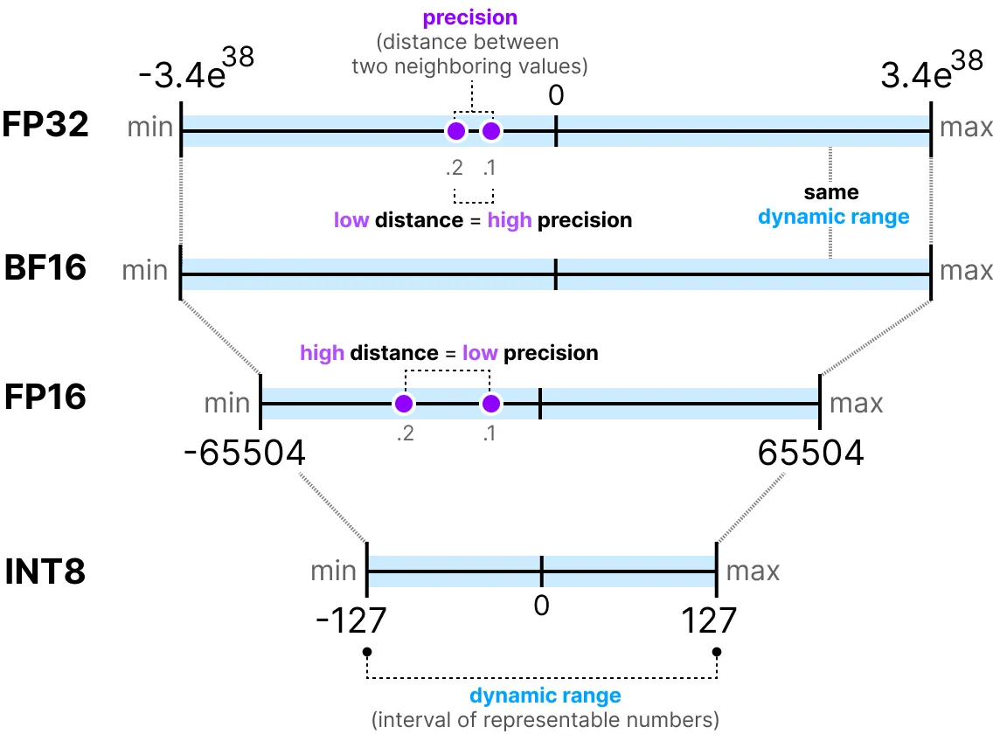
    <div style="background-color: rgba(238, 242, 255, 0.98); padding: 1rem 1.5rem; border-radius: 0 0 12px 12px; box-shadow: 0 8px 24px rgba(0, 0, 0, 0.15); border: 2px solid rgba(99, 102, 241, 0.3); border-top: none; flex-shrink: 0;">
      <h3 style="color: #4338ca; margin: 0; font-size: 1.2rem; font-weight: 600; text-align: center;">量子化</h3>
    </div>
  </div>
</div>

</div>

:: right ::

VRAM別動かせるモデルの目安（[参照先](https://dev.classmethod.jp/articles/local-llm-guide-2026/)）

|   VRAM | 動かせるモデル                                        |  量子化 |
| -----: | ---------------------------------------------- | ---: |
|    8GB | Qwen3-1.7B、Qwen 7B                             | 4bit |
|   16GB | gpt-oss-20b、Qwen3-14B、Nemotron 3 Nano、Llama 8B | 8bit |
|   24GB | Llama 70B 、Gemma 3-27B、GLM-4.7-Flash     | 4bit |
|  48GB+ | Llama 405B                                     | 8bit |
| 150GB+ | Qwen3-Coder-480B                        | 4bit |


---
layout: top-title
color: indigo-light
align: lt
---

:: title ::

# 大規模言語モデルの使用：ローカルLLM

:: content ::

- Hugging Face の [Transformers](https://huggingface.co/docs/transformers/en/index)ライブラリで動かす
    - [HuggingFace Hub](https://huggingface.co/)からオープンソースLLMのリンクを取得
- `AutoModel`や`pipeline`などの機能で手軽にオープンソースLLMを実装
- [`bitsandbytes`](https://huggingface.co/docs/transformers/en/quantization/bitsandbytes) と組み合わせることで量子化を実装


````md magic-move {lines: true}

```py {3|4-9|10}
import torch
from transformers import pipeline
model_dir = "model_path"
gen = pipeline(
    task="text-generation",
    model=model_dir,
    torch_dtype=torch.float16, 
    device_map="auto",             # GPU/CPUへ自動割り当て
)
out = gen("日本語で自己紹介して。", max_new_tokens=128, do_sample=True, temperature=0.7)
```

```py {1-6|7}
from transformers import AutoTokenizer, AutoModelForCausalLM
model_dir = "model_path"
tok = AutoTokenizer.from_pretrained(model_dir)
model = AutoModelForCausalLM.from_pretrained(
    model_dir,
    device_map="auto",
    load_in_4bit=True,   # 4bit量子化
)
```
````


---
layout: top-title
color: indigo-light
align: lt
---

:: title ::

# 大規模言語モデルの使用：API

:: content ::

- OpenAIやGoogleなどの会社は、APIで独自のAIモデルを利用するサービスを提供している
   - 事前に発行した`APIキー`をリクエストに添えて送る形で利用する権限を取得して呼び出す
   - **従量課金（pay-as-you-go）**: 基本的には、入力トークンと出力トークンの長さによって課金される
       - 一部モデルでは内部推論に相当するトークンがあり、見えなくても出力側として課金対象になる
- Pythonライブラリで手軽に各社のLLMsサービスをAPIを経由して利用することができる

````md magic-move {lines: true}

```py {1-2|3-5|6-10|*}
# 公式SDKを読み込む
from openai import OpenAI
# OpenAI API キーを設定
api_key=XXX
client = OpenAI(api_key=api_key)
# LLMに入力を渡してテキスト生成を依頼する
resp = client.responses.create(
    model="gpt-4.1-mini",
    input="LLM APIの使い方を説明しなさい"
)
```
````

---
layout: top-title
color: indigo-light
align: lt
title: LLMsを用いるテキスト分類
---

:: title ::

# LLMsを用いるテキスト分類

:: content ::

[](https://colab.research.google.com/github/lvzeyu/Presentation/blob/main/Tutorial/2026/JAMS_2026/classification_llm.ipynb)

````md magic-move {lines: true}

```py {*}
def get_predictions(prompt_generator, texts, model):
  """
  Inference with the API for a model, a list of texts and a prompt format
  """
  results = []
  for i,j in texts.items():
    try:
      print(f"\rRequest element {i}", end= "")
      completion = client.chat.completions.create(
        model=model,
        messages=prompt_generator(j)
      )
      results.append(completion)
    except Exception as e:
      print(e)
      results.append(None)
  print("\rPrediction finished")
  return [i.choices[0].message.content for i in results]
```

```py {*}
def build_prompt(text):
  system_prompt = (
      "You are a strict sentiment classifier for Japanese text. "
      "Output exactly one label from: NEGATIVE, NEUTRAL, POSITIVE. "
      "No explanation, no punctuation, no extra words."
  )

  user_prompt = (
      f"Text: {text}\n"
      "Label (NEGATIVE/NEUTRAL/POSITIVE):"
  )

  return [{"role":"system",
           "content":system_prompt,
           },
           {"role":"user",
            "content": user_prompt,
           },
  ]
```
```py {*}

r = get_predictions(
    prompt_generator=build_prompt, #prompt you want to use
    texts=sample_data["sentence"][0:5], #texts you want to classify (change or remove [0:5])
    model="gpt-4o-mini" #model you want to use
    )
```

````

---
layout: top-title
color: indigo-light
align: lt
---

:: title ::

# LLMを用いたテキスト分類の応用に向けた実践的アドバイス

:: content ::

<script setup>
import { ref } from 'vue'
const showLoraMemoryImage = ref(false)
const showDebateImage = ref(false)
const toggleLoraMemoryImage = () => {
  showLoraMemoryImage.value = !showLoraMemoryImage.value
}
const toggleDebateImage = () => {
  showDebateImage.value = !showDebateImage.value
}
</script>

<div style="position: relative;">

<div :style="{ opacity: (showLoraMemoryImage || showDebateImage) ? 0.1 : 1, transition: 'opacity 0.3s' }">

<v-clicks depth="2">

- APIで高度なLLMsを用いて、複雑なタスクにおいても高い精度を達成できるが([Griswold et al., 2025](https://www.cambridge.org/core/journals/political-analysis/article/stay-tuned-improving-sentiment-analysis-and-stance-detection-using-large-language-models/2D8F121012D3D1CB2259B6DD5EE32D0D))
    - 大規模なデータを処理するための費用が高い
    - **再現性**と**透明性**に問題点 ([Aiyappa et al., 2023](https://aclanthology.org/2023.trustnlp-1.5/);[Motoki et al., 2024](https://link.springer.com/article/10.1007/s11127-023-01097-2))
- **学術研究ではオープンソースLLMsを使うべきの呼びかけ**[(Palmer et al., 2024)](https://www.nature.com/articles/s43588-023-00585-1)
    - 複数モデルの比較と併用
        - 精度の向上と特定モデルによるバイアスの軽減[(Than et al., 2025)](https://journals.sagepub.com/doi/full/10.1177/00491241251339188)
    - ファインチューニングを通じて、一部のタスクでは比較的に小規模なモデルでも同等の精度を達成できる[(Chae & Davidson, 2025)](https://journals.sagepub.com/doi/abs/10.1177/00491241251325243)
        - 量子化技術と`Parameter efficient fine-tuning`手法の発展により、ファインチューニングは従来よりも手軽に実施できるようになった <a @click="toggleLoraMemoryImage" class="ns-c-iconlink" style="cursor: pointer;"><mdi-graph /></a>
    - **専門特化のモデル**:多様な政治関連の分類タスクでファインチュニックすることで、関連分野における未知の分離タスクでも対応可能になる[(Burnham et al., 2026)](https://www.cambridge.org/core/journals/political-analysis/article/political-debate-efficient-zeroshot-and-fewshot-classifiers-for-political-text/8D0B3E2AAF711F4812E42466DE503A13) <a @click="toggleDebateImage" class="ns-c-iconlink" style="cursor: pointer;"><mdi-graph /></a>

</v-clicks>

</div>

<div v-if="showLoraMemoryImage" @click="toggleLoraMemoryImage" style="position: absolute; top: 0; left: 0; right: 0; bottom: 0; cursor: pointer; display: flex; align-items: center; justify-content: center; z-index: 10; background-color: rgba(255, 255, 255, 0.95); padding: 2rem;">
  <div style="display: flex; flex-direction: column; max-width: 90%; max-height: 70vh;">
    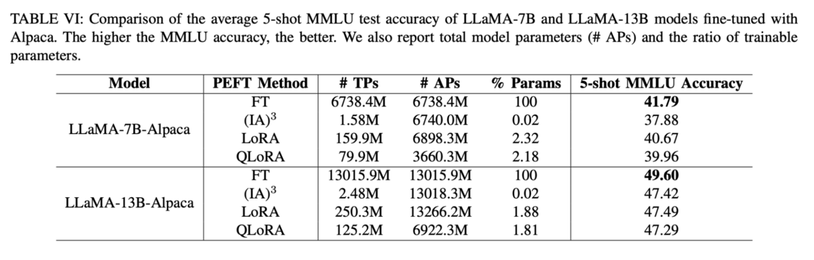
    <div style="background-color: rgba(238, 242, 255, 0.98); padding: 1rem 1.5rem; border-radius: 0 0 12px 12px; box-shadow: 0 8px 24px rgba(0, 0, 0, 0.15); border: 2px solid rgba(99, 102, 241, 0.3); border-top: none; flex-shrink: 0;">
      <h3 style="color: #4338ca; margin: 0; font-size: 1.2rem; font-weight: 600; text-align: center;">LoRAによる学習効率の向上</h3>
    </div>
  </div>
</div>

<div v-if="showDebateImage" @click="toggleDebateImage" style="position: absolute; top: 0; left: 0; right: 0; bottom: 0; cursor: pointer; display: flex; align-items: center; justify-content: center; z-index: 10; background-color: rgba(255, 255, 255, 0.95); padding: 2rem;">
  <div style="display: flex; flex-direction: column; max-width: 90%; max-height: 70vh;">
    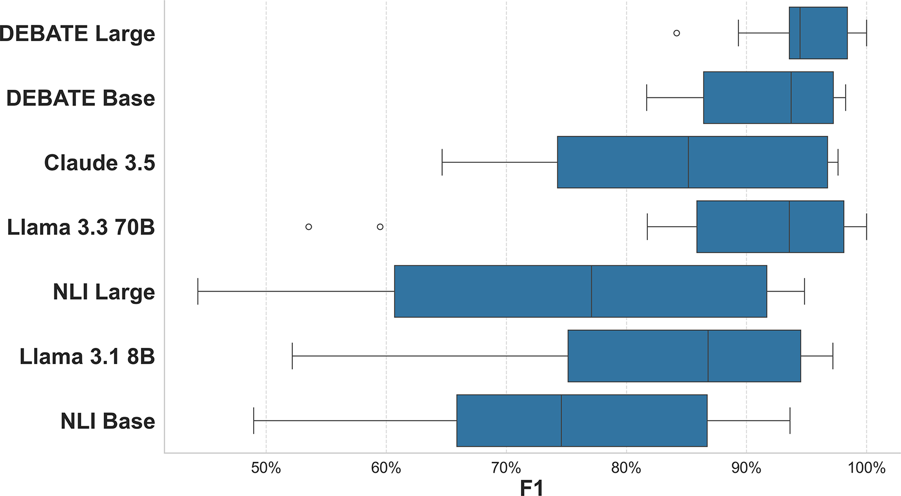
    <div style="background-color: rgba(238, 242, 255, 0.98); padding: 1rem 1.5rem; border-radius: 0 0 12px 12px; box-shadow: 0 8px 24px rgba(0, 0, 0, 0.15); border: 2px solid rgba(99, 102, 241, 0.3); border-top: none; flex-shrink: 0;">
      <h3 style="color: #4338ca; margin: 0; font-size: 1.2rem; font-weight: 600; text-align: center;">専門特化モデルより関連分野のテキスト分類</h3>
    </div>
  </div>
</div>

</div>


---
layout: top-title-two-cols
color: indigo-light
align: l-lt-lb
columns: is-6
clicks: 2
---

:: title ::

# LLMを用いたテキスト分類の応用に向けた実践的アドバイス

:: left ::

<v-click at="1">

<div style="display: flex; justify-content: center;">
  
</div>

- [Chae & Davidson (2025)](https://journals.sagepub.com/doi/abs/10.1177/00491241251325243)より提案したLLMを用いたテキスト分類を行う際、タスクの特徴に基づく適切な方法を選定するロードマップ
</v-click>

:: right ::

<v-click at="2">

<div style="display: flex; justify-content: center;">
  
</div>

- 実践上は、LLMによる分類結果を人間が検証・修正する反復的プロセスを採用することで、より信頼性の高い結果が得られる[(Than et al., 2025)](https://journals.sagepub.com/doi/full/10.1177/00491241251339188)

- **LLMは、研究者の労力を低減しつつ分析を支援するツールとして位置づけるべきである**

</v-click>


---
layout: section
color: indigo-light
---

### `大規模言語モデル`を用いる社会シミュレーション

<hr>


---
layout: top-title
color: indigo-light
align: lt
---
:: title ::

# 社会シミュレーションの目標: 社会的事実の再現

:: content ::

<div style="display: flex; justify-content: center;">
  
</div>

---
layout: top-title
color: indigo-light
align: lt
---

:: title ::

# 社会シミュレーションの目標: 解釈

:: content ::

<div style="display: flex; justify-content: center;">
  
</div>

<v-clicks depth="2">

**社会シミュレーションによるメカニズムを説明する**([Hedström & Swedberg, 1998](https://www.cambridge.org/core/books/social-mechanisms/F54BB7A4A77F7308D5FEA7D9C0EAD086);[瀧川, 2019](https://www.jstage.jst.go.jp/article/ojjams/34/1/34_47/_article/-char/ja/))

- マクロレベルの制度・規範・文化・社会構造は個人行動に影響を与える
- 個体間の相互作用は集団的行動を生み出す
- **多数の個体行動が集積すると、新たなマクロ社会現象が形成される**
   - ⚠️ 個体間の相互作用と集積過程を把握することは難しい

</v-clicks>

---
layout: iframe-right
title: iframe Right Layout
# the web page source
url: http://nifty.stanford.edu/2014/mccown-schelling-model-segregation/

# a custom class name to the content
class: my-cool-content-on-the-right
slide_info: false
---

# 社会科学における社会シミュレーション手法: Agent based Model

- **Agentは局所的ルールに従って独立に行動し、最終的にマクロな社会構造が生じる**

- Agent(=住民): 異なる人種の住民
  - 各住民は近傍における同類住民の割合を観察する
  - その割合が許容度を下回ると、住民は移動を選択する

<AdmonitionType type="important" width="300px">
Agentの特性と行動は数学的な形式化によって定義される
</AdmonitionType>


---
layout: top-title
color: indigo-light
align: lt
---

:: title ::

# 社会シミュレーションの目標

:: content ::

<script setup>
import { ref } from 'vue'
const showAimImage = ref(false)
const toggleAimImage = () => {
  showAimImage.value = !showAimImage.value
}
</script>

<div style="position: relative;">

<div :style="{ opacity: showAimImage ? 0.1 : 1, transition: 'opacity 0.3s' }">

<v-clicks depth="2">

- 社会シミュレーションの異なる方向性
  - **予測的シミュレーション**: 事実状況を可能な限り再現するシミュレーションを構築し、社会現象の将来動向を予測する
    - 例: 災害発生時の人口避難経路の予測
    - 🌟現実の人間らしいAgentを精密的に定義する必要がある
  - **説明的シミュレーション**: シミュレーションを通じて社会現象の成因とメカニズムを理解・説明する
    - 例: Schellingモデルは、個人の選好が低くても高度に隔離された社会構造が生じうることを示した
     - 🌟必要最小限の要素に絞ったAgentの方が解釈しやすい

- 計算社会科学の目標: solution-oriented[(Watts, 2017)](https://www.nature.com/articles/s41599-023-01577-2?fromPaywallRec=false); 解釈と予測の統合 [(Hofman et al., 2021)](https://www.nature.com/articles/s41586-021-03659-0) <a @click="toggleAimImage" class="ns-c-iconlink" style="cursor: pointer;"><mdi-graph /></a>
    - 実証データに基づくAgent based model[(Bruch & Atwell, 2013)](https://journals.sagepub.com/doi/full/10.1177/0049124113506405?casa_token=np7Jikc1cbcAAAAA%3ApJrnC7bevG7hw7AXbx7M89E7FrQuJN62KhADQVNqReGwYymAM7C1WFLySpkoZyFvOI_K3rOzg85iPA#bibr37-0049124113506405)

</v-clicks>

</div>

<div v-if="showAimImage" @click="toggleAimImage" style="position: absolute; top: 0; left: 0; right: 0; bottom: 0; cursor: pointer; display: flex; align-items: center; justify-content: center; z-index: 10; background-color: rgba(255, 255, 255, 0.95); padding: 2rem;">
  <div style="display: flex; flex-direction: column; max-width: 90%; max-height: 70vh;">
    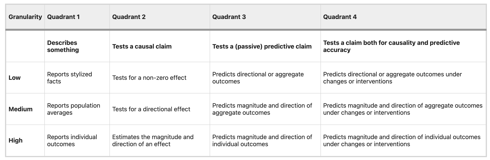
    <div style="background-color: rgba(238, 242, 255, 0.98); padding: 1rem 1.5rem; border-radius: 0 0 12px 12px; box-shadow: 0 8px 24px rgba(0, 0, 0, 0.15); border: 2px solid rgba(99, 102, 241, 0.3); border-top: none; flex-shrink: 0;">
      <h3 style="color: #4338ca; margin: 0; font-size: 1.2rem; font-weight: 600; text-align: center;">解釈と予測の統合</h3>
    </div>
  </div>
</div>

</div>


---
layout: top-title
color: indigo-light
align: lt
---

:: title ::

# LLM Agentがもたらす可能性

:: content ::

- LLM AgentでルールベースのAgentを入れ替えることでシミュレーションを構築[(Gao et al., 2024)](https://www.nature.com/articles/s41599-024-03611-3)


<div style="display: flex; justify-content: center;">
  
</div>


---
layout: top-title
color: indigo-light
align: lt
---

:: title ::

# LLMs Agentに基づく社会シミュレーション

:: content ::

<div grid="~ cols-2 gap-4">
<div>

- LLMs Agentを配置し、各エージェントにLLMsを通じて属性・日常計画・行動目標を設定した [(Park et al., 2023)](https://dl.acm.org/doi/fullHtml/10.1145/3586183.3606763)
  - 記憶（Memory）：​自然言語形式で過去経験を保存・検索する。​
  - 省察（Reflection）：​記憶を統合して高次の洞察を形成し、将来の行動を導く。​
  - 計画（Planning）：​日常計画を策定・調整し、環境変化に応答する。
- 事前に設定していなくても、エージェント間で自発的に社会的行動が生じた

<Admonition title="社会シミュレーションにおいて" color="indigo-light" custom="text-lg font-bold" customTitle="text-red-500">
Agentの行動と相互作用は、大規模言語モデルが生成する自然言語によって表現される
</Admonition>

</div>

<div>

<div style="display: flex; justify-content: center;">
  
</div>

<div style="display: flex; justify-content: center; margin-top: 2rem;">
  
</div>

</div>
</div>


<div class="abs-br m-6 text-xl">
  <a href="https://arxiv.org/abs/2304.03442" target="_blank" class="slidev-icon-btn">
    <carbon:document />
  </a>
</div>


---
layout: top-title
color: indigo-light
align: lt
---

:: title ::

# LLMs Agentの実装

:: content ::

- [Park et al., (2023)](https://dl.acm.org/doi/fullHtml/10.1145/3586183.3606763)の[実装デモ](https://reverie.herokuapp.com/UIST_Demo/)と[ソースコード](https://github.com/joonspk-research/generative_agents)

````md magic-move {lines: true}

```{1-7|8-12|13-16|13-16|17-18|20-21}
~~~ prompt    ----------------------------------------------------
# 属性の設定
Name: Isabella Rodriguez
Age: 34
Innate traits: friendly, outgoing, hospitable
Learned traits: Isabella Rodriguez is a cafe owner of Hobbs Cafe who loves to make people feel welcome. 
She is always looking for ways to make the cafe a place where people can come to relax and enjoy themselves.
# Memory
Currently: Isabella Rodriguez is planning on having a Valentine Day party at Hobbs Cafe with 
her customers on February 14th, 2023 at 5pm. She is gathering party material, and is telling everyone
to join the party at Hobbs Cafe on February 14th, 2023, from 5pm to 7pm.
Lifestyle: Isabella Rodriguez goes to bed around 11pm, awakes up around 6am.
# Plan
Daily plan requirement: Isabella Rodriguez opens Hobbs Cafe at 8am everyday, and works at the counter until 8pm, at which point she closes the cafe.
Current Date: Monday February 13
In general, Isabella Rodriguez goes to bed around 11pm, awakes up around 6am.
# Act
Isabella's wake up hour: 

~~~ output    ----------------------------------------------------
6 
```


````


---
layout: top-title
color: indigo-light
align: lt
---

:: title ::

# LLMs Agentを用いる社会シミュレーションの問題点

:: content ::

<v-clicks depth="2">

- 学習データや設計による**LLMのバイアス**
    - LLMを用いて人間行動や意思決定を再現する際には、**特定の社会属性（性別・人種など）や政治的立場に関する表現・判断が偏る傾向**がある[(Kotek et al., 2023](https://dl.acm.org/doi/10.1145/3582269.3615599);[Bang et al., 2024](https://arxiv.org/abs/2403.18932))
    - LLMは、集団を単一の「典型像」として表象してしまい、**集団内の異質性が失われやすい**([Wang et al., 2025](https://www.nature.com/articles/s42256-025-00986-z);[Bisbee et al., 2024](https://www.cambridge.org/core/journals/political-analysis/article/synthetic-replacements-for-human-survey-data-the-perils-of-large-language-models/B92267DC26195C7F36E63EA04A47D2FE))
    - 学習データには虚構的な場面の記述も含まれるため、LLMの出力が必ずしも現実社会の状況を正確に反映するとは限らない[(Kozlowski & Evans, 2025)](https://journals.sagepub.com/doi/10.1177/00491241251337316)
- 再現性と透明性はLLMs Agentを用いる社会シミュレーションにおいても問題視されている
   - 同じ設定でも、モデルやプロンプトの調整次第で結果が大きく変わることがある[(Bisbee et al., 2024)](https://www.cambridge.org/core/journals/political-analysis/article/synthetic-replacements-for-human-survey-data-the-perils-of-large-language-models/B92267DC26195C7F36E63EA04A47D2FE)
   - 学習データと学習プロセスを公開しないLLMも多くある
      - 多くのLLMは「無害化」方向に調整されたかもしれんが、その影響で一部の社会シミュレーションには不向きな場合もある[(Bail, 2024)](https://www.pnas.org/doi/10.1073/pnas.2314021121)

</v-clicks>

---
layout: two-cols-title
columns: is-7
align: l-lt-lt
---

:: title ::

# 社会シミュレーションと実証データの結合

:: left ::

### Agent Bank [(Park et al., 2024)](https://arxiv.org/abs/2411.10109)


- **基本的アイデア**：特定の実在個人に関する詳細な情報を収集してLLMに与えることで、その人物をより確実に模したLLMエージェントを作成できる
- AIによるインタビュアーを実施し、そのインタビュー記録を“Agentの記憶”としてプロンプトに入れる
- 作成されたAgentに質問し、その回答結果を該当する人間と比較することで、Agentの性能を評価する
    - General Social Surveyの質問への回答では、提案手法のほうがより整合性の高い結果を得た

<AdmonitionType type="important" width="500px">
実証データを組み込むプロンプト設計により、人間の振る舞いをより高精度に再現することが可能となる
</AdmonitionType>

:: right ::

<div style="display: flex; justify-content: center;">
  
</div>

<div style="display: flex; justify-content: center;">
  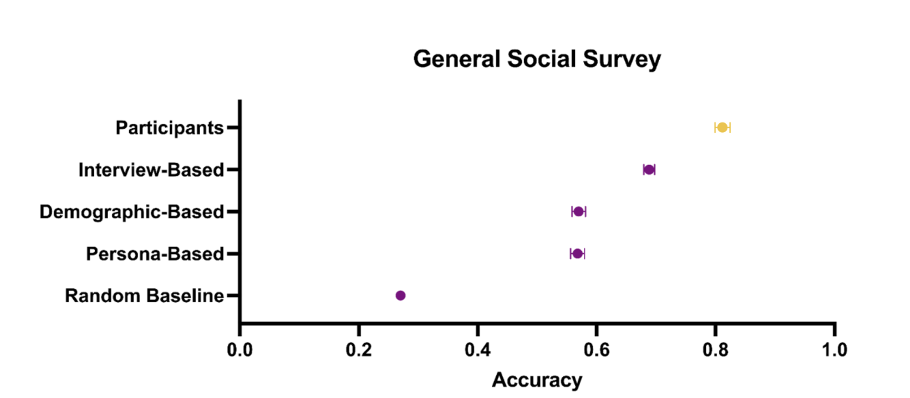
</div>


---
layout: top-title
color: indigo-light
align: lt
---

:: title ::

# 社会科学研究に向けてLLMsのファインチューニング

:: content ::

- 蓄積された社会科学研究データを学習データとして用い、社会科学研究に特化したLLMを作成する試み([Kolluri et al., 2025](https://aclanthology.org/2025.emnlp-main.1530.pdf);[Suh et al., 2025](https://aclanthology.org/2025.acl-long.1028.pdf))

<div style="display: grid; grid-template-columns: repeat(2, minmax(0, 1fr)); gap: 1rem; align-items: start;">
  <div style="display: flex; justify-content: center;">
    
  </div>
  <div style="display: flex; flex-direction: column; align-items: center;">
    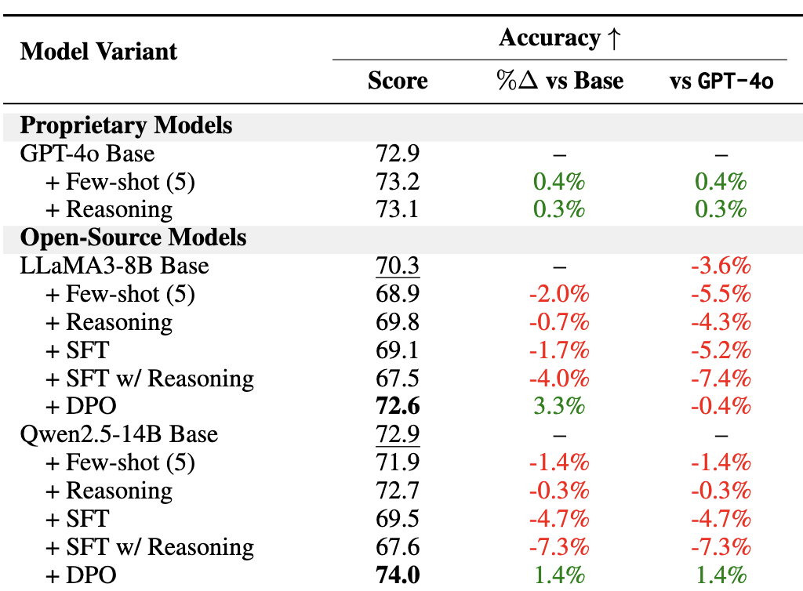
    <p style="margin-top: 0.5rem; font-size: 0.9rem;">Kolluri et al., (2025)では、大量の社会科学実験に基づく「デモグラ（persona）＋実験条件（condition）＋アウトカム質問（outcome）→回答（response）」といった標準化データセットを構築し、それを用いてオープンソースLLMをファインチューニングすることでGPT-4oを超える性能を達成した</p>
  </div>
</div>


---
layout: top-title
color: indigo-light
align: lt
---

:: title ::

# ファインチューニングの問題点

:: content ::

<v-clicks depth="2">

- 計算リソースの制限
- 過学習のリスク [(Kozlowski & Evans, 2025)](https://journals.sagepub.com/doi/10.1177/00491241251337316)
    - ある行動を学習させると、別の能力が落ちたり、他タスクで挙動が崩れることがある
- **Activation Steering**: 言語モデルの内部表現を操作することで、モデルが指示に従うように制御する手法
    - 計算コストの低減
       - 基本的にはモデルのパラメータを更新せず
    - 特定な状況に合わせるより精密な制御が可能となる
    - 解釈可能性の向上

</v-clicks>


---
layout: two-cols-title
columns: is-8
align: l-lt-lt
---

:: title ::

# Activation Steering [Rimsky et al., 2024](https://aclanthology.org/2024.acl-long.828/)

:: left ::

<div style="display: flex; justify-content: center;">
  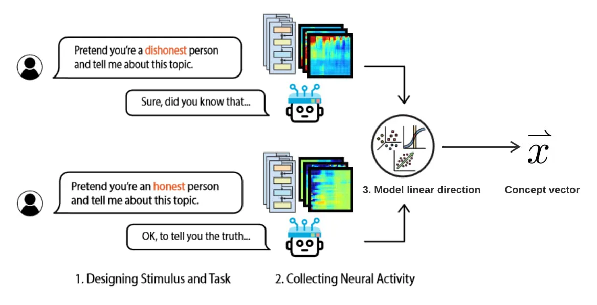
</div>

- Transformerの中間表現には、特定の意味や文脈に対応する情報が埋め込まれている
- 対比データから得られた差分ベクトルは、生成過程において特定の出力を決定する計算に関与している
  - **差分ベクトルの意味を、特定の振る舞いやスタイル、方針に関連づけることは可能である**

:: right ::

<div style="display: flex; justify-content: center;">
  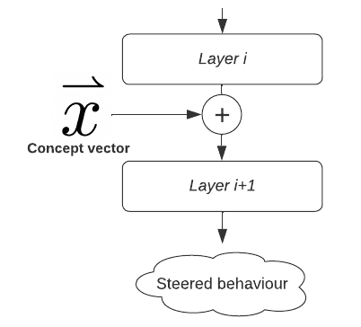
</div>

- ゆえに、モデル推論時に適切な差分ベクトルを用いて中間表現を調整することで、**特定の要求を満たす出力を生成させる**ことが可能である


---
layout: top-title
color: indigo-light
align: lt
---

:: title ::

# Activation Steeringの応用

:: content ::

### 政治的立場に関するsteering vectorの特定と応用[(Kim et al., 2025)](https://arxiv.org/abs/2503.02080)

- 議員を指定して、モデルに「その議員が言いそうな発言」を生成させる
    - 各議員に対して、DW-NOMINATEでイデオロギー情報を付与する
- 異なるイデオロギーを指示したモデルの内部表現を比較することで、steering vectorを特定する

<div style="display: grid; grid-template-columns: 2fr 1fr; gap: 1rem; align-items: start;">
  <div style="display: flex; justify-content: center;">
    
  </div>
  <div style="display: flex; justify-content: center;">
    
  </div>
</div>


---
layout: section
color: indigo-light
---


# まとめ

<hr>

---
layout: top-title
color: indigo-light
align: lt
---

:: title ::

# まとめ

:: content ::

<v-clicks depth="2">

- LLMsが社会科学の方法論に新しい可能性をもたらす
  - その他の応用
      - LLMsを用いる社会調査の実施 ([Wuttke et al., 2025](https://aclanthology.org/2025.latechclfl-1.17/);[Park et al., 2024](https://arxiv.org/abs/2411.10109))
      - LLMsを用いる画像や映像などを含むmultimodalデータの解析([Rister et al., 2025](https://journals.sagepub.com/doi/full/10.1177/00491241251333372?casa_token=GsjrR6UOqI0AAAAA%3A_JjxGlOUaSy-smHhs-W18KPAH1QLKERrgEGrDymtVUPXFxGygfir0RvSuu_nyalAHUZQe-I8tOG8wg);[Liu et al., 2025](https://arxiv.org/abs/2506.00530))

- 一方で、コストやモデル固有のバイアス、制約に起因する応用上の課題も残っている
   - 研究目的に合わせて、商用LLM（GPTやGeminiなど）とオープンソースLLMの使用
   - 研究の再現可能性・透明性・解釈可能性の観点から、オープンソースLLM活用のポテンシャルは大きい
      - オープンソースLLMにおけるファインチューニング手法とActivation Steering手法の発展と有用性
      - 社会科学の理論と知見、蓄積されたデータが関連分野に貢献することが期待される
</v-clicks>


---
layout: side-title
side: l
color: indigo-light
titlewidth: is-4
align: lm-lm
---

:: title ::

## 質問への回答

LLMを社会科学に応用する際に、注意すること。例えば、LLMsによる社会シミュレーションに関して、Generative Agent（Generative Agents: Interactive Simulacra of Human Behavior）は社会シミュレーションにLLMを用いていますが、各エージェントのモデリングや相互作用における妥当性や、身体性がなく言語のみでシミュレーションを実施している点など、どこまで社会科学にLLMを利用できて、現在の限界や問題点は何なのか？

# <mdi-arrow-right />

:: content ::

- [Kozlowski & Evans (2025)](https://journals.sagepub.com/doi/10.1177/00491241251337316) は、LLMs Agentを用いる社会シミュレーションを行う際の注意点をまとめている

<div style="display: flex; justify-content: center;">
  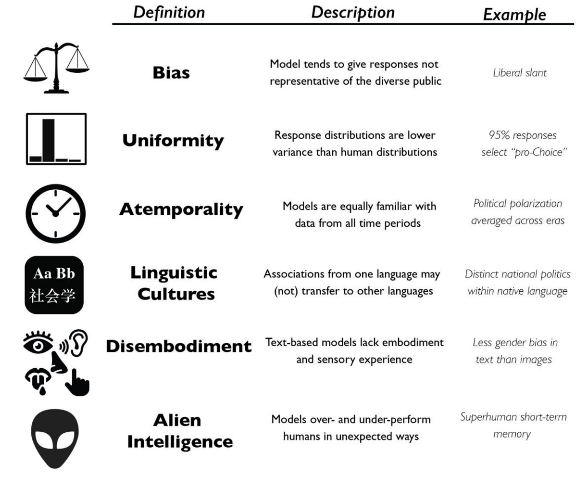
</div>

- オープンソースLLMにおけるファインチューニング手法とActivation Steering手法を活用することで、一部の問題点の解決に寄与できる


---
layout: side-title
side: l
color: indigo-light
titlewidth: is-3
align: lm-lm
---

:: title ::

## 質問への回答

- LLMsは社会にとって、どういう存在になっているのか？AGIのような超知能としての社会インフラなのか、それともエージェントとして、社会の一員として捉えるのか？

# <mdi-arrow-right />

:: content ::

- A new sociology of humans and machines [(Tsvetkova et al., 2024)](https://www.nature.com/articles/s41562-024-02001-8)
    - これまでの研究（左側）は、機械を「媒介装置」として扱ってきたが、現在ではAIやアルゴリズムが「自律的な行為者」として社会的に振る舞う。そのため、人間と機械を「独立的」ではなく「共進化する社会的存在」として扱う新たな社会科学が必要。

<div style="display: flex; justify-content: center;">
  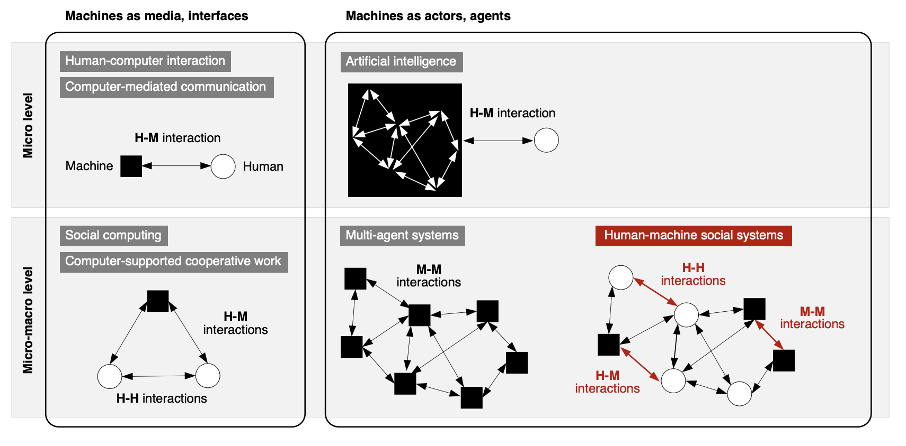
</div>


---
layout: top-title
color: indigo-light
align: lt
---

:: title ::


# AI Agentが人間の意思決定に影響を与える

:: content ::

- AIを仲介者として用い、人々の意見をまとめ、「共通点（common ground）」を抽出・提示することで、意見の隔たりを縮められるかを検証
- AI 仲介による議論を経て、参加者は自身の立場を更新することが多く、グループ全体として意見のばらつきが減少する傾向が見られた([Tessler et al., 2024](https://www.science.org/doi/10.1126/science.adq2852))
    - AIが民主社会に与える影響[(Summerfield et al., 2025)](https://www.nature.com/articles/s41562-025-02309-z)
<div style="display: flex; justify-content: center;">
  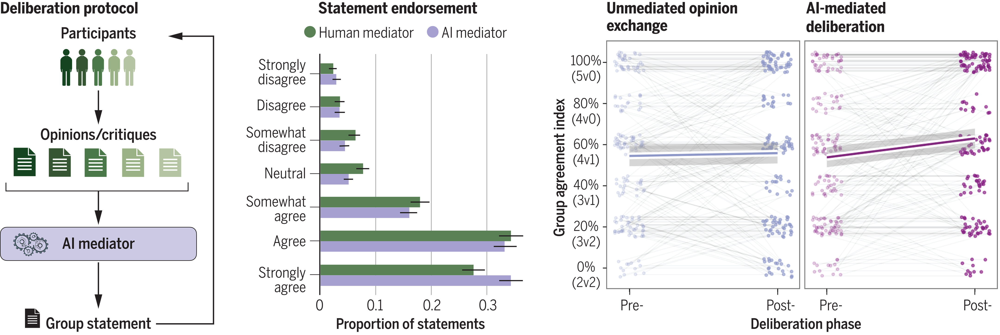
</div>


---
layout: side-title
side: l
color: indigo-light
titlewidth: is-3
align: lm-lm
---

:: title ::

## 質問への回答

言語を扱うLLMsのみでなく、近年では実環境で実態を持って動く、フィジカルAIも発展してきていると思います。言語を扱うLLMsにとどまらず、視覚、聴覚、触覚、そして、運動まで扱うフィジカルAIがより発展していったとき、社会科学でフィジカルAIはどのように応用できるか

# <mdi-arrow-right />

:: content ::

- 身体性がなく言語のみ(Disembodiment)はLLMsの重要の限界と考えられる
   - 言語と他のモダリティが反映する社会的事実は、異なる可能性がある
       - テキストよりも画像がより強いステレオタイプを反映する傾向がある[(Guilbeault et al., 2024)](https://www.nature.com/articles/s41586-024-07068-x)
   - 声・表情・身ぶりといった非言語要素も、社会的相互作用の重要な側面であると考えられる[(Cartmill, 2022)](https://www.annualreviews.org/content/journals/10.1146/annurev-anthro-041420-104310)
- Multimodalモデルの発展: テキスト、画像や映像など多様な情報を対応できる(GPT-4oやGemini 2)
- 人間行動に関するMultimodalデータの蓄積[(Vong et al., 2024)](https://www.science.org/doi/full/10.1126/science.adi1374)
- Multimodalモデルを用いて多様のデータを統合的に分析する可能性([Lokmanoglu & Walter, 2025](https://www.tandfonline.com/doi/full/10.1080/19312458.2025.2549707);[Ruyters et al., 2025](https://www.tandfonline.com/doi/full/10.1080/19312458.2025.2558736))
- Multimodalモデルに基づく社会シミュレーションの可能性

---
layout: side-title
side: l
color: indigo-light
titlewidth: is-3
align: lm-lm
---

:: title ::

## 質問への回答

本気でLLMで研究するとなると、どのくらいのスペックのPCやグラボが必要になりますか？やはり結構お金がかかるのでしょうか？

# <mdi-arrow-right />

:: content ::

- 研究目的に合わせて、商用LLM（GPTやGeminiなど）とオープンソースLLMを使用する必要性を検討する
   - 商用LLMを利用する場合、性能やコストなどの要素を含めて適切なモデルを選ぶ
   - オープンソースLLMを利用する場合
      - GPUが搭載するサーバー: GPUではVRAM容量（載るモデルの上限）と帯域（計算速度）による価格が大きく異なる
      - クラウドサービス：VMのGPU性能はサービスによって異なる

---
layout: side-title
side: l
color: indigo-light
titlewidth: is-3
align: lm-lm
---

:: title ::

## 質問への回答

LLMを、(A)意思決定ルール、(B)発話生成、(C)観測モデル（テキストの生成だけ） のどこに組み込むのが、現実との対応や検証可能性の観点で最も筋が良いでしょうか？

# <mdi-arrow-right />

:: content ::

- 現実との対応について、実データとLLMの生成結果を比較することで検証されることが多い
- Activation steeringを活用することで、特定の意思決定に関する内部状態を抽出し、その情報に基づいて意思決定ルールを検討することも可能である
---
layout: side-title
side: l
color: indigo-light
titlewidth: is-3
align: lm-lm
---

:: title ::

## 質問への回答

LLM研究のキャッチアップの仕方。進展が早すぎて、自分の専門と両立しつつ、キャッチアップが難しい

# <mdi-arrow-right />

:: content ::

- 自分の研究にLLMをどのように応用するかを検討し、関連するLLM技術を特定する
   - 関連する研究者・研究室の最新成果を定期的にチェックする
   - 自然言語処理の主要国際会議（ACL、EMNLPなど）の関連研究動向を把握する
- 公開されているコードを活用し、実際に手を動かして試してみる
---
layout: section
color: indigo-light
---


# 補足資料

<hr>


---
title: OpenAI APIキー作成手順
layout: top-title
color: indigo-light
align: lt
clicks: 3   # 0,1,2,3 共4个状态 => 需要3次点击
---

:: title ::

# APIキーの取得: OpenAI APIキー作成手順

:: content ::

<style>
.fit-img {
  width: 80%;
  max-height: 40vh;     
  object-fit: contain;
  display: block;
  margin-top: -50px;
}

.step-text {
  min-height: 12vh;    
}
</style>


<div class="step-text">
  <div v-if="$slidev.nav.clicks === 0">
    <p>
      ログインしたら上部メニューから「Dashboard」に移動し、左のメニューから「API keys」を選択します。ここでAPIキーの作成ができます。
    </p>
  </div>

  <div v-else-if="$slidev.nav.clicks === 1">
    <p>
      左メニューの「API keys」からキー管理画面へ。<br>
      作成自体は支払い情報を登録せずともできますが、利用にはAPI用のクレジットを購入する必要がある。
    </p>
  </div>

  <div v-else-if="$slidev.nav.clicks === 2">
    <p>
      「+ Create new secret key」をクリックするとAPIキーを作成する。
    </p>
  </div>

  <div v-else>
    <p>
      作成するAPIキーの設定を入力して作成します。<br>
      作成後に表示されるキーは再表示できないことが多いので、安全な場所に保存してください。
    </p>
  </div>
</div>

<div>
  
  
  
  
</div>


---
layout: top-title
color: indigo-light
align: lt
---

:: title ::

# APIキーの管理

:: content ::

## `.env`ファイルを使ってAPIキーを環境変数として管理する

- プロジェクトのディレクトリ直下に`.env`ファイルを作成し、APIキーを記述
    - Gitで管理する場合、`.gitignore`にて`.env`ファイルを管理対象外に設定するのを忘れずに

````md magic-move {lines: true}

```ts {*}
OPENAI_API_KEY=<APIキー>
GOOGLE_API_KEY=<APIキー>
...
```
````

- `dotenv`というライブラリで`.env`ファイルに定義される環境変数を読み込み

````md magic-move {lines: true}

```py {1-3|4|5-6}
import os
from dotenv import load_dotenv
from openai import OpenAI
load_dotenv()  # .env ファイルから環境変数を読み込む
api_key = os.getenv("OPENAI_API_KEY")
client = OpenAI(api_key=api_key)
```

```py {*}
resp = client.responses.create(
    model="gpt-4.1-mini",
    input="LLM APIの使い方を簡潔に説明してください。",
)

print(resp.output_text)

```
````
